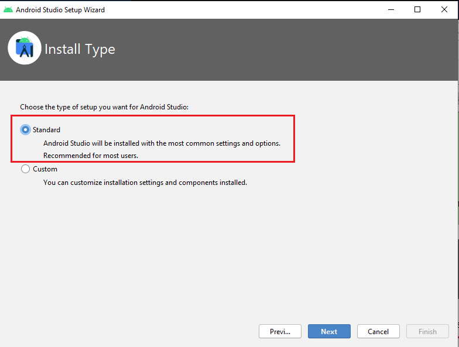
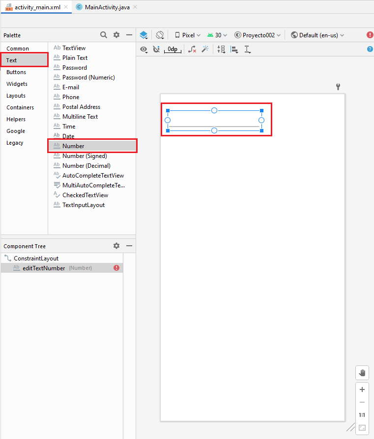
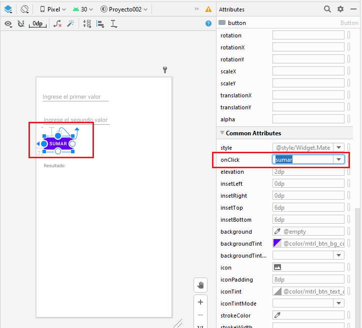
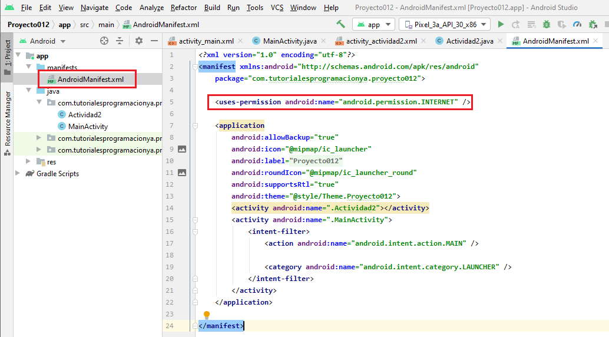
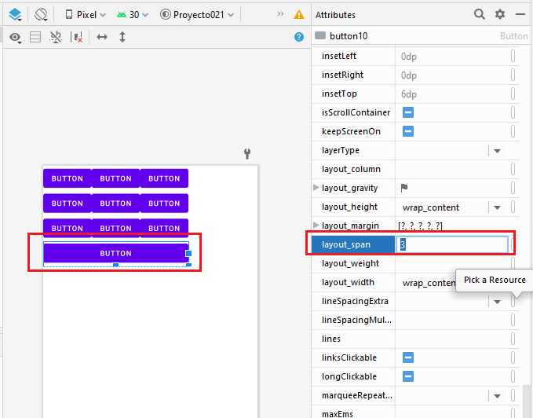
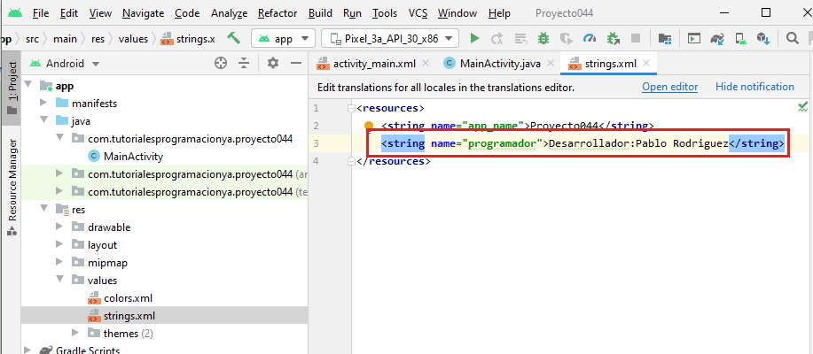
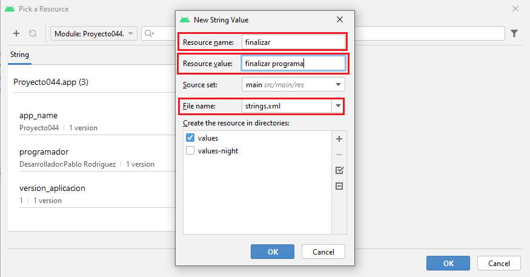

<html>
<head>
    <title>TUTORIAL SOBRE ANDROID STUDIO</title></head>
    
    <h1><a href="https://www.tutorialesprogramacionya.com/javaya/androidya/androidstudioya/index.php?inicio=0.">TUTORIAL SOBRE ANDROID STUDIO</a></h1>
    
Todos los tutoriales son originarios de la pagina web ANDROID YA, y puedes acceder en ella con el siguiente link:  <a href="https://www.tutorialesprogramacionya.com/javaya/androidya/androidstudioya/index.php?inicio=0.">ANDROID YA ("TUTORIALES")  </a>
    
O tambien dando clic en el titulo de "tutoriales sobre android studio"

    <tittle>
1 - INSTALACIÓN DE LAS HERRAMIENTAS NECESARIAS PARA PROGRAMAR PARA ANDROID STUDIO
 </tittle>
    <body
      style="background:linear-gradient(50deg, LightGreen,skyblue,violet,lightpink,#FC6E6E);">           
<text> <b style="color: black; font-size: 30px">Descarga de herramientas necesarios para programar para Android con el Android Studio
</b>
        </text> 

1 - El primer paso es la descarga del Android Studio (que contiene todo lo necesario para comenzar el desarrollo de aplicaciones en Android), lo hacemos del sitio :   
    <a class="active" href="https://developer.android.com/studio?hl=es; font-size: 20px">Android Studio</a>
    
Ahora procedemos a su instalación en el equipo ejecutando el archivo que acabamos de descargar:

    
    
Marcamos para que instale el Android Studio y Android Virtual Device:

        
Dejamos con los valores por defecto en las siguientes pantallas de instalación.

        

        

2 - El segundo paso es ejecutar el Android Studio para poder empezar a desarrollar para Android: 

        
La primera vez que lo ejecutamos elegimos el tipo de configuración "Standard":

        
Seguidamente se instalan las últimas componentes necesarias: 

        
Finalmente aparece el siguiente diálogo desde donde podemos crear nuestro primer proyecto:

<tittle>
2 - PASOS PARA CREAR EL PRIMER PROYECTO ANDROID STUDIO
 </tittle>

Una vez que iniciamos el entorno del Android Studio aparece el diálogo principal:

Elegimos la opción "Create New Project"

Ahora aparecerá una ventana donde debemos elegir el esqueleto básico de nuestra aplicación, seleccionaremos "Empty Activity":
 

En el segundo diálogo debemos definir el nombre del proyecto, la url de nuestra empresa (que será el nombre del paquete que asigna java para los archivos fuentes) y la ubicación en el disco de nuestro proyecto, también es muy importante elegir el lenguaje Java:

Tenemos finalmente creado nuestro primer proyecto en Android Studio y podemos ahora ver el entorno del Android Studio para codificar la aplicación:

El Android Studio nos genera todos los directorios y archivos básicos para iniciar nuestro proyecto, los podemos ver en el lado izquierdo del entorno de desarrollo:

No haremos en este momento un análisis del significado y objetivo de cada uno de estas secciones y archivos generados, sino a medida que avancemos con este curso iremos viendo en forma puntual y profunda.

La interfaz visual de nuestro programa para Android se almacena en un archivo XML en la carpeta res, subcarpeta layout y el archivo se llama activity_main.xml. En esta carpeta tenemos creada nuestra primer pantalla.

Al seleccionar este archivo el Android Studio nos permite visualizar el contenido en "Design" o "Code" (es decir en vista de diseño o en vista de código):

Vista de diseño:

A partir de la versión 2.2 del Android Studio tenemos la vista "blueprint" que nos muestra una interfaz simplificada muy útil cuando tenemos pantallas complejas que veremos más adelante. Podemos ver solo la vista de diseño o "blueprint" seleccionando alguna de las opciones que aparecen aquí:

        
Vista de código:

El Android Studio ya insertó dos controles, un TextView y un control de tipo ConstraintLayout que permite ingresar controles visuales alineados a los bordes y a otros controles que haya en la ventana (más adelante analizaremos este layout)

Ya veremos que podemos modificar todo este archivo para que se adapte a la aplicación que queremos desarrollar.

A lo largo de este curso iremos viendo los objetivos de cada una de las secciones que cuenta el Android Studio para implementar la interfaz, codificar en java las funcionalidades de la aplicación etc.

Antes de probar la aplicación en el emulador de un dispositivo Android procederemos a hacer un pequeño cambio a la interfaz que aparece en el celular: borraremos la label que dice "Hello World" (simplemente seleccionando con el mouse dicho elemento y presionando la tecla delete, podemos seleccionarla de cualquiera de las dos interfaces "Design" o "blueprint") y de la "Palette" arrastraremos un "Button" al centro del celular y en la ventana "Properties" estando seleccionado el "Button" cambiaremos la propiedad "text" por la cadena "Hola Mundo":

Nos queda un paso muy importante que es indicar la posición del botón dentro de la ventana, la forma automática es seleccionar el botón y presionar seguidamente el ícono de "Infer Constraints" (mientras no hagamos esto el botón no aparecerá correctamente en pantalla):

Este proceso será obligatorio con cada control visual (Botones, editores de línea etc.) que dispongamos en la ventana, veremos luego que los enlaces podemos hacerlos nosotros con el mouse y no estar obligados a los enlaces automáticos que se generan al presionar el botón de "Infer Constraints".

Para ejecutar la aplicación presionamos el triángulo verde o seleccionamos del menú de opciones "Run -> Run app" :

Luego de un rato aparecerá el emulador de Android en pantalla (el arranque del emulador puede llevar más de un minuto si tiene un equipo con poca ram), es IMPORTANTE tener en cuenta que una vez que el emulador se ha arrancado no lo debemos cerrar cada vez que hacemos cambios en nuestra aplicación o codificamos otras aplicaciones, sino que volvemos a ejecutar la aplicación con los cambios y al estar el emulador corriendo el tiempo que tarda hasta que aparece nuestro programa en el emulador es muy reducido.
        

Cuando terminó de cargarse el emulador debe aparecer nuestra aplicación ejecutándose:

Este proyecto lo puede descargar en un zip desde este enlace:
<a href="Proyecto001.zip"> Proyecto001.zip </a>

<tittle>
3 - CAPTURAR EL CLIC DE UN BOTÓN
</tittle>
<b style="color: black; font-size: 30px">Problema:</b> 

Confeccionar un programa que permita la carga de dos números enteros en controles de tipo EditText (Number). Mostrar dentro de los mismos controles EditText mensajes que soliciten la carga de los valores. Disponer un Button para sumar los dos valores ingresados. Mostrar el resultado en un control de tipo TextView.

La interfaz visual debe quedar algo semejante a esto:

        
Recordar que si queremos ocultar o volver a mostrar el diseño "blueprint" tenemos tres íconos en la parte superior del diseñador

        
Crear un proyecto llamado: Proyecto002.

        
Veamos paso a paso como creamos la interfaz visual de nuestro programa. Primero borramos el TextView que aparece por defecto cuando se crea un proyecto con el Android Studio. Ahora desde la ventana "Palette" seleccionamos de la pestaña "Text" el control "Number" (es de la clase EditText) y lo arrastramos a la ventana de diseño de nuestra interfaz a la parte superior izquierda

    
        
Como el control EditText se inserta en un contenedor ConstraintLayout, debemos indicar la posición relativa dentro del mismo, la forma más fácil es presionar el botón "Infer Constraints" para que se generen en forma automática (podemos hacerlo en forma manual presionando los círculos que aparecen en el EditText y desplazando con el mouse hasta los bordes):

    
        
Ahora lo seleccionamos y en la ventana de propiedades (Properties) especificamos la propiedad hint, disponemos el texto "Ingrese el primer valor":

    
    
También vamos a especificar la propiedad "id", y le asignaremos el valor et1

    

Hemos entonces asignado como nombre a este objeto: et1 (recordemos que se trata de un objeto de la clase EditText), este nombre haremos referencia posteriormente desde el programa en Java.

Efectuamos los mismos pasos para crear el segundo EditText de tipo "Number" (iniciamos las propiedades respectivas) Definimos el id con el nombre et2 y la propiedad hint con el mensaje "Ingrese el segundo valor", el resultado visual debe ser algo semejante a esto:

        

De la pestaña "Buttons" arrastramos un control de tipo "Button":

Iniciamos la propiedad text con el texto "Sumar" y la propiedad id la dejamos con el valor ya creado llamado "button":

        
Para terminar con nuestra interfaz visual arrastramos una componente de tipo "TextView" de la pestaña "Text". Definimos la propiedad id con el valor "tv1" y la propiedad text con el texto "Resultado": 

La interfaz final debe ser semejante a esta:

 

Si en este momento ejecutamos la aplicación aparece la interfaz visual correctamente pero cuando presionemos el botón no mostrará la suma.

Hasta ahora hemos trabajado solo con el archivo xml (activity_main.xml) donde se definen los controles visuales de la ventana que estamos creando.

Abrimos seguidamente el archivo MainActivity.java que lo podemos ubicar en la carpeta app\java\com\tutorialesprogramacionya\proyecto002\MainActivity:

La clase MainActivity hereda de la clase AppCompatActivity. La clase AppCompatActivity representa una ventana de Android y tiene todos los métodos necesarios para crear y mostrar los objetos que hemos dispuesto en el archivo xml.

El código fuente de la clase MainActivity.java es:

Como mínimo se debe sobrescribir el método onCreate heredado de la clase AppCompatActivity donde procedemos a llamar al método setContentView pasando como referencia una valor almacenado en una constante llamada activity_main contenida en una clase llamada layout que a su vez la contiene una clase llamada R (veremos más adelante que el Android Studio se encarga de crear la clase R en forma automática y sirve como puente entre el archivo xml y nuestra clase MainActivity)

<b style="color: black; font-size: 21px">Captura de eventos.</b> 

Ahora viene la parte donde definimos variables en java donde almacenamos las referencias a los objetos definidos en el archivo XML.

Definimos tres variables, dos de tipo EditText y finalmente una de tipo TextView (estas dos clases se declaran en el paquete android.widget, es necesario importar dichas clases para poder definir las variables de dichas clases, la forma más fácil de importar las clases es una vez que definimos el objeto por ejemplo private EditText et1; veremos que aparece en rojo el nombre de la clase y nos invita el Android Studio a presionar las teclas "Alt" e "Intro" en forma simultánea. Luego el Android Studio codifica automáticamente la línea que importa la clase: import android.widget.EditText;):

Recordar que la forma más fácil de importar las clases EditText y TextView es escribir las tres líneas:

    private EditText et1;

 private EditText et2;

private TextView tv1;

Y luego presionar las teclas "Alt" y "Enter" en cada nombre de clase que se debe importar
Esto hace que se escriban automáticamente los import:

        
import android.widget.EditText;

import android.widget.TextView;

Los nombres que le dí a los objetos en este caso coinciden con la propiedad id (no es obligatorio):

Para la clase Button no es necesario definir un atributo.

En el método onCreate debemos enlazar estas variables con los objetos definidos en el archivo XML, esto se hace llamando al método findViewById:

@Override
    

 protected void onCreate(Bundle savedInstanceState) { 

super.onCreate(savedInstanceState);

setContentView(R.layout.activity_main);

 et1=findViewById(R.id.et1);

et2=findViewById(R.id.et2);

tv1=findViewById(R.id.tv1);

 }

Al método findViewById debemos pasar la constante creada en la clase R (recordemos que se crea automáticamente esta clase) el nombre de la constante si debe ser igual con el nombre de la propiedad del objeto creado en el archivo XML.

Ya tenemos almacenados en las variables las referencias a los tres objetos que se crean al llamar al método:setContentView(R.layout.main); .

Ahora planteamos el método que se ejecutará cuando se presione el botón (el método debe recibir como parámetro un objeto de la clase View) En nuestro ejemplo lo llamé sumar:

Debemos importar la clase View (presionamos las teclas "Alt" y luego "Enter" en forma simultanea)

Ahora debemos ir al archivo XML (vista de diseño) e inicializar la propiedad onClick del objeto button con el nombre del método que acabamos de crear (este paso es fundamental para que el objeto de la clase Button pueda llamar al método sumar que acabamos de crear):

 public void sumar(View view) {     
       

String valor1=et1.getText().toString();

String valor2=et2.getText().toString();

int nro1=Integer.parseInt(valor1);

 int nro2=Integer.parseInt(valor2);

int suma=nro1+nro2;

        
String resu=String.valueOf(suma);
      
        
 tv1.setText(resu);
      

    }

Extraemos el texto de los dos controles de tipo EditText y los almacenamos en dos variables locales de tipo String. Convertimos los String a tipo entero, los sumamos y el resultado lo enviamos al TextView donde se muestra la suma (previo a convertir la suma a String)

        
La clase completa queda entonces como:

Si ejecutamos nuestro programa podemos ver ahora que los controles EditText muestran los mensajes "Ingrese el primer valor" e "Ingrese el segundo valor" (la propiedad hint de los EditText muestran un mensaje que se borra automáticamente cuando el operador carga los enteros):

    
Luego de cargar dos valores al presionar el botón aparece en el TextView el resultado de la suma de los dos EditText :

        
Este proyecto lo puede descargar en un zip desde este enlace:  <a href=Proyecto002.zip>Proyecto002.zip</a> 

<tittle>
4 - CONTROLES RADIOGROUP Y RADIOBUTTON
 </tittle>
        
El objetivo de este concepto es practicar la implementación de un programa que requiera controles de tipo RadioButton para seleccionar una actividad. Aprenderemos como agrupar un conjunto de RadioButton y verificar cual está seleccionado.

        
Crear un proyecto llamado Proyecto003.

        <b style="font-size: 25px; color:black";>Problema:</b> 
        
Realizar la carga de dos números en controles de tipo EditText. Mostrar mensajes que soliciten la carga de los valores dentro de los mismos EditText (propiedad hint). Disponer dos controles de tipo RadioButton para seleccionar si queremos sumar o restar dichos valores. Finalmente mediante un control de tipo Button efectuamos la operación respectiva. Mostramos el resultado en un TextView.

        
El problema es similar al anterior. Disponemos dos controles EditText (Number) y configuramos sus propiedades id y hint. Para disponer los controles de tipo RadioButton debemos en realidad primero insertar un control de tipo RadioGroup (este control se encuentra en la paleta de componentes en la pestaña Buttons de la "Palette"):

        
 
Ahora debemos arrastrar dos controles de la clase RadioButton de la pestaña "Buttons" dentro del RadioGroup, la forma más sencilla es arratrar dichos objetos a la ventana "Component Tree" en lugar de la vista de diseño:

    
        

 
Nuestro problema solo requiere dos controles de tipo RadioButton.   

 
Ahora a los dos controles de tipo RadioButton definimos sus id (los llamaremos r1 y r2 respectivamente)
Cambiamos sus propiedades text por los textos "sumar" y "restar".
    

 
 No olvidemos también cambiar los id de los controles EditText por et1 y et2 (igual que en el problema anterior)     

 
 Por último agreguemos un botón y un TextView para mostrar el resultado
Inicializamos las propiedades del botón con los valores:     

    id : button

 
text : operar      
    
 
Y el TextView con los valores:     

 
 id : tv1
     
        
 
 text : resultado     
        
 
Podemos controlar en la ventana "Component Tree" el id definido para cada control (et1, et2, grupo1, r1, r2, tv1)
También podemos observar de que clase es cada control visual y el texto de la propiedad text para aquellos controles que tienen sentido su inicialización.     
  

  
     
       
 <b style="font-size: 21px; color: black">Captura del evento clic del button e identificación del RadioButton seleccionado. </b>        
      
 
 El código fuente de la clase MaintActivity es:
 
  

Primero debemos enlazar el objeto button con el método operar. Para esto similar al problema anterior seleccionamos el control button y cambiamos la propiedad onClick por el valor operar (si no hacemos esto nunca se ejecutará el método operar de la clase MainActivity): 
  

 
Como podemos ver el código fuente es igual al problema anterior. Tenemos dos objetos más que debemos inicializar en el método onCreate:
        
 
 r1=findViewById(R.id.r1);
        
 
r2=findViewById(R.id.r2);     
        
 
Las variables r1 y r2 son de la clase RadioButton y son necesarios en el método operar para verificar cual de los dos RadioButton están seleccionados. La clase RadioButton tiene un método llamado isChecked que retorna true si dicho elemento está seleccionado:
        
 
public void operar(View view) {  
        
  
String valor1=et1.getText().toString(); 
        
 
String valor2=et2.getText().toString();     
        
 
int nro1=Integer.parseInt(valor1);     
        
 
 int nro2=Integer.parseInt(valor2);     
                      
 
if (r1.isChecked()==true) {     
        
 
int suma=nro1+nro2;     
        
 
String resu=String.valueOf(suma);     
        
 
 tv1.setText(resu);     
          
 
} else     
        
 
if (r2.isChecked()==true) {     
        
 
int resta=nro1-nro2;     
        
 
String resu=String.valueOf(resta);     
      
  
tv1.setText(resu);     
        
 
  }     
        

}     
        

Este proyecto lo puede descargar en un zip desde este enlace:
<a href="Proyecto001.zip"> Proyecto003.zip </a>
  
<tittle>
5 - Control CheckBox
</tittle>
 
El objetivo de este concepto es seguir practicando lo visto hasta ahora para la creación de un proyecto con Android Studio e incorporar el control visual CheckBox
        
 
Crear un proyecto llamado Proyecto004.
  
<b style="font-size: 21px; color: black">Problema:</b>
 
Realizar la carga de dos números en controles de tipo EditText ("Number"). Mostrar en las propiedades "hint" de cada componente un mensaje que solicite la carga de los valores. Disponer dos controles de tipo CheckBox para seleccionar si queremos sumar y/o restar dichos valores. Finalmente mediante un control de tipo Button efectuamos la operación respectiva. Mostramos el o los resultados en un TextView.
        
 
Lo nuevo en este problema es la inserción de dos objetos de la clase CheckBox que se encuentra en la pestaña "Buttons":     
 

 
Debemos iniciar las propiedades "text" para mostrar un texto y la propiedad "id" para poder hacer referencia al CheckBox en el programa java.
        
 
El primer CheckBox definimos su "id" con el valor check1 y el segundo con el valor check2.
        
 
Luego la interfaz gráfica final para este problema y los nombres de los controles o componentes visuales los podemos ver en la ventana "Component Tree":
  

 
Controlar que fijamos los valores de las propiedades "id" de cada objeto: et1, et2, check1, check2 y tv1.
      
  
No olvidemos inicializar la propiedad onClick del objeto button con el valor "operar" (es el nombre del método a ejecutarse cuando se presione el botón y lo implementa la clase que hacemos) 
        
 <b style="font-size: 21px; color: black">Código fuente:</b>  
 
     
 

 
Definimos dos objetos de la clase CheckBox como atributos de la clase:
                      
 
private CheckBox check1,check2;     
        
 
En el método onCreate los inicializamos con los objetos definidos en el archivo XML:     
        
 
 check1=findViewById(R.id.check1); 
        
 
 check2=findViewById(R.id.check2);       
          
 
En el método operar debemos definir dos if a la misma altura ya que los dos controles de tipo CheckBox pueden estar seleccionados simultáneamente. Definimos una variable de tipo String y la inicializamos con cadena vacía para el caso en que los dos CheckBox no estén seleccionados:
        
 
String resu="";     
        
 
if (check1.isChecked()==true) {     
        
 
int suma=nro1+nro2;     
      

resu="La suma es: "+ suma;     
        
 
 }     
          
 
 if (check2.isChecked()==true) {     
        
 
int resta=nro1-nro2;     
        
 
resu=resu + " La resta es: "+ resta;     
        
 
}     
      
  
tv1.setText(resu);     
        
 
Cuando ejecutamos el programa en el emulador tenemos como resultado:     
 

Este proyecto lo puede descargar en un zip desde este enlace:
<a href="Proyecto004.zip"> Proyecto004.zip </a>

<tittle>
6 - Control Spinner
</tittle>
 
El objetivo de este concepto es seguir practicando lo visto hasta ahora e incorporar el control visual Spinner.
 
 
El control Spinner muestra una lista de String y nos permite seleccionar uno de ellos. Cuando se lo selecciona se abre y muestra todos sus elementos para permitir seleccionar uno de ellos. 
        
 
Crear un proyecto llamado Proyecto005.     
                      
 <b style="font-size: 21px; color: black">Problema:</b>        
 
Realizar la carga de dos números en controles de tipo EditText ("Number"). Mostrar un mensaje que solicite la carga de los valores iniciando la propiedad "hint" de cada control. Disponer un control de tipo Spinner que permita seleccionar si queremos sumar, restar, multiplicar o dividir dichos valores. Finalmente mediante un control de tipo Button efectuamos la operación respectiva. Mostramos el resultado en un TextView.     
   

 
Dejamos la propiedad id con el valor spinner (valor por defecto que crea el Android Studio al insertar el objeto de la clase Spinner). 
        
 
En la siguiente imagen en la ventana "Component Tree" del Android Studio podemos observar los objetos dispuestos en el formulario, sus id, sus textos y de que clase son cada uno (Como podemos ver la vista Blueprint muestra el Spinner, en cambio en vista "Design" no aparece):
 

 
No olvidemos inicializar la propiedad onClick del objeto button con el valor "operar" (dicho nombre es el método que debemos implementar)
        
 <b style="font-size: 21px; color: black">Código fuente:     </b>        
 
     
  

 
Definimos un objeto de la clase Spinner:     
                        

private Spinner spinner1;     
        
 
En el método onCreate obtenemos la referencia al control visual declarado en el archivo XML (Veamos que no es obligatorio que el nombre de nuestro objeto llamado spinner1 sea igual al id definido en la interfaz visual llamado spinner):     
          
 
 spinner1=findViewById(R.id.spinner);     
        
 
Definimos un vector con la lista de String que mostrará el Spinner:     
        
 
String []opciones={"sumar","restar","multiplicar","dividir"};     
        
 
Definimos y creamos un objeto de la clase ArrayAdapter:     
      
  
ArrayAdapter&lt;String&gt; adapter = new ArrayAdapter&lt;String&gt;(this,android.R.layout.simple_spinner_item, opciones);
       
 
 Al constructor le pasamos como primer parámetro la referencia de nuestro AppCompatActivity (this), el segundo parámetro indica el tipo de Spinner, pudiendo ser las constantes:     
        
 
 Al constructor le pasamos como primer parámetro la referencia de nuestro AppCompatActivity (this), el segundo parámetro indica el tipo de Spinner, pudiendo ser las constantes:    
        
 
android.R.layout.simple_spinner_item
                      
 
android.R.layout.simple_spinner_dropdown_item     
        
 
El tercer parámetro es la referencia del vector que se mostrará.
        
 
Luego llamamos al método setAdapter de la clase Spinner pasando la referencia del objeto de la clase ArrayAdapter que acabamos de crear:     
        
 
spinner1.setAdapter(adapter);     
          
 
En el método operar que se ejecuta cuando presionamos el botón "OPERAR" y donde procedemos a extraer el contenido seleccionado del control Spinner:  
        
 
String selec=spinner1.getSelectedItem().toString();     
        
 
Luego mediante una serie de if anidados verificamos si debemos sumar, restar, multiplicar o dividir:     
        
 

  if (selec.equals("sumar")) {    
        
 
int suma=nro1+nro2;     
                        

String resu=String.valueOf(suma);     
        
 
tv1.setText(resu);     
          
 
} else     
        
 

        if (selec.equals("restar")) {   
        
 
 int resta=nro1-nro2;
                 
        
 
String resu=String.valueOf(resta);
               
      
  
tv1.setText(resu);
             
        
 
 }
           
        
 
 else
             
        
 
if (selec.equals("multiplicar")) { 
                      
 
  int multi=nro1*nro2; 
        
 
  String resu=String.valueOf(multi);  
        
 
  tv1.setText(resu);  
        
 
}  
          
 
else 
        
 
  if (selec.equals("dividir")) { 
        
 
int divi=nro1/nro2;  
        
 
   String resu=String.valueOf(divi);   
   

 tv1.setText(resu); 
                        

    }   
        
 
 En el emulador tenemos como resultado de ejecutar el programa:    
        
        
 
Si queremos que el Spinner no ocupe todo el ancho cambiamos la propiedad layout_width con el valor wrap_content. 
        
 
Este proyecto lo puede descargar en un zip desde este enlace: <a href="Proyecto005.zip"> Proyecto005.zip 
</a>
    <tittle>
7 - Control ListView (con una lista de String)

</tittle>     
 
El control ListView a diferencia del Spinner que se cierra luego de seleccionar un elemento permanecen visibles varios elementos (se lo utiliza cuando hay que mostrar muchos elementos)     
        
 
El control ListView ha sido remplazado en la actualidad por el control llamado RecyclerView, pero lo presentamos rápidamente al control ListView ya que existe mucho software desarrollado con el mismo.     
      
  
Si la lista no entra en el espacio que hemos fijado para el ListView nos permite hacer scroll de los mismos.     
        
 
El control ListView se encuentra en la pestaña "Legacy", es decir junto a los controles no recomendados a utilizar si desarrolla nuevas aplicaciones.     
        
 
Crear un proyecto llamado Proyecto006.     
        
 <b style="font-size: 21px; color: black">Problema:     </b>                      
 
Disponer un ListView con los nombres de paises de sudamérica. Cuando se seleccione un país mostrar en un TextView la cantidad de habitantes del país seleccionado.     
        
 
La interfaz visual a implementar es la siguiente (primero disponemos un TextView en la parte superior (cuyo id lo definimos con el valor tv1) y un ListView (y definimos su id con el valor list1)):

 
     
        
 <b style="font-size: 21px; color: black">Código fuente:</b>   
<pre class="recuadro"; style="font-size: 21px; color: black">
package com.tutorialesprogramacionya.proyecto006;

import androidx.appcompat.app.AppCompatActivity;

import android.os.Bundle;
import android.view.View;
import android.widget.AdapterView;
import android.widget.ArrayAdapter;
import android.widget.ListView;
import android.widget.TextView;

public class MainActivity extends AppCompatActivity {
    private String[] paises = { "Argentina", "Chile", "Paraguay", "Bolivia",
            "Peru", "Ecuador", "Brasil", "Colombia", "Venezuela", "Uruguay" };
    private String[] habitantes = { "40000000", "17000000", "6500000",
            "10000000", "30000000", "14000000", "183000000", "44000000",
            "29000000", "3500000" };
    private TextView tv1;
    private ListView lv1;

    @Override
    protected void onCreate(Bundle savedInstanceState) {
        super.onCreate(savedInstanceState);
        setContentView(R.layout.activity_main);

        tv1=findViewById(R.id.tv1);
        lv1=findViewById(R.id.list1);
        ArrayAdapter&lt;String&gt; adapter = new ArrayAdapter&lt;String&gt;(this,android.R.layout.simple_list_item_1, paises);
        lv1.setAdapter(adapter);

        lv1.setOnItemClickListener(new AdapterView.OnItemClickListener() {
            @Override
            public void onItemClick(AdapterView adapterView, View view, int i, long l) {
                tv1.setText("Población de "+ lv1.getItemAtPosition(i) + " es "+ habitantes[i]);
            }
        });
    }
}</pre>
 
Primero definimos dos vectores paralelos donde almacenamos en uno los nombres de países y en el otro almacenamos la cantidad de habitantes de dichos países:     
        
 
private String[] paises={"Argentina","Chile","Paraguay","Bolivia","Peru",
                             "Ecuador","Brasil","Colombia","Venezuela","Uruguay"};
    private String[] habitantes={"40000000","17000000","6500000","10000000","30000000",
                                 "14000000","183000000","44000000","29000000","3500000"};     
        
 
Definimos un objeto de tipo TextView y otro de tipo ListView donde almacenaremos las referencias a los objetos que definimos en el archivo XML:     
  
    <pre class="recuadro"; style="font-size: 21px; color: black">private TextView tv1;
private ListView lv1;</pre>
 
En el método onCreate obtenemos la referencia a los dos objetos:
   
    <pre class="recuadro"; style="font-size: 21px; color: black">tv1=findViewById(R.id.tv1);
        lv1=findViewById(R.id.list1);</pre>

Creamos un objeto de la clase ArrayAdapter de forma similar a como lo hicimos cuando vimos la clase Spinner:
   
<pre class="recuadro"; style="font-size: 21px; color: black">ArrayAdapter&lt;String&gt; adapter = new ArrayAdapter&lt;String&gt;(this,android.R.layout.simple_list_item_1, paises);
        lv1.setAdapter(adapter);</pre>
 

      
  
Llamamos al método setOnItemClicListener de la clase ListView y le pasamos como parámetro una clase anónima que implementa la interfaz OnItemClickListener (dicha interfaz define el método onItemClick que se dispara cuando seleccionamos un elemento del ListView):  
  
    <pre class="recuadro"; style="font-size: 21px; color: black"> lv1.setOnItemClickListener(new AdapterView.OnItemClickListener() {
            @Override
            public void onItemClick(AdapterView adapterView, View view, int i, long l) {
                tv1.setText("Población de "+ lv1.getItemAtPosition(i) + " es "+ habitantes[i]);
            }
        });</pre>
 
Para codificar esta clase anónima podemos utilizar la facilidad que nos brinda el Android Studio para generarla automáticamente, para esto tipeamos:     
  

 
Luego presionamos la tecla "Enter" y el Android Studio automáticamente nos genera la clase anónima implementando la interfaz onItemClick.     
        
 
Dentro del método onItemClick modificamos el contenido del TextView con el nombre del país y la cantidad de habitantes de dicho país. Este método recibe en el tercer parámetro la posición del item seleccionado del ListView.     
         
 
 Cuando ejecutamos el proyecto podemos ver una interfaz en el emulador similar a esta:
        
 
  
Este proyecto lo puede descargar en un zip desde este enlace: <a href="Proyecto006.zip"> Proyecto006.zip 
</a> 
<tittle>
8 - Control ImageButton

    
Hemos visto la creación de objetos de la clase Button, ahora veremos otra clase muy similar a la anterior llamada ImageButton que tiene la misma filosofía de manejo con la diferencia que puede mostrar una imagen en su superficie.     
 </tittle>       
 <b style="font-size: 21px; color: black">Problema:     </b>          
 
Disponer un objeto de la clase ImageButton que muestre una imagen de un teléfono. Cuando se presione mostrar en un control TextView el mensaje "Llamando".     
        
 
Primero crearemos un proyecto llamado Proyecto007 y luego debemos buscar una imagen en formato jpg que represente un teléfono de 50*50 píxeles.     
        
 
Nombre del archivo: telefono.jpg (es obligatorio que el nombre de archivo de la imagen siempre debe estar en minúsculas y no tener caracteres especiales, veremos que luego se genera un nombre de variable con dicho nombre)
Ahora copiamos el archivo a la carpeta de recursos de nuestro proyecto : Proyecto007/app/src/main/res/mipmap-mdpi
Esto lo podemos hacer desde el administrador de archivos del sistema operativo Windows.     
        
 
En la ventana "Project" cambiamos a vista "Project Files" y navegamos hasta la carpeta donde copiamos el archivo, vemos que el archivo se ubica en dicha carpeta: 
 

Esto solo a efectos de ver que el proyecto se actualiza con los archivos de recursos que copiamos a las carpetas mipmap-mdpi.     
        

Ahora insertaremos el objeto de la clase ImageButton en el formulario de nuestra aplicación. La clase ImageButton se encuentra en la pestaña "Buttons": 

Luego de disponer el objeto se abre un diálogo donde debemos seleccionar la imagen a mostrar: 
        
 
Al cerrar el diálogo se carga la propiedad "srcCompact" la referencia a la imagen (podemos modificar la imagen cambiando esta propiedad)     
        
 
Inicializamos la propiedad Id con el nombre boton1 y la propiedad "onClick" con el nombre de método "llamar":     
  

 
Por el momento nos muestra el ícono rojo de error, debido ha que no hemos codificado el método "llamar".
                      
 
Agreguemos un TextView a nuestra aplicación y configuremos sus propiedades Id (con tv1) y text. Luego la interfaz visual debe ser similar a:     
 

 <b style="font-size: 21px; color: black">Código fuente:     </b>
    <pre class="recuadro"; style="font-size: 21px; color: black">package com.tutorialesprogramacionya.proyecto007;

import androidx.appcompat.app.AppCompatActivity;

import android.os.Bundle;
import android.view.View;
import android.widget.TextView;

public class MainActivity extends AppCompatActivity {

    private TextView tv1;

    @Override
    protected void onCreate(Bundle savedInstanceState) {
        super.onCreate(savedInstanceState);
        setContentView(R.layout.activity_main);

        tv1=findViewById(R.id.tv1);
    }

    //Este método se ejecutará cuando se presione el ImageButton
    public void llamar(View view) {
        tv1.setText("Llamando");
    }
}</pre>
 

Definimos el atributo de tipo TextView:     
        

private TextView tv1;     
      

 Enlazamos el control definido en el archivo XML y la variable de java:    
        
 
 tv1=findViewById(R.id.tv1);     
        
 
Implementamos el método que se ejecutará cuando se presione el objeto de la clase ImageButton:     
        
 
  public void llamar(View view) {
        tv1.setText("Llamando");
    }    
                      
 
No olvidemos inicializar la propiedad onClick del objeto boton1 con el nombre del método "llamar" (recordemos que esto lo hacemos accediendo a la propiedad onClick en la ventana de "Properties")     
        
 
Este proyecto lo puede descargar en un zip desde este enlace: <a href="Proyecto007.zip"> Proyecto007.zip 
</a>       
 <b style="font-size: 21px; color: black">Comentarios extras de este control.     </b>        
 
Cuando copiamos el archivo lo hicimos a la carpeta:     

<pre class="recuadro"; style="font-size: 21px; color: black">mipmap-mdpi</pre>
 
Pero vimos que hay otras carpetas con nombres similares:     
      
<pre class="recuadro"; style="font-size: 21px; color: black">mipmap-mdpi
mipmap-hdpi
mipmap-xhdpi
mipmap-xxhdpi
mipmap-xxxhdpi
mipmap-anydpi-v26</pre>
 
El objetivo de estas otras carpetas es guardar las mismas imágenes pero con una resolución mayor si la guardamos en mipmap-hdpi.     
        
 
 Esto se hace si queremos que nuestra aplicación sea más flexible si se ejecuta en un celular, en una tablet, en un televisor etc.    
        
 
 Debemos tener en cuenta estos tamaños:    
 
<pre class="recuadro"; style="font-size: 21px; color: black">En la carpeta res/mipmap-mdpi/
(guardamos la imagen con el tamaño original)

En la carpeta res/mipmap-hdpi/
(guardamos la imagen con el tamaño del 150% con respecto al de la carpeta mipmap-mdpi)

En la carpeta res/mipmap-xhdpi/
(guardamos la imagen con el tamaño del 200% con respecto al de la carpeta mipmap-mdpi)

En la carpeta res/mipmap-xxhdpi/
(guardamos la imagen con el tamaño del 300% con respecto al de la carpeta mipmap-mdpi)

En la carpeta res/mipmap-xxxhdpi/
(guardamos la imagen con el tamaño del 400% con respecto al de la carpeta mipmap-mdpi)

En la carpeta res/mipmap-anydpi-v26/
(en las últimas versiones de android nos permite disponer íconos adaptativos que 
reemplacen a los archivios png o jpg, con la ventaja que nuestra aplicación será más liviana)</pre>
<tittle>
9 - Notificaciones sencillas mediante la clase Toast
</tittle>

Android permite mostrar una ventana emergente temporal que informa al usuario mediante un mensaje que aparece en la pantalla por un lapso pequeño de tiempo (luego de pasado un tiempo la ventana desaparece).     
          
 
Esta ventana que se superponer a la interfaz que se está mostrando en ese momento se administra mediante una clase llamada Toast.     
        
 
      Crear un proyecto llamado Proyecto008.     
   
<b style="font-size: 21px; color: black">Problema:     </b>
 
Generar un número aleatorio entre 1 y 100000. Mostrar mediante una ventana emergente dicho número por un lapso de tiempo. Luego mediante un control EditText ("Number") pedir al operador que ingrese el número que vio en la pantalla. Cuando se presione un botón controlar el número generado aleatoriamente con el que ingresó el usuario y mediante otro Toast informar si acertó o no.     
        
 
Lo primero que hacemos es crear la interfaz siguiente:     
   

Es decir que disponemos un TextView, un EditText ("Number") y un Button. Dejamos por defecto el nombre asignado al ID de botón, pero a los objetos TextView y EditText definimos su ID con los valor "et1" y "tv1". Recordemos que en la ventana "Component Tree" tenemos la referencia de todos los objetos que contiene nuestra interfaz.     
        

 Luego seleccionamos el botón de la interfaz visual e inicializamos la propiedad onClick con el nombre del método que se ejecutará al ser presionado, dicho nombre debe ser: "controlar" (recordemos que los nombre de métodos en Java por convención empiezan en minúsculas)    
   
<b style="font-size: 21px; color: black">Código fuente:</b>
<pre class="recuadro"; style="font-size: 21px; color: black">
package com.tutorialesprogramacionya.proyecto008;

import androidx.appcompat.app.AppCompatActivity;

import android.os.Bundle;
import android.view.View;
import android.widget.EditText;
import android.widget.Toast;

public class MainActivity extends AppCompatActivity {
    private EditText et1;
    private int num;

    @Override
    protected void onCreate(Bundle savedInstanceState) {
        super.onCreate(savedInstanceState);
        setContentView(R.layout.activity_main);

        et1=findViewById(R.id.et1);
        num=(int)(Math.random()*100001);
        String cadena=String.valueOf(num);
        Toast notificacion= Toast.makeText(this,cadena,Toast.LENGTH_LONG);
        notificacion.show();
    }

    public void controlar(View v) {
        String valorIngresado=et1.getText().toString();
        int valor=Integer.parseInt(valorIngresado);
        if (valor==num) {
            Toast notificacion=Toast.makeText(this,"Muy bien recordaste el número mostrado.",Toast.LENGTH_LONG);
            notificacion.show();
        }
        else {
            Toast notificacion=Toast.makeText(this,"Lo siento pero no es el número que mostré.", Toast.LENGTH_LONG);
            notificacion.show();
        }
    }
}</pre>

Analicemos el código fuente de la aplicación, lo primero es definir un objeto de la clase EditText y una variable entera donde almacenaremos el valor aleatorio que generamos y mostramos en un principio:     
  
 
private EditText et1;
     
        
 
private int num;     
        
 
En el método onCreate que es el primero que se ejecuta al inicializar la aplicación es donde inicializamos la referencia del EditText:     
                      
 
 et1=findViewById(R.id.et1);     
        
 
Generamos un valor aleatorio comprendido entre 0 y 100000 y lo almacenamos en la variable num:     
        
 
num=(int)(Math.random()*100001);     
        
 
Convertimos el valor entero a String ya que la clase Toast siempre hay que pasarte un String para mostrar:     
          
 
String cadena=String.valueOf(num);     
        
 
Veamos ahora lo nuevo que es la clase Toast, tenemos que crear un objeto de la clase Toast, para ello definimos una variable que la llamamos notificacion y mediante el método estático makeText de la clase Toast creamos el objeto.     
        
 
El método makeText tiene tres parámetros: el primero hace referencia a la ventana o Activity donde aparece (this), el segundo es la variable de tipo String que se mostrará en pantalla y por último es una constante que indica que la notificación se mostrará por un tiempo largo o corto:     
        
 
Toast notificacion=Toast.makeText(this,cadena,Toast.LENGTH_LONG);     
 

Finalmente cuando queremos que se muestre la notificación en pantalla procedemos a llamar al método show de la clase Toast:     
        

 notificacion.show();     
      

Esto hace que inmediatamente arranquemos la aplicación se mostrará la notificación con el número que deberá memorizar el usuario:     
      

 
Luego de unos segundos desaparece la notificación de pantalla (es decir en nuestro programa desaparece de pantalla el número aleatorio)     
        
 
  Cuando el operador termina de cargar el número y procede a ejecutar el botón "controlar" se ejecuta el código que dispusimos en el método "controlar":  
 
<pre class="recuadro"; style="font-size: 21px; color: black"> public void controlar(View v) {
        String valorIngresado=et1.getText().toString();
        int valor=Integer.parseInt(valorIngresado);
        if (valor==num) {
            Toast notificacion=Toast.makeText(this,"Muy bien recordaste el número mostrado.",Toast.LENGTH_LONG);
            notificacion.show();
        }
        else {
            Toast notificacion=Toast.makeText(this,"Lo siento pero no es el número que mostré.",Toast.LENGTH_LONG);
            notificacion.show();
        }
    }</pre>
 
En este método extraemos del control EditText el número que ingreso el usuario:     
                      
 
 String valorIngresado=et1.getText().toString();     
        
 
Lo convertimos a entero:     
        
 
 int valor=Integer.parseInt(valorIngresado);     
        
 
 Y mediante un if verificamos si coincide con el número aleatorio ingresado por el operador, si coincide inmediatamente creamos una nueva notificación y procedemos a mostrar que acertó:    
   
<pre class="recuadro"; style="font-size: 21px; color: black">  if (valor==num) {
            Toast notificacion=Toast.makeText(this,"Muy bien recordaste el número mostrado.",Toast.LENGTH_LONG);
            notificacion.show();
        }</pre>
 
Por el falso mediante otra notificación mostramos que no ingresó correctamente el número:     
       <pre class="recuadro"; style="font-size: 21px; color: black">        else {
            Toast notificacion=Toast.makeText(this,"Lo siento pero no es el número que mostré.",Toast.LENGTH_LONG);
            notificacion.show();
        }
</pre> 
 
 Si queremos que aparezca de nuevo un número aleatorio debemos cerrar el programa y volverlo a ejecutar.

    
        
 
Si queremos no tener que definir un objeto de la clase Toast, podemos simplificar el código:     
        
 
Toast.makeText(this,cadena,Toast.LENGTH_LONG).show();     
 

Este proyecto lo puede descargar en un zip desde este enlace: <a href="Proyecto008.zip">Proyecto008.zip</a>

<tittle>
10 - Control EditText
</tittle>

Desde el primer problema hemos estado utilizando el control que permite en Android ingresar valores por teclado. La clase que administra la entrada de caracteres por teclado es EditText. 

Pero en la palette de componentes vemos que hay muchos tipos de EditText: 

Como podemos ver en la pestaña "Text" se encuentran todos los tipos de EditText que nos ofrece Android para utilizar en nuestras aplicaciones: Password, E-mail, Number, etc. (la primera de todas es un TextView que no es un EditText) 

Dependiendo del tipo de entrada de datos que necesitemos utilizaremos un tipo específico de EditText.

Crear un proyecto llamado Proyecto009. 

<b style="font-size: 21px; color: black">Problema: </b>

Confeccionar una aplicación para android que permita ingresar el nombre de usuario y su clave en dos controles de tipo EditText.

Verificar al presionar un botón si se ingresó algún texto en la clave. Si no se ingresó texto informar mediante una notificación dicha situación.

Utilizar el método length() de la clase String para ver cuantos caracteres se ingresaron.

La interfaz visual debe ser similar a esta:

El EditText para el ingreso del nombre es de tipo "Plain Text", iniciamos la propiedad "hint" con el valor "ingrese nombre". El segundo EditText es de tipo "Password" e iniciamos la propiedad "hint" con el valor "ingrese clave". 

Definamos el ID de los dos controles de tipo EditText con los valores "et1" y "et2". Iniciamos la propiedad onClick del Button con el nombre de método "verificar" 

<b style="font-size: 21px; color: black">Código fuente: </b>
<pre style="font-size: 21px; color: black">
package com.tutorialesprogramacionya.proyecto009;

import androidx.appcompat.app.AppCompatActivity;

import android.os.Bundle;
import android.view.View;
import android.widget.EditText;
import android.widget.Toast;

public class MainActivity extends AppCompatActivity {
    private EditText et1,et2;

    @Override
    protected void onCreate(Bundle savedInstanceState) {
        super.onCreate(savedInstanceState);
        setContentView(R.layout.activity_main);

        et1=findViewById(R.id.et1);
        et2=findViewById(R.id.et2);
    }

    public void verificar(View v) {
        String clave=et2.getText().toString();
        if (clave.length()==0) {
            Toast notificacion= Toast.makeText(this,"La clave no puede quedar vacía", Toast.LENGTH_LONG);
            notificacion.show();
        }
    }
}</pre>

Como podemos ver cuando se presiona el botón "verificar" se procede a extraer el contenido del EditText de la clave y mediante el método length() controlamos si tiene cero caracteres, en caso afirmativo mostramos la notificación en pantalla:

<pre style="font-size: 21px; color: black">
public void verificar(View v) {
        String clave=et2.getText().toString();
        if (clave.length()==0) {
            Toast notificacion= Toast.makeText(this,"La clave no puede quedar vacía",Toast.LENGTH_LONG);
            notificacion.show();
        }
    }</pre>

En pantalla tendremos un resultado similar a esto si no se ingresa una clave:

Este proyecto lo puede descargar en un zip desde este enlace: <a href="Proyecto009.zip">Proyecto009.zip</a>

<tittle>
11 - Lanzar un segundo "Activity"
</tittle>

Hasta ahora todos los programas han tenido una sola ventana (Activity)

Es muy común que una aplicación tenga más de una ventana. Para implementar esto en Android debemos plantear otros dos archivos uno xml con la interfaz y otro java con la lógica (tengamos en cuenta que cuando utilizamos Android Studio automáticamente cuando creamos un proyecto nos crea el archivo XML y el código java del primer Activity)

Vamos a ver en este concepto los pasos que debemos dar para crear otro Activity y como activarlo desde el Activity principal.

<b style="font-size: 21px; color: black">Problema:</b>

Confeccionar un programa que muestre en la ventana principal un botón que al ser presionado muestre otra ventana (Activity) mostrando un TextView con el nombre del programador de la aplicación y un botón para cerrar la ventana o actividad y que vuelva al primer Activity.

1 - Primero creamos un nuevo proyecto que lo llamaremos Proyecto010 y en la ventana principal creamos la siguiente interfaz:

Es decir que nosotros queremos que cuando se presione el botón "ACERCA DE" nos abra otra ventana (Activity) y nos muestre el nombre del programador y un botón para cerrar dicha ventana.

2 - Ahora tenemos que crear el segundo Activity. Para esto hacemos clic con el botón derecho del mouse en la ventana de Project donde dice "app" y seleccionamos New -> Activity -> Empty Activity

Aparece un diálogo donde debemos definir el nombre del Activity "Activity Name" y le asignaremos como nombre "AcercaDe" (se crearán dos archivos AcercaDe.java y activity_acerca_de.xml):

Ya tenemos los cuatro archivos necesarios para implementar la aplicación:

Los dos primeros que se crean cuando iniciamos el proyecto:

<pre style="font-size: 21px; color: black">
 activity_main.xml
  MainActivity.java</pre>

Y estos dos nuevos archivos para la segundo ventana:

<pre style="font-size: 21px; color: black">
 activity_acerca_de.xml
  AcercaDe.java</pre>

Implementamos la interfaz visual del segundo Activity es decir del archivo activity_acerca_de.xml con los siguientes controles: 

3 - Ahora implementaremos la funcionalidad en la actividad (Activity) principal para que se active la segunda ventana.

Inicializamos la propiedad onClick del objeto de la clase Button con el valor "acercade", este es el método que se ejecutará cuando se presione. 

<b style="font-size: 21px; color: black">El código fuente de la actividad principal queda: </b>
<pre style="font-size: 21px; color: black"> 
package com.tutorialesprogramacionya.proyecto010;

import androidx.appcompat.app.AppCompatActivity;

import android.content.Intent;
import android.os.Bundle;
import android.view.View;

public class MainActivity extends AppCompatActivity {

    @Override
    protected void onCreate(Bundle savedInstanceState) {
        super.onCreate(savedInstanceState);
        setContentView(R.layout.activity_main);
    }

    public void acercade(View view) {
        Intent i = new Intent(this, AcercaDe.class );
        startActivity(i);
    }
}
</pre>

En el método acercade creamos un objeto de la clase Intent y le pasamos como parámetros la referencia del objeto de esta clase (this) y la referencia del otro Activity (AcercaDe.class)
Llamamos posteriormente al método startActivity pasando el objeto de la clase Intent (con esto ya tenemos en pantalla la ventana del segundo Activity):

<pre style="font-size: 21px; color: black">
 public void acercade(View view) {
        Intent i = new Intent(this, AcercaDe.class );
        startActivity(i);
    }</pre>

Si ejecutamos el programa podemos ver que cuando presionamos el botón "Acerca De" aparece la segunda ventana donde se muestra el TextView con el valor "Autor : Rodriguez Pablo" y un botón con el texto "salir" (si presionamos este botón no sucede nada, esto debido a que no hemos asociado ningún evento a dicho botón) 

4 - Debemos codificar el evento onClick de la segunda actividad. Seleccionemos el botón "salir" y definamos en la propiedad onClick el nombre de método que se ejecutará al presionarse el botón (en nuestro caso lo llamaremos "salir") : 

<b style="font-size: 21px; color: black">El código fuente de la actividad AcercaDe queda: </b>
<pre style="font-size: 21px; color: black">
package com.tutorialesprogramacionya.proyecto010;

import androidx.appcompat.app.AppCompatActivity;

import android.os.Bundle;
import android.view.View;

public class AcercaDe extends AppCompatActivity {

    @Override
    protected void onCreate(Bundle savedInstanceState) {
        super.onCreate(savedInstanceState);
        setContentView(R.layout.activity_acerca_de);
    }

    public void salir(View v) {
        finish();
    }
}</pre>

Cuando se presiona el botón salir se ejecuta el método "salir" llamando al método finish() que tiene por objetivo liberar el espacio de memoria de esta actividad y pedir que se muestre la actividad anterior. 

Ahora nuestro programa está funcionando completamente: 
  

Primer Activity: 

Segundo Activity: 

Este proyecto lo puede descargar en un zip desde este enlace: <a href="Proyecto010.zip">Proyecto010.zip</a>

<b style="font-size: 21px; color: black">Problema propuesto </b>

1.Realizar un programa que contenga dos Activity. En el primero que solicite el ingreso de una clave (control Password) Si ingresa la clave "abc123" activar el segundo Activity mostrando en un TextView un mensaje de bienvenida (mostrar en Toast si se ingresa la clave incorrecta en el primer Activity).
Llamar al proyecto: Proyecto011.
En tiempo de ejecución los dos Activity deben mostrarse algo similar a esto: 

Este proyecto lo puede descargar en un zip desde este enlace: <a href="Proyecto011.zip">Proyecto011.zip</a>

<tittle>
12 - Lanzar un segundo "Activity" y pasar parámetros
</tittle>

Hemos visto en el concepto anterior que un programa puede tener más de una ventana representando cada ventana con una clase que hereda de AppCompatActivity.
Una situación muy común es que la primer ventana necesite enviar datos a la segunda para que a partir de estos proceda a efectuar una acción. 

<b style="font-size: 21px; color: black">Problema:</b>

Confeccionar un programa que solicite el ingrese de una dirección de un sitio web y seguidamente abrir una segunda ventana que muestre dicha página. 

Para resolver este problema utilizaremos el control visual WebView que nos permite mostrar el contenido de un sitio web. 

Crearemos un nuevo proyecto llamado proyecto012. 

1 - Nuestro primer Activity tendrá la siguiente interfaz visual (ver controles): 

Tenemos un control de tipo tipo EditText (ID = et1, hint = "Ingrese un sitio web") y otro de tipo Button (inicializar la propiedad onClick con el nombre de método llamado "ver"). 

<b style="font-size: 21px; color: black">El código fuente de esta Activity es: </b>
<pre style="font-size: 21px; color: black">
package com.tutorialesprogramacionya.proyecto012;

import androidx.appcompat.app.AppCompatActivity;

import android.content.Intent;
import android.os.Bundle;
import android.view.View;
import android.widget.EditText;

public class MainActivity extends AppCompatActivity {
    private EditText et1;

    @Override
    protected void onCreate(Bundle savedInstanceState) {
        super.onCreate(savedInstanceState);
        setContentView(R.layout.activity_main);

        et1=findViewById(R.id.et1);
    }

    public void ver (View v) {
        Intent i=new Intent(this,Actividad2.class);
        i.putExtra("direccion", et1.getText().toString());
        startActivity(i);
    }
}</pre>

Como podemos ver la diferencia con el concepto anterior es que llamamos al método putExtra de la clase Intent. Tiene dos parámetros de tipo String, en el primero indicamos el nombre del dato y en el segundo el valor del dato: 

<pre style="font-size: 21px; color: black">
public void ver(View v) {
        Intent i=new Intent(this,Actividad2.class);
        i.putExtra("direccion", et1.getText().toString());
        startActivity(i);
    }</pre>

La segunda interfaz visual (recordemos que debemos presionar el botón derecho en la ventana Project (sobre app) y seleccionar la opción New -> Activity -> Empty Activity): 

En el diálogo que aparece especificamos el nombre de nuestra segundo Activity y lo llamaremos Actividad2: 

Disponemos un objeto de la clase WebView que se encuentra en la pestaña "Widgets" y un Button:

Codificamos la funcionalidad de la segunda actividad

<pre style="font-size: 21px; color: black">
package com.tutorialesprogramacionya.proyecto012;

import androidx.appcompat.app.AppCompatActivity;

import android.os.Bundle;
import android.view.View;
import android.webkit.WebView;

public class Actividad2 extends AppCompatActivity {
    WebView web1;

    @Override
    protected void onCreate(Bundle savedInstanceState) {
        super.onCreate(savedInstanceState);
        setContentView(R.layout.activity_actividad2);

        web1=findViewById(R.id.web1);

        Bundle bundle = getIntent().getExtras();
        String dato=bundle.getString("direccion");
        web1.loadUrl("https://" + dato);
    }

    public void finalizar(View v) {
        finish();
    }
}</pre>

En esta clase definimos una variable de tipo Bundle y la inicializamos llamando al método getExtras() de la clase Intent (esto lo hacemos para recuperar el o los parámetros que envió la otra actividad (Activity)): 

<pre style="font-size: 21px; color: black"> 
 Bundle bundle = getIntent().getExtras();
        String dato=bundle.getString("direccion");
        web1.loadUrl("http://" + dato);</pre>

El método loadUrl de la clase WebView permite visualizar el contenido de un sitio web.

<b style="font-size: 21px; color: black">Importante</b>  

Como nuestra aplicación debe acceder a internet debemos hacer una configuración en el archivo "AndroidManifest.xml", podemos ubicar este archivo:

Agregamos el permiso tipeando lo siguiente en este archivo:

<pre style="font-size: 21px; color: black"> </pre>

&lt;uses-permission android:name="android.permission.INTERNET" /&gt;

Luego el archivo AndroidManifest.xml queda con el permiso agregado:

Ahora nuestro programa debería estar funcionando completamente.

La primer ventana debería ser algo similar a esto:

La segunda ventana debería ser algo similar a esto otro:

Este proyecto lo puede descargar en un zip desde este enlace: <a href="Proyecto012.zip">Proyecto012.zip</a>

<tittle>
13 - Almacenamiento de datos mediante la clase SharedPreferences
</tittle>

La plataforma de Android nos da varias facilidades para el almacenamiento permanente de datos (es decir que los mismos no se borran cuando se apaga o cierra la aplicación)

Según el tipo de necesidades utilizaremos alguno de estos métodos:

<ol>
<li style="font-size: 21px; color: black">
Mediante la clase SharedPreferences.
</li>

<li style="font-size: 21px; color: black">
Mediante archivos de Texto.
</li>

<li style="font-size: 21px; color: black">
En una base de datos con acceso a SQL.
</li>
</ol>

No será raro que una aplicación utilice más de uno de estos métodos para el almacenamiento de datos.

Cuando tenemos que almacenar una cantidad limitada de datos es adecuado utilizar la clase SharedPreferences. Por ejemplo configuraciones de la aplicación como pueden ser colores de pantalla, nivel actual en un juego, datos iniciales de controles de entrada etc.

<b style="font-size: 21px; color: black">Problema 1:</b>

Confeccionar un programa que solicite el ingrese del mail de una persona. Guardar el mail ingresado utilizando la clase SharedPreferences. Cada vez que se inicie la aplicación almacenar en el control EditText el último mail ingresado. Disponer un botón para almacenar el mail ingresado y finalizar el programa.

Crearemos un nuevo proyecto llamado proyecto013.

La interfaz visual a implementar es:

Tenemos las componentes:

<pre style="font-size: 21px; color: black"> 
Disponemos un EditText  (ID="et1", hint="Ingrese mail")
Disponemos un Button    (onClick="ejecutar", text="EJECUTAR")</pre>

El código java es:

<pre style="font-size: 21px; color: black">
package com.tutorialesprogramacionya.proyecto013;

import androidx.appcompat.app.AppCompatActivity;

import android.content.Context;
import android.content.SharedPreferences;
import android.os.Bundle;
import android.view.View;
import android.widget.EditText;

public class MainActivity extends AppCompatActivity {

    private EditText et1;

    @Override
    protected void onCreate(Bundle savedInstanceState) {
        super.onCreate(savedInstanceState);
        setContentView(R.layout.activity_main);

        et1=findViewById(R.id.et1);
        SharedPreferences prefe=getSharedPreferences("datos", Context.MODE_PRIVATE);
        et1.setText(prefe.getString("mail",""));
    }

    public void ejecutar(View v) {
        SharedPreferences preferencias=getSharedPreferences("datos",Context.MODE_PRIVATE);
        SharedPreferences.Editor editor=preferencias.edit();
        editor.putString("mail", et1.getText().toString());
        editor.commit();
        finish();
    }
</pre>

Obtenemos la referencia del EditText:

<pre style="font-size: 21px; color: black">        et1=findViewById(R.id.et1);</pre>

Obtenemos una referencia de un objeto de la clase SharedPreferences a través del método getSharedPreferences. El primer parámetro es el nombre del archivo de preferencias y el segundo la forma de creación del archivo (MODE_PRIVATE indica que solo esta aplicación puede consultar el archivo XML que se crea) 

<pre style="font-size: 21px; color: black">         SharedPreferences prefe=getSharedPreferences("datos",Context.MODE_PRIVATE);</pre>  

Para extraer los datos del archivo de preferencias debemos indicar el nombre a extraer y un valor de retorno si dicho nombre no existe en el archivo de preferencias (en nuestro ejemplo la primera vez que se ejecute nuestro programa como es lógico no existe el archivo de preferencias lo que hace que Android lo cree, si tratamos de extraer el valor de mail retornará el segundo parámetro es decir el String con una cadena vacía:

<pre style="font-size: 21px; color: black">
        et1.setText(prefe.getString("mail",""));
</pre>

Cuando se presiona el botón "ejecutar" lo que hacemos es grabar en el archivo de preferencias el contenido del EditText en una variable llamada "mail":

<pre style="font-size: 21px; color: black"> 
public void ejecutar(View v) {
        SharedPreferences preferencias=getSharedPreferences("datos",Context.MODE_PRIVATE);
        SharedPreferences.Editor editor=preferencias.edit();
        editor.putString("mail", et1.getText().toString());
        editor.commit();
        finish();
    }</pre>

Debemos crear un objeto de la clase Editor que es una clase interna de la clase SharedPreferences y obtener la referencia del objeto de la clase SharedPreferences que acabamos de crear. Mediante el método putString almacenamos en mail el valor del String cargado en el EditText. Luego debemos llamar al método commit de la clase Editor para que el dato quede almacenado en forma permanente en el archivo de preferencias. Esto hace que cuando volvamos a arrancar la aplicación se recupere el último mail ingresado.

Recordemos que el método finish de la clase Activity finaliza la actividad actual (como tenemos una aplicación con una sola actividad finalizará completamente nuestro programa.

Este proyecto lo puede descargar en un zip desde este enlace: <a href="Proyecto013">Proyecto013.zip</a>

Cuando guardamos datos en el archivo de preferencias podemos almacenar distintos tipos de datos según el método que llamemos en el momento de grabar:

<pre style="font-size: 21px; color: black">
editor.putInt("edad",3);
editor.putBoolean("activo", true);
editor.putFloat("altura", 2.3f);
</pre>

Cuando los recuperamos debemos indicar también que tipo de datos extraemos:

<pre style="font-size: 21px; color: black">
int e=prefe.getInt("edad", 0);
boolean acti=prefe.getBoolean("activo", false);
float alt=prefe.getFloat("altura", 0f);</pre>
<b style="font-size: 21px; color: black">Problema 2: </b>

Confeccionar un programa que permita administrar una agenda personal. Nuestra clave será el nombre de la persona.

Crearemos un nuevo proyecto llamado proyecto014.

La interfaz visual a implementar será similar a esta:
  
 
<pre style="font-size: 21px; color: black">
 EditText de tipo Plain Text (ID=et1, hint="Nombre de la persona", text="")
  EditText de tipo Multiline Text (ID=et2, hint="datos")
  Button (ID="button", onClick="grabar", text="GRABAR")
  Button (ID="button2", onClick="recuperar", text="RECUPERAR")</pre>

El código fuente en java es:

<pre style="font-size: 21px; color: black"> 
package com.tutorialesprogramacionya.proyecto014;

import androidx.appcompat.app.AppCompatActivity;

import android.content.Context;
import android.content.SharedPreferences;
import android.os.Bundle;
import android.view.View;
import android.widget.EditText;
import android.widget.Toast;

public class MainActivity extends AppCompatActivity {
    private EditText et1,et2;

    @Override
    protected void onCreate(Bundle savedInstanceState) {
        super.onCreate(savedInstanceState);
        setContentView(R.layout.activity_main);

        et1=findViewById(R.id.et1);
        et2=findViewById(R.id.et2);
    }

    public void grabar(View v) {
        String nombre=et1.getText().toString();
        String datos=et2.getText().toString();
        SharedPreferences preferencias=getSharedPreferences("agenda", Context.MODE_PRIVATE);
        SharedPreferences.Editor editor=preferencias.edit();
        editor.putString(nombre, datos);
        editor.commit();
        Toast.makeText(this,"Datos grabados", Toast.LENGTH_LONG).show();
    }

    public void recuperar(View v) {
        String nombre=et1.getText().toString();
        SharedPreferences prefe=getSharedPreferences("agenda", Context.MODE_PRIVATE);
        String d=prefe.getString(nombre, "");
        if (d.length()==0) {
            Toast.makeText(this,"No existe dicho nombre en la agenda", Toast.LENGTH_LONG).show();
        }
        else {
            et2.setText(d);
        }
    }
}</pre>

Definimos dos objetos de la clase EditText donde se ingresan el nombre de la persona y los datos de dicha persona:

<pre style="font-size: 21px; color: black">
    private EditText et1,et2;</pre>

Cuando se presiona el botón grabar:

<pre style="font-size: 21px; color: black">
public void grabar(View v) {
        String nombre=et1.getText().toString();
        String datos=et2.getText().toString();
        SharedPreferences preferencias=getSharedPreferences("agenda", Context.MODE_PRIVATE);
        SharedPreferences.Editor editor=preferencias.edit();
        editor.putString(nombre, datos);
        editor.commit();
        Toast.makeText(this,"Datos grabados", Toast.LENGTH_LONG).show();
    }</pre>

Extraemos los dos datos de los EditText, creamos un objeto de la clas SharedPReferences con el nombre de "agenda".

Creamos un objeto de la clase Editor y procedemos a grabar en el archivo de preferencias mediante putString:

<pre style="font-size: 21px; color: black">        editor.putString(nombre, datos); </pre>

Significa que en el archivo de preferencias se almacena una entrada con el nombre de la persona y los datos de dicha persona.

Por otro lado tenemos la lógica para recuperar los datos de una persona de la agenda:

<pre style="font-size: 21px; color: black"> 
public void recuperar(View v) {
        String nombre=et1.getText().toString();
        SharedPreferences prefe=getSharedPreferences("agenda", Context.MODE_PRIVATE);
        String d=prefe.getString(nombre, "");
        if (d.length()==0) {
            Toast.makeText(this,"No existe dicho nombre en la agenda", Toast.LENGTH_LONG).show();
        }
        else {
            et2.setText(d);
        }
    }</pre>

Abrimos el archivo de preferencias y llamamos al método getString buscando el nombre ingresado en el et1. En el caso que lo encuentre retorna el dato asociado a dicha clave.

En el emulador podemos ver como ingresamos y recuperamos datos de la agenda:

Este proyecto lo puede descargar en un zip desde este enlace: <a href="Proyecto014.zip">Proyecto014.zip</a>

<b style="font-size: 21px; color: black">Problema propuesto</b>

1.Realizar un programa que genere un número aleatorio entre 1 y 50, pedir que el operador lo adivine, informar si ganó o si el número es mayor o menor al ingresado. Cuando el operador lo adivine incrementar en uno el puntaje de juego. Cada vez que se ingrese a la aplicación mostrar el puntaje actual, es decir recordar el puntaje en un archivo de preferencias.
 

La interfaz visual de la aplicación a desarrollar es:

Y en tiempo de ejecución debe ser:

Este proyecto lo puede descargar en un zip desde este enlace: <a href="Proyecto015.zip">Proyecto015.zip</a>

<tittle>
14 - Almacenamiento de datos en un archivo de texto en la memoria interna
</tittle>

Otra posibilidad de almacenar datos en nuestro dispositivo Android es el empleo de un archivo de texto que se guardará en el almacenamiento interno del equipo (la otro posibilidad es almacenarlo en una tarjeta SD Card)

<b style="font-size: 21px; color: black">Problema 1:</b>

Confeccionar un programa que permita almacenar notas en un control EditText y cuando se presione un botón almacenar los datos del EditText en un archivo de texto llamado "notas.txt".

Cada vez que se ingrese al programa verificar si existe el archivo de textos "notas.txt", proceder a su lectura y almacenamiento de datos en el EditText.

Crear un proyecto en Android Studio y definir como nombre: Proyecto016.
  

Para crear la interfaz visual primero disponemos un botón alineado en la parte inferior del celular y luego de la pestaña "Text" seleccionamos un objeto de la clase EditText ("Multiline Text") y lo disponemos en la parte superior de la pantalla.

A partir de la versión 2.3.0 de Android Studio las propiedades de cada objeto aparecen las más usadas en la pantalla principal. Si queremos ver todas las propiedades que tiene el objeto debemos seleccionar la opción "All Attributes" que aparece en la parte inferior de la ventana de propiedades.

Una vez que aparecen todas las propiedades inicializamos la propiedad background del EditText con el valor #ffff00 (que corresponde con el color amarillo):

Finalmente procedemos a redimensionar el EditText presionando las líneas contenidas en el sector "Constraint Widget":

Definir para el Button la propiedad onClick con el valor "grabar" y la propiedad text con el valor "Grabar".

El código fuente de la aplicación:

<pre style="font-size: 21px; color: black"> 
package com.tutorialesprogramacionya.proyecto016;

import androidx.appcompat.app.AppCompatActivity;

import android.app.Activity;
import android.os.Bundle;
import android.view.View;
import android.widget.EditText;
import android.widget.Toast;

import java.io.BufferedReader;
import java.io.IOException;
import java.io.InputStreamReader;
import java.io.OutputStreamWriter;

public class MainActivity extends AppCompatActivity {
    private EditText et1;

    @Override
    protected void onCreate(Bundle savedInstanceState) {
        super.onCreate(savedInstanceState);
        setContentView(R.layout.activity_main);

        et1=findViewById(R.id.et1);
        String[] archivos = fileList();

        if (existe(archivos, "notas.txt"))
            try {
                InputStreamReader archivo = new InputStreamReader(openFileInput("notas.txt"));
                BufferedReader br = new BufferedReader(archivo);
                String linea = br.readLine();
                String todo = "";
                while (linea != null) {
                    todo = todo + linea + "\n";
                    linea = br.readLine();
                }
                br.close();
                archivo.close();
                et1.setText(todo);
            } catch (IOException e) {
            }
    }

    private boolean existe(String[] archivos, String archbusca) {
        for (int f = 0; f &lt; archivos.length; f++)
            if (archbusca.equals(archivos[f]))
                return true;
        return false;
    }

    public void grabar(View v) {
        try {
            OutputStreamWriter archivo = new OutputStreamWriter(openFileOutput("notas.txt", Activity.MODE_PRIVATE));
            archivo.write(et1.getText().toString());
            archivo.flush();
            archivo.close();
        } catch (IOException e) {
        }
        Toast t = Toast.makeText(this, "Los datos fueron grabados",Toast.LENGTH_SHORT);
        t.show();
        finish();
    }
}</pre>

Veamos primero como grabamos datos en un archivo de texto. Esto se hace en el método grabar que se ejecuta cuando presionamos el botón "grabar" (recordemos de inicializar la propiedad "onClick" del botón con el valor "grabar"):

<pre style="font-size: 21px; color: black">

    public void grabar(View v) {
        try {
            OutputStreamWriter archivo = new OutputStreamWriter(openFileOutput("notas.txt",Activity.MODE_PRIVATE));</pre>

Creamos un objeto de la clase OutputStreamWriter y al constructor de dicha clase le enviamos el dato que retorna el método openFileOutput propio de la clase ActionBarActivity que le pasamos como parámetro el nombre del archivo de texto y el modo de apertura.
  

Seguidamente si el archivo se creó correctamente procedemos a llamar al método write y le pasamos el String a grabar, en este caso extraemos los datos del EditText:

<pre style="font-size: 21px; color: black">            archivo.write(et1.getText().toString());</pre>

Luego de grabar con el método write llamamos al método flush para que vuelque todos los datos que pueden haber quedado en el buffer y procedemos al cerrado del archivo:

<pre style="font-size: 21px; color: black"> 
 archivo.flush();
 archivo.close();</pre>

Todo esto está cerrado en un try/catch para verificar si sucede algún error en la apertura del archivo.

Finalmente mostramos un mensaje temporal en pantalla utilizando la clase Toast:

<pre style="font-size: 21px; color: black">
Toast t=Toast.makeText(this,"Los datos fueron grabados", Toast.LENGTH_SHORT);
        t.show();
        finish();</pre>

Para crear un objeto de la clase Toast llamamos al método makeText de la clase Toast y le pasamos la referencia del ActionBarActivity actual, el String a mostrar y el tiempo de duración del mensaje. Con el objeto devuelto por el método makeText procedemos a llamar seguidamente al método show para que se muestre el mensaje.

Es común llamar al método show de la clase Toast en una sola línea como esta:

<pre style="font-size: 21px; color: black">        Toast.makeText(this,"Los datos fueron grabados", Toast.LENGTH_SHORT).show();</pre>

El método onCreate tiene por objetivo verificar si existe el archivo de texto, proceder a su lectura y mostrar su contenido en el EditText.

Primero obtenemos la lista de todos los archivos creados por la Activity. En nuestro ejemplo puede ser cero o uno:

<pre style="font-size: 21px; color: black">        String []archivos=fileList();</pre>

Llamamos a un método que verifica si en el vector de tipo String existe el archivo "notas.txt":

<pre style="font-size: 21px; color: black">        if (existe(archivos,"notas.txt")) </pre>

En el caso que me retorne true procedemos a crear un objeto de la clase InputStreamReader y al constructor de dicha clase le pasamos el dato devuelto por el método openFileInput:

<pre style="font-size: 21px; color: black">                InputStreamReader archivo=new InputStreamReader(openFileInput("notas.txt"));</pre>

Creamos un objeto de la clase BufferedReader y le pasamos al constructor la referencia del objeto de la clase InputStreamReader:

<pre style="font-size: 21px; color: black">                BufferedReader br=new BufferedReader(archivo);</pre>

Leemos la primer línea del archivo de texto:

<pre style="font-size: 21px; color: black">                String linea=br.readLine();</pre>

Inicializamos un String vacío:

<pre style="font-size: 21px; color: black">                String todo="";</pre>

Mientras el método readLine de la clase BufferedReader devuelva un String:

 
<pre style="font-size: 21px; color: black"> 
while (linea!=null)
                {</pre>

Lo concatenamos al String junto a un salto de línea:

<pre style="font-size: 21px; color: black">                    todo=todo+linea+"\n";
</pre>

Leemos la próxima línea:

<pre style="font-size: 21px; color: black">
   linea=br.readLine();
                }</pre>

Llamamos al método close de la clase BufferedReader y al del InputStreamReader:

<pre style="font-size: 21px; color: black">
br.close();
archivo.close();</pre>

Cargamos el EditText con el contenido del String que contiene todos los datos del archivo de texto:

<pre style="font-size: 21px; color: black">                et1.setText(todo);</pre>

El método existe llega un vector de tipo String y otro String a buscar. Dentro de un for verificamos el String a buscar con cada uno de los String del vector, si lo encontramos retornamos true. Si recorre todo el for sin encontrarlo fuera del for retornamos false:
  
<pre style="font-size: 21px; color: black">
private boolean existe(String[] archivos,String archbusca)
    {
        for(int f=0;f&lt;archivos.length;f++)
            if (archbusca.equals(archivos[f]))
                return true;
        return false;
    }</pre>

Cada vez que ejecutemos el programa veremos las últimas notas guardadas:

Este proyecto lo puede descargar en un zip desde este enlace: <a href="Proyecto016">Proyecto016.zip</a>

<b style="font-size: 21px; color: black">Problema 2:
</b>

Confeccionar un programa para administrar un calendario de actividades diarias. Los nombres de archivos corresponderán a las fechas que ingresamos. Luego cuando consultamos una fecha verificamos si hay un archivo de texto que coincida con dicha fecha.

Crear un proyecto en Android Studio y definir como nombre: Proyecto017.

La interfaz visual a crear será la siguiente:

Es decir disponemos un "TextView" donde dice fecha. Un EditText de tipo "Date" donde se carga la fecha. Luego otro EditText de tipo "Multiline Text" y finalmente dos botones:

<pre style="font-size: 21px; color: black"> 
TextView (text="Ingrese fecha")
  EditText de tipo "Date" (ID="et1")
  Button (text="Grabar", onClick="grabar")
  Button (text="Recuperar" onClick="recuperar")
  EditText de tipo "Multiline Text" (id="et2", background="#ffff00")</pre>

El código fuente de la aplicación:

<pre style="font-size: 21px; color: black">
package com.tutorialesprogramacionya.proyecto017;

import androidx.appcompat.app.AppCompatActivity;

import android.app.Activity;
import android.os.Bundle;
import android.view.View;
import android.widget.EditText;
import android.widget.Toast;

import java.io.BufferedReader;
import java.io.IOException;
import java.io.InputStreamReader;
import java.io.OutputStreamWriter;

public class MainActivity extends AppCompatActivity {
    private EditText et1,et2;

    @Override
    protected void onCreate(Bundle savedInstanceState) {
        super.onCreate(savedInstanceState);
        setContentView(R.layout.activity_main);

        et1=findViewById(R.id.et1);
        et2=findViewById(R.id.et2);
    }

    public void grabar(View v) {
        String nomarchivo=et1.getText().toString();
        nomarchivo=nomarchivo.replace('/','-');
        try {
            OutputStreamWriter archivo = new OutputStreamWriter(openFileOutput(
                    nomarchivo, Activity.MODE_PRIVATE));
            archivo.write(et2.getText().toString());
            archivo.flush();
            archivo.close();
        } catch (IOException e) {
        }
        Toast t = Toast.makeText(this, "Los datos fueron grabados",
                Toast.LENGTH_SHORT);
        t.show();
        et1.setText("");
        et2.setText("");
    }

    public void recuperar(View v) {
        String nomarchivo=et1.getText().toString();
        nomarchivo=nomarchivo.replace('/','-');
        boolean enco=false;
        String[] archivos = fileList();
        for (int f = 0; f &lt; archivos.length; f++)
            if (nomarchivo.equals(archivos[f]))
                enco= true;
        if (enco==true) {
            try {
                InputStreamReader archivo = new InputStreamReader(
                        openFileInput(nomarchivo));
                BufferedReader br = new BufferedReader(archivo);
                String linea = br.readLine();
                String todo = "";
                while (linea != null) {
                    todo = todo + linea + "\n";
                    linea = br.readLine();
                }
                br.close();
                archivo.close();
                et2.setText(todo);
            } catch (IOException e) {
            }
        } else
        {
            Toast.makeText(this,"No hay datos grabados para dicha fecha", Toast.LENGTH_LONG).show();
            et2.setText("");
        }
    }
}</pre>

El método grabar que se ejecuta cuando presionamos el botón grabar (no olvidar de inicializar la propiedad onClick de cada botón con el nombre del método respectivo) tenemos primero que extraer la fecha ingresada en el primer EditText y remplazar las barras de la fecha por guiones ya que no se puede utilizar este caracter dentro de un nombre de archivo en Android:

<pre style="font-size: 21px; color: black">
      String nomarchivo=et1.getText().toString();
            nomarchivo=nomarchivo.replace('/','-');</pre>

Creamos un objeto de la clase OutputStreamWriter y al constructor de dicha clase le enviamos el dato que retorna el método openFileOutput propio de la clase ActionBarActivity que le pasamos como parámetro el nombre del archivo de texto y el modo de apertura.

<pre style="font-size: 21px; color: black">
 try {
                OutputStreamWriter archivo = new OutputStreamWriter(openFileOutput(
                        nomarchivo, Activity.MODE_PRIVATE));</pre>

Seguidamente si el archivo se creó correctamente procedemos a llamar al método write y le pasamos el String a grabar, en este caso extraemos los datos del EditText:

<pre style="font-size: 21px; color: black">                archivo.write(et2.getText().toString()); </pre>

Luego de grabar con el método write llamamos al método flush para que vuelque todos los datos que pueden haber quedado en el buffer y procedemos al cerrado del archivo:

  archivo.flush();
  archivo.close();     

Cada vez que se graba un dato se genera un archivo de texto para dicha fecha, si ya había un archivo con el mismo nombre (es decir la misma fecha) se pisa el anterior.

Para recuperar los datos de una determinada fecha se ejecuta el método "recuperar":

<pre style="font-size: 21px; color: black">
 public void recuperar(View v) {
        String nomarchivo=et1.getText().toString();
        nomarchivo=nomarchivo.replace('/','-');
        boolean enco=false;
        String[] archivos = fileList();
        for (int f = 0; f &lt; archivos.length; f++)
            if (nomarchivo.equals(archivos[f]))
                enco= true;
        if (enco==true) {
            try {
                InputStreamReader archivo = new InputStreamReader(
                        openFileInput(nomarchivo));
                BufferedReader br = new BufferedReader(archivo);
                String linea = br.readLine();
                String todo = "";
                while (linea != null) {
                    todo = todo + linea + "\n";
                    linea = br.readLine();
                }
                br.close();
                archivo.close();
                et2.setText(todo);
            } catch (IOException e) {
            }
        } else
        {
            Toast.makeText(this,"No hay datos grabados para dicha fecha",Toast.LENGTH_LONG).show();
            et2.setText("");
        }
    }</pre>

Lo primero que hacemos es recuperar del EditText la fecha que ingresó el operador para buscar:

<pre style="font-size: 21px; color: black">        String nomarchivo=et1.getText().toString();
</pre>

Remplazamos las barras por guiones (recordemos que grabamos guiones en la carga ya que la barra de una fecha no es un caracter válido en un archivo en Android):
 
<pre style="font-size: 21px; color: black">        nomarchivo=nomarchivo.replace('/','-');</pre>

Obtenemos la lista de todos los archivos que almacena la aplicación mediante la llamada al método fileList():

<pre style="font-size: 21px; color: black">        String[] archivos = fileList();</pre>

Mediante un for recorremos el vector con los nombres de archivos y los comparamos con la fecha ingresada, en el caso de encontrarlo procedemos a cambiar el estado de una bandera:

<pre style="font-size: 21px; color: black">
 for (int f = 0; f &lt; archivos.length; f++)
            if (nomarchivo.equals(archivos[f]))
                enco= true;</pre>

Si la bandera está en true significa que existe el archivo por lo que procedemos a abrirlo, leerlo y cargar el et2 con los datos del archivo:

<pre style="font-size: 21px; color: black">
if (enco==true) {
            try {
                InputStreamReader archivo = new InputStreamReader(
                        openFileInput(nomarchivo));
                BufferedReader br = new BufferedReader(archivo);
                String linea = br.readLine();
                String todo = "";
                while (linea != null) {
                    todo = todo + linea + "\n";
                    linea = br.readLine();
                }
                br.close();
                archivo.close();
                et2.setText(todo);
            } catch (IOException e) {
            }</pre>

La interfaz visual en tiempo de ejecución debe ser similar a esta: 

Este proyecto lo puede descargar en un zip desde este enlace: <a href="Proyecto017">Proyecto017.zip</a>

<tittle>
15 - Almacenamiento de datos en un archivo de texto localizado en una tarjeta SD
</tittle>

En el concepto anterior vimos como crear y leer un archivo de texto en la memoria interna del equipo Android. En algunas situaciones podría ser útil almacenar los datos en una tarjeta SD (tener en cuenta que no todos los dispositivos Android cuentan con esta característica), esto debido a su mayor capacidad o la facilidad de compartir los archivos con otras personas entregando la tarjeta SD.

<b style="font-size: 21px; color: black">Problema: </b>

Confeccionar un programa que permita ingresar el nombre de un archivo y el contenido. Permitir grabar los datos ingresados al presionar un botón. Disponer un segundo botón que permita recuperar los datos del archivo de texto.

Hacer que los archivos se graben en una tarjeta SD.

Crear un proyecto en Android Studio y definir como nombre: Proyecto018

La interfaz visual a implementar es la siguiente:

Podemos ver en la ventana "Component Tree" que la interfaz contiene dos EditText y dos Button, los valores que debemos iniciar sus propiedades son: 

<pre style="font-size: 21px; color: black">
EditText de tipo "Plaint Text"(ID="et1", hint="Ingrese nombre del archivo", text="")
  EditText de tipo "Multiline Text"(ID="et2", background="#ff0000")
  Button (ID="button", text="grabar", onClick="grabar")
  Button (ID="button2", text="Recuperar", onClick="recuperar")</pre>

El primer paso es modificar el archivo AndroidManifest.xml para permitir el acceso a la tarjeta SD desde nuestra aplicación esto lo hacemos desde el editor de texto del Android Studio 

En la carpeta app/manifests podemos abrir el archivo "AndroidManifest.xml" y agregar la línea de permiso de acceso a la memoria externa del dispositivo: 

Tenemos que agregar el permiso siguiente: 

<pre style="font-size: 21px; color: black">&lt;uses-permission android:name="android.permission.WRITE_EXTERNAL_STORAGE" /&gt; </pre>

Tener cuidado que debe estar fuera del elemento application pero dentro del elemento manifest: 

<pre style="font-size: 21px; color: black">
<?xml version="1.0" encoding="utf-8"?>
&lt;manifest xmlns:android="http://schemas.android.com/apk/res/android"
    package="com.tutorialesprogramacionya.proyecto018"&gt;

    &lt;uses-permission android:name="android.permission.WRITE_EXTERNAL_STORAGE" /&gt;

    &lt;application
        android:allowBackup="true"
        android:icon="@mipmap/ic_launcher"
        android:label="@string/app_name"
        android:roundIcon="@mipmap/ic_launcher_round"
        android:supportsRtl="true"
        android:theme="@style/Theme.Proyecto018"&gt;
        &lt;activity android:name=".MainActivity"&gt;
            &lt;intent-filter>
                &lt;action android:name="android.intent.action.MAIN" /&gt;

                &lt;category android:name="android.intent.category.LAUNCHER" /&gt;
            &lt;/intent-filter&gt;
        &lt;/activity&gt;
    &lt;/application&gt;

&lt;/manifest&gt;</pre>

El código fuente es: 
  
<pre style="font-size: 21px; color: black">
package com.tutorialesprogramacionya.proyecto018;

import androidx.appcompat.app.AppCompatActivity;

import android.os.Bundle;
import android.os.Environment;
import android.view.View;
import android.widget.EditText;
import android.widget.Toast;

import java.io.BufferedReader;
import java.io.File;
import java.io.FileInputStream;
import java.io.FileOutputStream;
import java.io.IOException;
import java.io.InputStreamReader;
import java.io.OutputStreamWriter;

public class MainActivity extends AppCompatActivity {
    private EditText et1,et2;

    @Override
    protected void onCreate(Bundle savedInstanceState) {
        super.onCreate(savedInstanceState);
        setContentView(R.layout.activity_main);

        et1=findViewById(R.id.et1);
        et2=findViewById(R.id.et2);
    }

    public void grabar(View v) {
        String nomarchivo = et1.getText().toString();
        String contenido = et2.getText().toString();
        try {
            File file =new  File(getExternalFilesDir(null), nomarchivo);
            OutputStreamWriter osw = new OutputStreamWriter(
                    new FileOutputStream(file));
            osw.write(contenido);
            osw.flush();
            osw.close();
            Toast.makeText(this, "Los datos fueron grabados correctamente",
                    Toast.LENGTH_SHORT).show();
            et1.setText("");
            et2.setText("");
        } catch (IOException ioe) {
            Toast.makeText(this, "No se pudo grabar",
                    Toast.LENGTH_SHORT).show();
        }
    }

    public void recuperar(View v) {
        File file =new  File(getExternalFilesDir(null), et1.getText().toString());
        try {
            FileInputStream fIn = new FileInputStream(file);
            InputStreamReader archivo = new InputStreamReader(fIn);
            BufferedReader br = new BufferedReader(archivo);
            String linea = br.readLine();
            String todo = "";
            while (linea != null) {
                todo = todo + linea + " ";
                linea = br.readLine();
            }
            br.close();
            archivo.close();
            et2.setText(todo);

        } catch (IOException e) {
            Toast.makeText(this, "No se pudo leer",
                    Toast.LENGTH_SHORT).show();
        }
    }
}</pre>

El método para grabar los datos en un archivo de texto localizado en una tarjeta SD comienza obteniendo el directorio raiz de la tarjeta a través del método getExternalFilesDir, el mismo retorna un objeto de la clase File. 

<pre style="font-size: 21px; color: black">
public void grabar(View v) {
        String nomarchivo = et1.getText().toString();
        String contenido = et2.getText().toString();
        try {
            File file =new  File(getExternalFilesDir(null), nomarchivo);
            OutputStreamWriter osw = new OutputStreamWriter(
                    new FileOutputStream(file));</pre>

Creamos un objeto de la clase File indicando el camino de la unidad SD y el nombre del archivo a crear: 

<pre style="font-size: 21px; color: black">            File file =new  File(getExternalFilesDir(null), nomarchivo); </pre>

Por último similar al acceso de un archivo interno creamos un objeto de la clase OutputStreamWriter:

<pre style="font-size: 21px; color: black">
 OutputStreamWriter osw = new OutputStreamWriter(
                    new FileOutputStream(file));</pre>

Grabamos el contenido del EditText: 

            osw.write(contenido);

Cerramos el archivo:
  
<pre style="font-size: 21px; color: black">
osw.flush();
            osw.close();
            Toast.makeText(this,"Los datos fueron grabados correctamente",Toast.LENGTH_SHORT).show();
            et1.setText("");
            et2.setText("");
        }
        catch (IOException ioe)
        {
            Toast.makeText(this, "No se pudo grabar",
                    Toast.LENGTH_SHORT).show();

        }
    }
</pre>

Para la lectura del archivo nuevamente obtenemos la referencia de la tarjeta SD para obtener el path de la unidad de almacenamiento, el resto del algoritmo es similar al visto con un archivo interno: 

<pre style="font-size: 21px; color: black">
public void recuperar(View v) {
        File file =new  File(getExternalFilesDir(null), et1.getText().toString());
        try {
            FileInputStream fIn = new FileInputStream(file);
            InputStreamReader archivo = new InputStreamReader(fIn);
            BufferedReader br = new BufferedReader(archivo);
            String linea = br.readLine();
            String todo = "";
            while (linea != null) {
                todo = todo + linea + " ";
                linea = br.readLine();
            }
            br.close();
            archivo.close();
            et2.setText(todo);

        } catch (IOException e) {
            Toast.makeText(this, "No se pudo leer",
                    Toast.LENGTH_SHORT).show();
        }
    }
</pre>

Este proyecto lo puede descargar en un zip desde este enlace: <a href="Proyecto018">Proyecto018.zip</a>

<tittle>
16 - Almacenamiento en una base de datos SQLite
</tittle>

Hemos visto hasta ahora dos modos de almacenar datos en forma permanente (archivos de texto y la clase SharedPreferences), ahora veremos otra herramienta nativa de Android para almacenar datos en una base de datos llamada SQLite. 

Se encuentra invitado para desarrollar un curso completo de <a href="https://www.tutorialesprogramacionya.com/sqliteya/" target="_blank"  class="btn btn-success">SQLite Ya!</a>  

SQLite es una base de datos Open Source, es muy popular en muchos dispositivos pequeños, como Android.

Las ventajas que presenta utilizar SQLite es que no requiere configuración, no tiene un servidor de base de datos ejecutándose en un proceso separado y es relativamente simple su empleo.

<b style="font-size: 21px; color: black">Problema: </b>

Confeccionar un programa que permita almacenar los datos de articulos. Crear la tabla articulos y definir los campos codigo, descripción del articulo y precio.

El programa debe permitir:

<ol>
<li style="font-size: 21px; color: black">Carga de articulo.</li>
<li style="font-size: 21px; color: black">Consulta por el codigo.</li>
<li style="font-size: 21px; color: black">Consulta por la descripción.</li>
<li style="font-size: 21px; color: black">Borrado de un articulo ingresando su código.</li>
<li style="font-size: 21px; color: black">Modificación de la descripción y el precio.</li>
</ol>

Crear un proyecto en Android Studio y definir como nombre: Proyecto019

Lo primero que haremos es crear una clase que herede de SQLiteOpenHelper. Esta clase nos permite crear la base de datos y actualizar la estructura de tablas y datos iniciales.

Para crear una nueva clase desde Android Studio procedemos a presionar el botón derecho del mouse sobre la carpeta que contienen todos los archivo java del proyecto y seleccionamos New - > Java Class:

En este diálogo ingresamos el nombre de nuestra clase, en nuestro ejemplo la llamaremos AdminSQLiteOpenHelper:

Ya tenemos un nuevo archivo en nuestro proyecto:

Ahora tenemos que codificar esta clase que tiene por objetivo administrar la base de datos que crearemos. Primero hacemos que nuestra clase herede de la clase SQLiteOpenHelper:

<pre style="font-size: 21px; color: black"> 
package com.tutorialesprogramacionya.proyecto019;

import android.database.sqlite.SQLiteOpenHelper;

public class AdminSQLiteOpenHelper  extends SQLiteOpenHelper {
}</pre>

La clase SQLiteOpenHelper requiere que se implementen dos métodos obligatoriamente onCreate y onUpgrade, podemos hacer que el Android Studio nos ayude en su codificación así no tenemos que tipearlos nosotros: presionamos la teclas "ALT" y "ENTER" teniendo el cursor sobre el nombre de la clase "AdminSQLiteOpenHelper" y nos aparece un menú donde seleccionamos "Implement Methods" y luego un diálogo donde seleccionamos los métodos a implementar:

Ya tenemos la clase con los dos métodos:

<pre style="font-size: 21px; color: black">
package com.tutorialesprogramacionya.proyecto019;

import android.database.sqlite.SQLiteDatabase;
import android.database.sqlite.SQLiteOpenHelper;

public class AdminSQLiteOpenHelper  extends SQLiteOpenHelper {
    @Override
    public void onCreate(SQLiteDatabase db) {
        
    }

    @Override
    public void onUpgrade(SQLiteDatabase db, int oldVersion, int newVersion) {

    }
}</pre>

Pero todavía nos marca un error ya que la clase padre SQLiteOpenHelper implementa constructores que tienen parámetros, entonces tenemos que definir el constructor en esta clase, para ello estando el cursor sobre el nombre de la clase "AdminSQLiteOpenHelper" presionamos nuevamente las teclas "ALT" y "Enter" y en el menú contectual que aparece seleccionamos "Create constructor matching super". Aparece un diálogo con todos los constructores que implementa la clase padre (seleccionammos el que tiene tres parámetros):

 

Ahora la clase no muestra ningún error y pasaremos a implementar la creación de la tabla articulos dentro del método onCreate:

<pre style="font-size: 21px; color: black">
package com.tutorialesprogramacionya.proyecto019;

import android.content.Context;
import android.database.sqlite.SQLiteDatabase;
import android.database.sqlite.SQLiteOpenHelper;

import androidx.annotation.Nullable;

public class AdminSQLiteOpenHelper  extends SQLiteOpenHelper {
    public AdminSQLiteOpenHelper(@Nullable Context context, @Nullable String name, @Nullable SQLiteDatabase.CursorFactory factory, int version) {
        super(context, name, factory, version);
    }

    @Override
    public void onCreate(SQLiteDatabase db) {
        db.execSQL("create table articulos(codigo int primary key,descripcion text,precio real)");
    }

    @Override
    public void onUpgrade(SQLiteDatabase db, int oldVersion, int newVersion) {

    }
}</pre> 

Hemos codificado en el método onCreate la creación de la tabla articulos con los campos codigo (que es entero y clave primaria), descripcion que es de tipo texto y precio es un valor real. El método onCreate se ejecutará una única vez (Eventualmente si uno quiere modificar la estructura de la tabla debemos hacerlo en el método onUpgrade).

Ahora implementemos la interfaz visual para resolver nuestro problema. Debemos crear en nuestro archivo activity_main.xml la siguiente interfaz:

Como vemos disponemos tres EditText y cinco Button:

<pre style="font-size: 21px; color: black">
EditText de tipo "Number" (ID="et1", hint="Ingrese codigo")
  EditText de tipo "Plain Text" (ID="et2", hint="Ingrese descripcion")
  EditText de tipo "Number Decimal" (ID="et3", hint="Ingrese precio")
  Button (ID="button", text="Alta", onClick="alta")
  Button (ID="button2", text="Consulta por codigo", onClick="consultaporcodigo")
  Button (ID="button3", text="Consulta por descripcion", onClick="consultapordescripcion")
  Button (ID="button4", text="Baja por codigo", onClick="bajaporcodigo")
  Button (ID="button5", text="Modificacion", onClick="modificacion")</pre>

El código fuente de nuestro Activity es el siguiente:

<pre style="font-size: 21px; color: black">
package com.tutorialesprogramacionya.proyecto019;

import androidx.appcompat.app.AppCompatActivity;

import android.content.ContentValues;
import android.database.Cursor;
import android.database.sqlite.SQLiteDatabase;
import android.os.Bundle;
import android.view.View;
import android.widget.EditText;
import android.widget.Toast;

public class MainActivity extends AppCompatActivity {
    private EditText et1,et2,et3;

    @Override
    protected void onCreate(Bundle savedInstanceState) {
        super.onCreate(savedInstanceState);
        setContentView(R.layout.activity_main);

        et1=findViewById(R.id.et1);
        et2=findViewById(R.id.et2);
        et3=findViewById(R.id.et3);
    }

    public void alta(View v) {
        AdminSQLiteOpenHelper admin = new AdminSQLiteOpenHelper(this,
                "administracion", null, 1);
        SQLiteDatabase bd = admin.getWritableDatabase();
        String cod = et1.getText().toString();
        String descri = et2.getText().toString();
        String pre = et3.getText().toString();
        ContentValues registro = new ContentValues();
        registro.put("codigo", cod);
        registro.put("descripcion", descri);
        registro.put("precio", pre);
        bd.insert("articulos", null, registro);
        bd.close();
        et1.setText("");
        et2.setText("");
        et3.setText("");
        Toast.makeText(this, "Se cargaron los datos del artículo",
                Toast.LENGTH_SHORT).show();
    }

    public void consultaporcodigo(View v) {
        AdminSQLiteOpenHelper admin = new AdminSQLiteOpenHelper(this,
                "administracion", null, 1);
        SQLiteDatabase bd = admin.getWritableDatabase();
        String cod = et1.getText().toString();
        Cursor fila = bd.rawQuery(
                "select descripcion,precio from articulos where codigo=" + cod, null);
        if (fila.moveToFirst()) {
            et2.setText(fila.getString(0));
            et3.setText(fila.getString(1));
        } else
            Toast.makeText(this, "No existe un artículo con dicho código",
                    Toast.LENGTH_SHORT).show();
        bd.close();
    }

    public void consultapordescripcion(View v) {
        AdminSQLiteOpenHelper admin = new AdminSQLiteOpenHelper(this,
                "administracion", null, 1);
        SQLiteDatabase bd = admin.getWritableDatabase();
        String descri = et2.getText().toString();
        Cursor fila = bd.rawQuery(
                "select codigo,precio from articulos where descripcion='" + descri +"'", null);
        if (fila.moveToFirst()) {
            et1.setText(fila.getString(0));
            et3.setText(fila.getString(1));
        } else
            Toast.makeText(this, "No existe un artículo con dicha descripción",
                    Toast.LENGTH_SHORT).show();
        bd.close();
    }

    public void bajaporcodigo(View v) {
        AdminSQLiteOpenHelper admin = new AdminSQLiteOpenHelper(this,
                "administracion", null, 1);
        SQLiteDatabase bd = admin.getWritableDatabase();
        String cod= et1.getText().toString();
        int cant = bd.delete("articulos", "codigo=" + cod, null);
        bd.close();
        et1.setText("");
        et2.setText("");
        et3.setText("");
        if (cant == 1)
            Toast.makeText(this, "Se borró el artículo con dicho código",
                    Toast.LENGTH_SHORT).show();
        else
            Toast.makeText(this, "No existe un artículo con dicho código",
                    Toast.LENGTH_SHORT).show();
    }

    public void modificacion(View v) {
        AdminSQLiteOpenHelper admin = new AdminSQLiteOpenHelper(this,
                "administracion", null, 1);
        SQLiteDatabase bd = admin.getWritableDatabase();
        String cod = et1.getText().toString();
        String descri = et2.getText().toString();
        String pre = et3.getText().toString();
        ContentValues registro = new ContentValues();
        registro.put("codigo", cod);
        registro.put("descripcion", descri);
        registro.put("precio", pre);
        int cant = bd.update("articulos", registro, "codigo=" + cod, null);
        bd.close();
        if (cant == 1)
            Toast.makeText(this, "se modificaron los datos", Toast.LENGTH_SHORT)
                    .show();
        else
            Toast.makeText(this, "no existe un artículo con el código ingresado",
                    Toast.LENGTH_SHORT).show();
    }
}</pre>

Recordar de inicializar la propiedad onClick de cada botón para enlazarlo con el método respectivo: "alta","consultaporcodigo","consultapordescripcion","bajaporcodigo" y "modificacion".

1 - Alta de datos.

Cuando se presiona el botón "ALTA" se ejecuta el método "alta" recordemos inicializar la propiedad "onClick" del botón desde la ventana de visualización del archivo XML.

Lo primero que hacemos en este método es crear un objeto de la clase que planteamos anteriormente y le pasamos al constructor this (referencia del Activity actual), "administracion" (es el nombre de la base de datos que crearemos en el caso que no exista) luego pasamos null y un uno indicando que es la primer versión de la base de datos (en caso que cambiemos la estructura o agreguemos tablas por ejemplo podemos pasar un dos en lugar de un uno para que se ejecute el método onUpgrade donde indicamos la nuestra estructura de la base de datos)
  

Luego de crear un objeto de la clase AdminSqLiteOpenHelper procedemos a crear un objeto de la clase SQLiteDataBase llamando al método getWritableDatabase (la base de datos se abre en modo lectura y escritura).

Creamos un objeto de la clase ContentValues y mediante el método put inicializamos todos tos campos a cargar.
Seguidamente llamamos al método insert de la clase SQLiteDatabase pasando en el primer parámetro el nombre de la tabla, como segundo parámetro un null y por último el objeto de la clase ContentValues ya inicializado (este método es el que provoca que se inserte una nueva fila en la tabla articulos en la base de datos llamada administracion)
Borramos seguidamente los EditText y mostramos un mensaje para que conozca el operador que el alta de datos se efectuó en forma correcta:

<pre style="font-size: 21px; color: black">
public void alta(View v) {
        AdminSQLiteOpenHelper admin = new AdminSQLiteOpenHelper(this,
                "administracion", null, 1);
        SQLiteDatabase bd = admin.getWritableDatabase();
        String cod = et1.getText().toString();
        String descri = et2.getText().toString();
        String pre = et3.getText().toString();
        ContentValues registro = new ContentValues();
        registro.put("codigo", cod);
        registro.put("descripcion", descri);
        registro.put("precio", pre);
        bd.insert("articulos", null, registro);
        bd.close();
        et1.setText("");
        et2.setText("");
        et3.setText("");
        Toast.makeText(this, "Se cargaron los datos del artículo",
                Toast.LENGTH_SHORT).show();
    }</pre>

2 - Consulta de articulo por código.

Cuando se presiona el botón "CONSULTA POR CODIGO" se ejecuta el método consultaporcodigo:

<pre style="font-size: 21px; color: black">
public void consultaporcodigo(View v) {
        AdminSQLiteOpenHelper admin = new AdminSQLiteOpenHelper(this,
                "administracion", null, 1);
        SQLiteDatabase bd = admin.getWritableDatabase();
        String cod = et1.getText().toString();
        Cursor fila = bd.rawQuery(
                "select descripcion,precio from articulos where codigo=" + cod, null);
        if (fila.moveToFirst()) {
            et2.setText(fila.getString(0));
            et3.setText(fila.getString(1));
        } else
            Toast.makeText(this, "No existe un artículo con dicho código",
                    Toast.LENGTH_SHORT).show();
        bd.close();
    }</pre>

En el método consultaporcodigo lo primero que hacemos es crear un objeto de la clase AdminSQLiteOpenHelper y obtener una referencia de la base de datos llamando al método getWritableDatabase.
Seguidamente definimos una variable de la clase Cursor y la inicializamos con el valor devuelto por el método llamado rawQuery.

La clase Cursor almacena en este caso una fila o cero filas (una en caso que hayamos ingresado un codigo existente en la tabla articulos), llamamos al método moveToFirst() de la clase Cursor y retorna true en caso de existir un articulo con el codigo ingresado, en caso contrario retorna cero.

Para recuperar los datos propiamente dichos que queremos consultar llamamos al método getString y le pasamos la posición del campo a recuperar (comienza a numerarse en cero, en este ejemplo la columna cero representa el campo descripcion y la columna 1 representa el campo precio)

3 - Consulta de articulo por descripción.

Cuando se presiona el botón "CONSULTA POR DESCRIPCION" se ejecuta el método consultapordescripcion:

<pre style="font-size: 21px; color: black">
public void consultapordescripcion(View v) {
        AdminSQLiteOpenHelper admin = new AdminSQLiteOpenHelper(this,
                "administracion", null, 1);
        SQLiteDatabase bd = admin.getWritableDatabase();
        String descri = et2.getText().toString();
        Cursor fila = bd.rawQuery(
                "select codigo,precio from articulos where descripcion='" + descri +"'", null);
        if (fila.moveToFirst()) {
            et1.setText(fila.getString(0));
            et3.setText(fila.getString(1));
        } else
            Toast.makeText(this, "No existe un artículo con dicha descripción",
                    Toast.LENGTH_SHORT).show();
        bd.close();
    }</pre>

En el método consultapordescripcion lo primero que hacemos es crear un objeto de la clase AdminSQLiteOpenHelper y obtener una referencia de la base de datos llamando al método getWritableDatabase.
Seguidamente definimos una variable de la clase Cursor y la inicializamos con el valor devuelto por el método llamado rawQuery.

Es importante notar en el where de la clausula SQL hemos dispuesto comillas simples entre el contenido de la variable descri:

<pre style="font-size: 21px; color: black">
                "select codigo,precio from articulos where descripcion='" + descri +"'", null);</pre>

Esto es obligatorio para los campos de tipo text (en este caso descripcion es de tipo text)

4 - Baja o borrado de datos.

Para borrar uno o más registros la clase SQLiteDatabase tiene un método que le pasamos en el primer parámetro el nombre de la tabla y en el segundo la condición que debe cumplirse para que se borre la fila de la tabla. El método delete retorna un entero que indica la cantidad de registros borrados:

<pre style="font-size: 21px; color: black">
public void bajaporcodigo(View v) {
            AdminSQLiteOpenHelper admin = new AdminSQLiteOpenHelper(this,
                    "administracion", null, 1);
            SQLiteDatabase bd = admin.getWritableDatabase();
            String cod= et1.getText().toString();
            int cant = bd.delete("articulos", "codigo=" + cod, null);
            bd.close();
            et1.setText("");
            et2.setText("");
            et3.setText("");
            if (cant == 1)
                Toast.makeText(this, "Se borró el artículo con dicho código",
                        Toast.LENGTH_SHORT).show();
            else
                Toast.makeText(this, "No existe un artículo con dicho código",
                        Toast.LENGTH_SHORT).show();
    }
</pre>

5 - Modificación de datos.

En la modificación de datos debemos crear un objeto de la clase ContentValues y mediante el método put almacenar los valores para cada campo que será modificado. Luego se llama al método update de la clase SQLiteDatabase pasando el nombre de la tabla, el objeto de la clase ContentValues y la condición del where (el cuanto parámetro en este ejemplo no se lo emplea)

<pre style="font-size: 21px; color: black">
public void modificacion(View v) {
        AdminSQLiteOpenHelper admin = new AdminSQLiteOpenHelper(this,
                "administracion", null, 1);
        SQLiteDatabase bd = admin.getWritableDatabase();
        String cod = et1.getText().toString();
        String descri = et2.getText().toString();
        String pre = et3.getText().toString();
        ContentValues registro = new ContentValues();
        registro.put("codigo", cod);
        registro.put("descripcion", descri);
        registro.put("precio", pre);
        int cant = bd.update("articulos", registro, "codigo=" + cod, null);
        bd.close();
        if (cant == 1)
            Toast.makeText(this, "se modificaron los datos", Toast.LENGTH_SHORT)
                    .show();
        else
            Toast.makeText(this, "no existe un artículo con el código ingresado",
                    Toast.LENGTH_SHORT).show();
    }</pre>

Cuando ejecutamos el programa tenemos la siguiente interfaz:

Este proyecto lo puede descargar en un zip desde este enlace: <a href="Proyecto019">Proyecto019.zip</a>

<tittle>
17 - Instalación del programa Android en un dispositivo real

</tittle>

Normalmente uno cuando desarrolla aplicaciones en Android hace toda la programación, depuración y pruebas en un dispositivo virtual en la pc.
 

Ahora vamos a ver los pasos para probar la aplicación en un dispositivo Android real.

La primera forma que veremos de probar nuestra aplicación es copiar el archivo con extensión APK a nuestro dispositivo.

<ol>
<li style="font-size: 21px; color: black">Primero en el ícono de configuración de nuestro teléfono o tablet android seleccionamos la opción "Aplicaciones" -> y marcamos la opción "Origen desconocido (Permitir la instalación de aplicaciones no pertenecientes al mercado)"</li>
<li style="font-size: 21px; color: black">Desde nuestro equipo de escritorio enviamos un mail a nuestro celular adjuntando el archivo con extensión apk que se encuentra en el directorio app/build/outputs/apk de nuestro proyecto.
</li>
<li style="font-size: 21px; color: black">Abramos el mail desde nuestro celular y seleccionemos el archivo adjunto. Confirmamos que queremos instalarlo.</li>
</ol>

Ya podemos probar nuestra aplicación:

<tittle>
18 - Layout (LinearLayout)
</tittle>

Android organiza las componentes visuales (Button, EditText, TextView etc.) en pantalla mediante contenedores llamados Layout.

Hasta ahora no nos ha preocupada como organizar una pantalla, sino nos hemos centrado en la funcionalidad de cada programa que implementamos.

Ahora comenzaremos a preocuparnos como organizar y disponer las componentes dentro de la pantalla.

- LinearLayout.

LinearLayout es uno de los diseños más simples y más empleado. Simplemente establece los componentes visuales uno junto al otro, ya sea horizontal o verticalmente.
 

Creemos un proyecto llamado Proyecto020, borremos el TextView que agrega por defecto el Android Studio.

Por defecto el template crea un layout de tipo 'ConstraintLayout', procederemos a cambiar dicho layout presionando el botón derecho del mouse y seleccionando la opción 'Convert View...':

Seleccionamos convertir a LinearLayout:

Ahora podemos ver que sucede cuando disponemos cinco botones dentro del contenedor LinearLayout (Todos los botones se disponen obligatoriamente uno al lado del otro y no hay posibilidad de ubicarlos con el mouse):

El primer cambio que podemos hacer a esta tipo de Layout es cambiar la propiedad "orientation" por el valor horizontal o vertical (esto hace que los botones se dispongan uno al lado del otro o uno debajo de otro), hay un ícono que hace la misma actividad de cambiar la orientación.

Hay que tener en cuenta que si los controles no entran en pantalla los mismos no se ven y si son botones como en este caso es imposible hacer clic sobre los mismos.

SI queremos que los botones ocupen todo el ancho del contenedor debemos seleccionar cada uno y modificar la propiedad 'layout_width' por el valor 'match_parent':

 

<b style="font-size: 21px; color: black">Anidando Layout.</b>

Podemos disponer otros LinearLayout dentro de un Layout. Borremos los cinco botones y creemos la siguiente interface anidando LinearLayout horizontales y verticales que debemos arrastrar desde la pestaña 'Layouts' (lo más sencillo es arrastrar los objetos directamente a la ventana 'Component Tree' que a la ventana de diseño):
  

Como podemos comprobar podemos crear pantallas mezclando distintos tipos de Layout.

Es importante definir la propiedad 'layout_height' de cada uno de los LinearLayout horizontales con el valor 'wrap_content'.

Este proyecto lo puede descargar en un zip desde este enlace: <a href="Proyecto020.zip">Proyecto020.zip</a>

<tittle>
19 - Layout (TableLayout)
</tittle>

El Layout de tipo TableLayout agrupa componentes en filas y columnas. Un TableLayout contiene un conjunto de componentes de tipo TableRow que es el que agrupa componentes visuales por cada fila (cada fila puede tener distinta cantidad de componentes visuales)

<b style="font-size: 21px; color: black">Problema </b>

Disponer 9 botones en forma de un tablero de TaTeTi. Utilizar un TableLayout, tres TableRow y nueve botones.

Primero creemos el Proyecto021 y vamos a la pestaña Layout, identifiquemos la componente "TableLayout" y la arrastramos a la ventana 'Component Tree', cuando disponemos el objeto dentro de la ventana podemos ver en el "Component Tree" que el TabletLayout contiene 4 objetos de tipo "Table Row", además debemos ubicar el TableLayout respecto al ConstraintLayout:

Como nuestro problema requiere solo tres filas procedemos a borrar un "TableRow" desde la ventana "Component Tree".

Luego de esto tenemos toda la pantalla cubierta con una componente de tipo "TableLayout", ahora tenemos que empezar a disponer cada uno de los botones en cada fila.

La forma más sencilla es arrastrar los botones no a la vista de diseño sino a la ventana "Component Tree" a la fila correspondiente:

Debemos arrastrar cada uno de los 9 botones al TableRow respectivo :

Otra posibilidad que nos da este Layout es que un control se expanda más de una celda.
Disponer un cuarto "TableRow" de la pestaña "Layouts" y agregar un botón en la cuarta fila del TableLayout

Ahora fijamos la propiedad "layout_span" con el valor 3:

Ahora seleccionamos los nueve botones y fijamos la propiedad 'layout_height' con el valor 'match_parent' para que se estiren ocupando todo el espacio de la fila:

También estando seleccionado los nueve botones fijamos la propiedad 'layout_weight' con 1:

De esta forma no importa que tan grande sea el dispositivo, los botones se redimensionan y ocupan todo el espacio.

Este proyecto lo puede descargar en un zip desde este enlace: <a href="Proyecto021.zip">Proyecto021.zip</a>

<tittle>
20 - Layout (FrameLayout)
</tittle>

El control de tipo FrameLayout dispone dentro del contenedor todos los controles visuales alineados al vértice superior izquierdo,centrado, vértice inferior derecho etc. (tiene nueve posiciones posibles).

Si disponemos dos o más controles los mismos se apilan.

Por ejemplo si disponemos dentro de un FrameLayout un ImageView y un Button luego el botón se superpone a la imagen.

Una actividad posible del control FrameLayout es disponer una serie de controles visuales no visibles e ir alternando cual se hace visible.

<b style="font-size: 21px; color: black">Problema: </b>

Disponer un ImageView y un Button dentro de un layout FrameLayout. Cuando se inicia la aplicación mostrar solo el botón y al ser presionado ocultar el botón y hacer visible la imagen que muestra el ImageView.

Crear un proyecto en Android Studio y definir como nombre: Proyecto022

Disponemos un FrameLayout:

Seguidamente dentro del mismo agregamos un ImageView y seleccionamos una imagen que ya tiene el sistema Android:
 

También disponemos un botón dentro del FrameLayout e iniciamos las propiedades ID, onClick y Text:

Seleccionamos el control ImageView y fijamos la propiedad visibility con el valor invisible (esto hace que la imagen no se muestre en pantalla), tener en cuenta que para acceder a esta propiedad de la clase ImageView debemos cambiar la vista de propiedades a "All Attributes":

El código fuente de la clase es:

<pre style="font-size: 21px; color: black">
package com.tutorialesprogramacionya.proyecto022;

import androidx.appcompat.app.AppCompatActivity;

import android.os.Bundle;
import android.view.View;
import android.widget.Button;
import android.widget.ImageView;

public class MainActivity extends AppCompatActivity {

    private ImageView iv1;
    private Button b1;

    @Override
    protected void onCreate(Bundle savedInstanceState) {
        super.onCreate(savedInstanceState);
        setContentView(R.layout.activity_main);

        iv1=findViewById(R.id.imageView);
        b1=findViewById(R.id.boton1);
    }

    public void ocultar(View v) {
        b1.setVisibility(View.INVISIBLE);
        iv1.setVisibility(View.VISIBLE);
    }
}</pre>

Este proyecto lo puede descargar en un zip desde este enlace: <a href="Proyecto022.zip">Proyecto022.zip</a>

<tittle>
21 - Layout (ScrollView y LinearLayout)
</tittle>

El ScrollView junto con un LinearLayout nos permite disponer una cantidad de componentes visuales que superan la cantidad de espacio del visor del celular o tablet. Luego el usuario puede desplazar con el dedo la interfaz creada.

<b style="font-size: 21px; color: black">Problema: </b>

Crear un proyecto llamado: Proyecto023 y disponer un control de tipo ScrollView (que se encuentra en la pestaña "Containers") como podemos controlar luego veremos que nuestro Scroll View tiene dentro un control "Linear Layout":

Ahora vamos a disponer 20 objetos de la clase Button dentro del LinearLayout (como no van a entran en pantalla iremos arrastrando los botones a la ventana "Component Tree" dentro del objeto "LinearLayout"):

Seguimos arrastrando botones dentro del LinearLayout hasta completar los 20 (luego cambiemos la propiedad text), como podemos observar hay más botones dentro del LinearLayout que los que puede mostrarse en la interfaz del dispositivo (por eso tuvimos que arrastrarlos a la ventana del "Component Tree"):
 

Gracias a la funcionalidad del ScrollView junto al LinearLayout ahora en tiempo de ejecución podemos hacer scroll:

Este proyecto lo puede descargar en un zip desde este enlace: <a href="Proyecto023.zip">Proyecto023.zip</a>

<tittle>
22 - ICONO DE LA APLICACION
</tittle>

1-Cuando creamos un proyecto para implementar una aplicación con el entorno de desarrollo Android Studio, éste nos crea un ícono por defecto

    

Los íconos e imágenes se almacenan res, hay cinco carpetas llamadas:
 
<pre style="font-size: 21px; color: black">
    mipmap-mdpi
    mipmap-hdpi
    mipmap-xhdpi
    mipmap-xxhdpi
    mipmap-xxxhdpi
    </pre>
    
Y en cada una de estas hay un archivo llamado ic_launcher.png (para ver las carpetas podemos seleccionar "Project Files"):

Como las resoluciones de los dispositivos Android pueden ser muy distintos (un celular, una tablet, un televisor etc.) se recomienda proporcionar múltiples copias de cada imagen de recursos a diferentes resoluciones y almacenarlos en las carpetas nombradas respetando las siguientes reglas:

<pre style="font-size: 21px; color: black">res/mipmap-mdpi/
     El ícono debe ser de 48*48 píxeles.
res/mipmap-hdpi/ 
     150% del tamaño de las imágenes almacenadas en la carpeta mipmap-mdpi 
     El ícono debe ser de 72*72 píxeles.
res/mipmap-xhdpi/ 
     200% del tamaño de las imágenes almacenadas en la carpeta mipmap-mdpi
     El ícono debe ser de 96*96 píxeles.
res/mipmap-xxhdpi/ 
     300% del tamaño de las imágenes almacenadas en la carpeta mipmap-mdpi
     El ícono debe ser de 144*144 píxeles.
res/mipmap-xxxhdpi/ 
     400% del tamaño de las imágenes almacenadas en la carpeta de mipmap-mdpi
     El ícono debe ser de 192*192 píxeles.
</pre> 
<b style="font-size: 21px; color: black">Problema:
</b>
    
Crear una aplicación dibujar y almacenar cinco archivos llamados ic_launcher.png (borrar los actuales). Tener en cuenta que el archivo que se almacena en la sarpeta mipmap-mdpi debe ser de 48 píxeles, el de la carpeta mipmap-hdpi debe ser de 72 píxeles de ancho y alto, el de la carpeta mipmap-xhdpi debe ser de 96x96 píxeles, el de la carpeta mipmap-xxhdpi debe ser de 144*144 píxeles y finalmente el de la carpeta mipmap-xxxdpi debe ser de 192x192 píxeles. 
Ejecutar la aplicación y ver el ícono nuevo.

    
Este proyecto lo puede descargar en un zip desde este enlace:<a href="proyecto024.zip">Proyecto024.zip </a>

En el archivo AndroidManifest.xml es donde indicamos el nombre del ícono de la aplicación:

Como vemos tenemos el nombre del archivo ic_launcher (no debemos indicar extensión)

<b style="font-size: 21px; color: black">Importante:
</b>
    
Los nombres de archivos solo pueden tener caracteres en minúsculas, números y el guión bajo, cualquier otro caracter generará un error cuando tratemos de ejecutar la aplicación. Si bien podemos utilizar números como primer caracter del nombre del archivo (esto es debido a que el Android Studio genera un archivo de recuersos y define una variable con dicho nombre del archivo)
  
<tittle>
23 - REPRODUCCION DE AUDIO (ARCHIVO CONTENIDO EN LA APLICACION)
</tittle>
    
Veremos los pasos para reproducir un archivo mp3 (otros formatos doportados por Android son: Ogg, Wav)

<b style="font-size: 21px; color: black">Problema:
</b>

Primero crear un nuevo proyecto llamado Proyecto025.

Disponer dos botones con las etiquetas:Gato y León, luego cuando se presione reproducir el archivo de audio respectivo. Los archivos de sonidos almacenarlos en la misma aplicaión.
    
Luego crear el proyecto procedemos a crear una carpeta llamada raw que dependa de la carpeta res, almacenamos los dos archivos mp3 en dicha carpeta (para crear la carpeta presionamos el botón derecho del mouse sobre la carpeta res y seleccionamos New -> Directory):

    
Luego aplicamos los archivos a la carpeta (en Android Studio funciona el Copy/Paste):

    
Creamos una interfaz con dos botones e inicializamos las propiedades text y onClick de cada botón:

El código fuente es:
package com.tutorialesprogramacionya.proyecto025;
<pre style="font-size: 21px; color: black"> import androidx.appcompat.app.AppCompatActivity;

import android.media.MediaPlayer;
import android.os.Bundle;
import android.view.View;

ublic class MainActivity extends AppCompatActivity {

    @Override
    protected void onCreate(Bundle savedInstanceState) {
        super.onCreate(savedInstanceState);
        setContentView(R.layout.activity_main);
    }

    public void presionGato(View v) {
        MediaPlayer mp = MediaPlayer.create(this, R.raw.gato);
        mp.start();
    }

    public void presionLeon(View v) {
        MediaPlayer mp = MediaPlayer.create(this, R.raw.leon);
        mp.start();
    }
}</pre> 

Cuando copiamos los archivos mp3 se genera luego en la clase R la referencia a los dos archivos y posteriormente los podemos rescatar cuando creamos un objeto de la clase MediaPlayer: <pre style="font-size: 21px; color: black">
      MediaPlayer  mp=MediaPlayer.create(this,R.raw.gato); </pre>

Seguidamente llamamos al método start: <pre style="font-size: 21px; color: black">
      mp.start();</pre>

Este proyecto lo puede descargar en un zip desde este enlace:<a 
href="proyecto025.zip">Proyecto025.zip </a>

<tittle>
24 - REPRODUCCION, PAUSA, CONTINUACION Y DETENCION DE UN ARCHIVO DE AUDIO
</tittle>
<b style="font-size: 21px; color: black">Problema:
</b>

Confeccionar una aplicación que permita iniciar un archivo mp3, detener, continuar, detener en forma definitiva y activación o no de la reproducción en forma circular.

Crear un archivo mp3 con el programa <a 
href="Audacity.">Audacity.</a> contando del 1 al 30.

    
Primero creamos un proyecto (Proyecto026) y definimos los 5 botones y métodos a ejecutar cuando se presionen los botones respectivos:

    
Iniciamos la propiedad onClick de cada botón:
<pre style="font-size: 21px; color: black">
button (onClick="iniciar")
button2 (onClick="pausar")
button3 (onClick="continuar")
button4 (onClick="detener")
button5 (onClick="circular")</pre>

Creamos la carpeta raw y almacenamos en la misma el archivo mp3 creadp previamente:
    

El código fuente es:
<pre style="font-size: 21px; color: black">
package com.tutorialesprogramacionya.proyecto026;

import androidx.appcompat.app.AppCompatActivity;

import android.media.MediaPlayer;
import android.os.Bundle;
import android.view.View;
import android.widget.Button;
import android.widget.Toast;

public class MainActivity extends AppCompatActivity {
    MediaPlayer mp;
    Button b5;
    int posicion = 0;

    @Override
    protected void onCreate(Bundle savedInstanceState) {
        super.onCreate(savedInstanceState);
        setContentView(R.layout.activity_main);

        b5=findViewById(R.id.button5);
    }

    public void destruir() {
        if (mp != null)
            mp.release();
    }

    public void iniciar(View v) {
        destruir();
        mp = MediaPlayer.create(this, R.raw.numeros);
        mp.start();
        String op = b5.getText().toString();
        if (op.equals("no reproducir en forma circular"))
            mp.setLooping(false);
        else
            mp.setLooping(true);
    }

    public void pausar(View v) {
        if (mp != null && mp.isPlaying()) {
            posicion = mp.getCurrentPosition();
            mp.pause();
        }
    }

    public void continuar(View v) {
        if (mp != null && mp.isPlaying() == false) {
            mp.seekTo(posicion);
            mp.start();
        }
    }

    public void detener(View v) {
        if (mp != null) {
            mp.stop();
            posicion = 0;
        }
    }

    public void circular(View v) {
        detener(null);
        String op = b5.getText().toString();
        if (op.equalsIgnoreCase("no reproducir en forma circular"))
            b5.setText("reproducir en forma circular");
        else
            b5.setText("no reproducir en forma circular");
    }
}</pre>
    
Primero definimos tres atributos uno de la clase MediaPlayer para administrar el archivo mp3, un entero donde se almacena la posición actual de reproducción en milisegundos (para poder continuarla en el futuro) y la referencia de un objeto de la clase Button:

<pre style="font-size: 21px; color: black">
MediaPlayer mp;
    Button b5;
    int posicion = 0;</pre>
    
El método destruir verifica con un if si el objeto de la clase MediaPlayer está creado procede a liberar recursos del mismo llamando al método release:

<pre style="font-size: 21px; color: black">
 public void destruir() {
        if(mp!=null) 
            mp.release();
    }</pre>

El método iniciar que se ejecuta al presionar el botón "iniciar" primero llama al método destruir (para el caso que el mp3 este en ejecución actualmente) seguidamente creamos un objeto de la clase MediaPlayer llamando al método create (en este hacemos referencia al archivo que copiamos a la carpeta raw) Llamamos al método start. Por último extraemos el texto del quinto botón y verificamos si la reproducción debe ejecutarse en forma circular (en forma indefinida una y otra vez):

<pre style="font-size: 21px; color: black">
public void iniciar(View v) {
        destruir();
        mp = MediaPlayer.create(this,R.raw.numeros);
        mp.start();
        String op=b5.getText().toString();
        if (op.equals("no reproducir en forma circular")) 
            mp.setLooping(false);
        else
            mp.setLooping(true);                
    }</pre>

El método pausar verifica que el objeto de la clase MediaPlayer este creado y en ejecución, en caso afirmativo recuperamos la posición actual de reproducción y llamamos seguidamente al método pause:

<pre style="font-size: 21px; color: black">
 public void pausar(View v) {
        if(mp != null && mp.isPlaying()) {
            posicion = mp.getCurrentPosition();
            mp.pause();
        }        
    }</pre>

El método continuar verifica que el objeto de la clase MediaPlayer te creado y la propiedad isPlaying retorne false para proceder a posicionar en que milisegundo continuar la reproducción:

<pre style="font-size: 21px; color: black">
public void continuar(View v) {
        if(mp != null && mp.isPlaying()==false) {
            mp.seekTo(posicion);
            mp.start();
        }        
    }</pre>
    
El método detener interrumpe la ejecución del mp3 e inicializa el atributo posicion con cero:

<pre style="font-size: 21px; color: black">
 public void detener(View v) {
        if(mp != null) {
            mp.stop();
            posicion = 0;
        }        
    }</pre>

Cuando se presiona el botón que cambia si la reproducción se efectúa en forma circular o no procedemos a extraer su texto y según dicho valor almacenamos el valor opuesto:

<pre style="font-size: 21px; color: black">
public void circular(View v) {
        detener(null);
        String op=b5.getText().toString();
        if (op.equalsIgnoreCase("no reproducir en forma circular"))
            b5.setText("reproducir en forma circular");
        else
            b5.setText("no reproducir en forma circular");        
    }</pre> 

Este proyecto lo puede descargar en un zip desde este enlace:<a href="proyecto026.zip">Proyecto026.zip</a>

    <tittle>
25 - REPRODUCCION DE AUDIO (ARCHIVO CONTENIDO EN UNA TARJETA SD)
</tittle>

El objetivo de este concepto es acceder a un archivo mp3 almacenado en la tarjeta SD de nuestro equipo (tener en cuenta que esto solo funciona con un equipo que dispone la capacidad de tarjeta SD) Debemos utilizar un emulador que tenga configurado tarjeta SD.

    <b style="font-size: 21px; color: black">Problema:
    </b>

Disponer un botón con la etiqueta: "gato", luego cuando se presione reproducir el archivo de audio respectivo. El archivo de sonido almacenarlo en la tarjeta SD.

Luego de crear el proyecto (Proyecto027) debemos ejecutar la aplicación para poder acceder a la tarjeta SD que crea el emulador Android.

Una vez que se este ejecutando la aplicación (no importa que todavía no hemos implementado su funcionalidad) procedemos a abrir la ventana "Device File Explorer". Seleccionamos del menú de opciones de View->Tool Windows->Device File Explorer.

En la carpeta que se muestra en la imagen de abajo debemos subir el archivo mp3 (debemos seleccionar esta carpeta con el mouse y presionar el botón derecho del mouse y seleccionar "Upload")

    

Ahora implementemos la interfaz de nuestra aplicación (un solo botón) que cuando se presione llame al método ejecutar:
    

El código fuente es:

<pre style="font-size: 21px; color: black">
package com.tutorialesprogramacionya.proyecto027;

import androidx.appcompat.app.AppCompatActivity;

import android.media.MediaPlayer;
import android.net.Uri;
import android.os.Bundle;
import android.view.View;

public class MainActivity extends AppCompatActivity {

    @Override
    protected void onCreate(Bundle savedInstanceState) {
        super.onCreate(savedInstanceState);
        setContentView(R.layout.activity_main);
    }

    public void ejecutar(View v) {
        Uri datos = Uri.parse(getExternalFilesDir(null).toString() + "/gato.mp3");
        MediaPlayer mp = MediaPlayer.create(this, datos);
        mp.start();
    }

}</pre>
    
Creamos un objeto de la clase Uri llamando al método parse donde indicamos el path y nombre del archivo a recuperar:

<pre style="font-size: 21px; color: black">
    Uri datos = Uri.parse(getExternalFilesDir(null).toString() + "/gato.mp3");</pre>

Creamos el objeto de la clase MediaPlayer pasando ahora la referencia del objeto de la clase Uri:

<pre style="font-size: 21px; color: black">
   MdiaPlayer mp=MediaPlayer.create(this, datos);</pre>
    
Iniciamos la reproducción del mp3:

<pre style="font-size: 21px; color: black">
    mp.start();</pre>
    
Otro paso importante antes de ejecutar la aplicación es agregar el permiso de leer la tarjeta SD, para ello modificamos el archivo AndroidManifest.xml agregando este permiso:

    
Este proyecto lo puede descargar en un zip desde este enlace:<a href="proyecto027.zip">>Proyecto027.zip</a>

    
Recordar que para ejecutar este proyecto se debe subir un archivo mp3 llamado "gato.mp3" a la tarjeta SD.

<tittle>
26 - REPRODUCCION DE AUDIO (ARCHIVO LOCALIZADO EN INTERNET)

        
Ahora vamos a ver los pasos para reproducir un archivo almacenado en un servidor de internet.

    <b style="font-size: 21px; color: black">Problema:
</b>

Disponer un botón con la etiqueta: "gato", luego cuando se presione reproducir el archivo de audio respectivo. El archivo de sonido se encuentra almacenado en https://www.tutorialesprogramacionya.com/recursos/gato.mp3

Creamos un proyecto (Proyecto028) y el primer paso es modificar el archivo AndroidManifest.xml donde autorizamos a la aplicación a acceder a recursos localizados en internet (debemos abrir este archivo y proceder a agregar el permiso de acceso a internet agregando la marca uses-permission respectivo):

    
Creamos la interfaz de la aplicación e inicializamos el evento oClick del Button con el método que implementaremos llamado "ejecutar":

El código fuente es:
<pre style="font-size: 21px; color: black">
package com.tutorialesprogramacionya.proyecto028;

import androidx.appcompat.app.AppCompatActivity;

import android.media.MediaPlayer;
import android.os.Bundle;
import android.view.View;

import java.io.IOException;

public class MainActivity extends AppCompatActivity {

    @Override
    protected void onCreate(Bundle savedInstanceState) {
        super.onCreate(savedInstanceState);
        setContentView(R.layout.activity_main);
    }

    public void ejecutar(View v) {
        MediaPlayer mp = new MediaPlayer();
        try {
            mp.setDataSource("https://www.tutorialesprogramacionya.com/recursos/gato.mp3");
            mp.prepare();
            mp.start();
        } catch (IOException e) {
        }
    }
}</pre>
    
Para recuperar un archivo mp3 de internet procedemos de la siguiente manera, primero creamos un objeto de la clase MediaPlayer:

<pre style="font-size: 21px; color: black">
    MediaPlayer mp=new MediaPlayer();</pre>
    
Luego llamamos al método setDataSource indicando la dirección de internet donde se almacena el archivo mp3:

<pre style="font-size: 21px; color: black">
           mp.setDataSource("https://www.tutorialesprogramacionya.com/recursos/gato.mp3");</pre>

Llamamos al método prepare y seguidamente llamamos a start:

<pre style="font-size: 21px; color: black">
        mp.prepare();
        mp.start();</pre>

Todo esto lo hacemos en un bloque try/catch para capturar excepciones de tipo IOException.

Esta primera aproximación para ejecutar un mp3 localizado en internet bloquea la aplicación hasta que se carga por completo el archivo, es decir queda ejecutándose el método mp.prepare() hasta que finaliza la recuperación en forma completa.
    
Este proyecto lo puede descargar en un zip desde este enlace:<a href="proyecto028.zip">Proyecto028.zip</a>

<b style="font-size: 21px; color: black">Problema:
</b>
    
Confeccionar otra aplicación similar a la anterior pero que no se congele la interfaz de la aplicación mientras se carga el mp3. Mostrar un mensaje que el archivo se está cargando.

    
Desarrollamos un nuevo proyecto (Proyecto029), asignamos el permiso de acceder a internet en el archivo AndroidManifest.xml y creamos una interfaz similar al problema anterior.

    
El código fuente es:

<pre style="font-size: 21px; color: black">
package com.tutorialesprogramacionya.proyecto029;

import androidx.appcompat.app.AppCompatActivity;

import android.media.MediaPlayer;
import android.os.Bundle;
import android.view.View;
import android.widget.Toast;

import java.io.IOException;

public class MainActivity extends AppCompatActivity  implements MediaPlayer.OnPreparedListener{

    private MediaPlayer mp;

    @Override
    protected void onCreate(Bundle savedInstanceState) {
        super.onCreate(savedInstanceState);
        setContentView(R.layout.activity_main);
    }

    public void ejecutar(View v) {
        mp = new MediaPlayer();
        mp.setOnPreparedListener(this);
        try {
            mp.setDataSource("https://www.tutorialesprogramacionya.com/recursos/gato.mp3");
            mp.prepareAsync();
        } catch (IOException e) {
        }
        Toast t = Toast.makeText(this,
                "Espere un momento mientras se carga el mp3",
                Toast.LENGTH_SHORT);
        t.show();
    }

    @Override
    public void onPrepared(MediaPlayer mp) {
        mp.start();
    }
}</pre>
    
Para poder capturar el evento que el archivo se terminó de recuperar debemos implementar la interface MediaPlayer.OnPreparedListener:

<pre style="font-size: 21px; color: black">
public class MainActivity extends ActionBarActivity  implements MediaPlayer.OnPreparedListener {</pre>
    
Con esto decimos que nuestra clase implementará el método onPrepared donde iniciamos la ejecución del mp3:

<pre style="font-size: 21px; color: black">
public void onPrepared(MediaPlayer mp) {
        mp.start();
    }</pre>

En el evento click del botón creamos el objeto de la clase MediaPlayer, le pasamos al método setOnPreparedListener la dirección del objeto que capturará el evento de que el recurso está completo. Luego llamamos a los métodos setDataSource y prepareAsync para inicializar la carga del mp3. Finalmente mostramos un mensaje para informar al usuario que el archivo se está descargando:
<pre style="font-size: 21px; color: black">
public void ejecutar(View v) {
        mp = new MediaPlayer();
        mp.setOnPreparedListener(this);
        try {
            mp.setDataSource("https://www.tutorialesprogramacionya.com/recursos/gato.mp3");
            mp.prepareAsync();
        } catch (IOException e) {
        }
        Toast t = Toast.makeText(this,
                "Espere un momento mientras se carga el mp3",
                Toast.LENGTH_SHORT);
        t.show();
    }</pre>

Este proyecto lo puede descargar en un zip desde este enlace:<a href="proyecto029.zip">>Proyecto029.zip</a>
 
    <tittle>
27- REPRODUCCION DE AUDIO UTILIZANDO EL REPRODUCTOR PROPIO DE ANDROID (VIA INTENT)

        
Otra forma de ejecutar un archivo mp3 es mediante el reproductor interno de Android. Esta aplicación reproduce todos los formatos soportados por Android y tiene una interfaz que le será familiar al usuario de nuestra aplicación.
<b style="font-size: 21px; color: black">Problema:
</b>
    
Disponer un botón con la etiqueta: "ejecutar mp3 con el reproductor propio de android", luego cuando se presione reproducir el archivo de audio respectivo con el reproductor de Android via Intent. El archivo de sonido almacenarlo en la tarjeta SD, utilizaremos el archivo "gato.mp3" que lo subimos a la tarjeta SD en conceptos anteriores.
        
Crearemos el Proyecto030.

        
Creamos la interfaz con el Button y especificamos el evento onClick con el método "ejecutar":

El código fuente es:
<pre style="font-size: 21px; color: black">
package com.tutorialesprogramacionya.proyecto030;

import androidx.appcompat.app.AppCompatActivity;

import android.content.Intent;
import android.net.Uri;
import android.os.Bundle;
import android.view.View;

public class MainActivity extends AppCompatActivity {

    @Override
    protected void onCreate(Bundle savedInstanceState) {
        super.onCreate(savedInstanceState);
        setContentView(R.layout.activity_main);
    }

    public void ejecutar(View v)
    {
        Intent intent = new Intent(android.content.Intent.ACTION_VIEW);
        Uri data = Uri.parse(getExternalFilesDir(null).toString()+ "/gato.mp3");
        intent.setDataAndType(data, "audio/mp3");
        startActivity(intent);
    }
}</pre>

Creamos un objeto de la clase Intent y un objeto de la clase Uri referenciando al archivo mp3 almacenado en la tarjeta SD. Indicamos mediante el método setDataAndType el Uri y el tipo de archivo a reproducir. Activamos la aplicación mediante startActivity.

Cuando presionamos el botón vemos como se activa el reproductor propio de android y es el que realmente reproduce el archivo de audio:

Este proyecto lo puede descargar en un zip desde este enlace:<a href="proyecto030.zip">>Proyecto030.zip</a>
 
<tittle>
28 - GRABACION DE AUDIO MEDIANTE EL GRABADOR PROVISTO POR ANDROID (VIA INTENT)
    
La forma más sencilla de capturar audio en Android es mediante el grabador que provee el sistema operativo Android. Invocamos la aplicación de grabación y luego recuperamos el audio grabado.

    
Tiene como ventaja que la interfaz le es familiar al usuario, ya que muchas aplicaciones utilizan esta característica.

<b style="font-size: 21px; color: black">Problema:
</b>

Disponer dos objetos de la clase Button con las etiquetas "grabar" y "reproducir". Cuando se presione el primer botón proceder a activar la grabadora provista por Android. Cuando se presione el segundo botón reproducir el audio grabado.
    
Crear un proyecto (Proyecto031) e implementar la interfaz, inicializar los eventos onClick de cada botón:

El código fuente es:
<pre style="font-size: 21px; color: black">
package com.tutorialesprogramacionya.proyecto031;

import androidx.annotation.Nullable;
import androidx.appcompat.app.AppCompatActivity;

import android.content.Intent;
import android.media.MediaPlayer;
import android.net.Uri;
import android.os.Bundle;
import android.provider.MediaStore;
import android.view.View;

public class MainActivity extends AppCompatActivity {

    int peticion = 1;
    Uri url1;

    @Override
    protected void onCreate(Bundle savedInstanceState) {
        super.onCreate(savedInstanceState);
        setContentView(R.layout.activity_main);
    }

    public void grabar(View v) {
        Intent intent = new Intent(MediaStore.Audio.Media.RECORD_SOUND_ACTION);
        startActivityForResult(intent, peticion);
    }

    public void reproducir(View v) {
        MediaPlayer mediaPlayer = MediaPlayer.create(this, url1);
        mediaPlayer.start();
    }

    @Override
    protected void onActivityResult(int requestCode, int resultCode, @Nullable Intent data) {
        if (resultCode == RESULT_OK && requestCode == peticion)
            url1 = data.getData();
    }
}</pre>

Cuando se presiona el botón de grabar el audio mediante un Intent activamos la aplicación de grabación propia de Android.

Seguidamente llamamos al método startActivityForResult para poder recuperar la grabación luego de finalizada a través del método onActivityResult:
<pre style="font-size: 21px; color: black">
   public void grabar(View v) {
        Intent intent =   new Intent(MediaStore.Audio.Media.RECORD_SOUND_ACTION);
        startActivityForResult(intent, peticion);
    }</pre>

Debemos pasar al método startActivityForResult además de la referencia del Intent una variable con un valor 0 o positivo (luego este valor retornará al método onActivityResult)

Cuando finalizamos la grabación se ejecuta el método onActivityResult, donde almacenamos en la variable url1 la referencia al archivo de audio creado:
<pre style="font-size: 21px; color: black">
    protected void onActivityResult(int requestCode, int resultCode, @Nullable Intent data) {
        if (resultCode == RESULT_OK && requestCode == peticion)
            url1 = data.getData();
    }</pre>
    
Por último para ejecutar el contenido de la grabación utilizamos la clase ya vista MediaPlayer:

<pre style="font-size: 21px; color: black">
    public void reproducir(View v) {
        MediaPlayer mediaPlayer = MediaPlayer.create(this, url1);
        mediaPlayer.start();       
    }</pre>

Este proyecto lo puede descargar en un zip desde este enlace:<a href="proyecto031.zip">>Proyecto031.zip</a>

<tittle>
29 - CAPTURA DE AUDIO MEDIANTE LA CLASE MEDIARECORDER

    
Otra forma de grabar audio en Android es el empleo de la clase MediaRecorder. Esta clase nos da más libertades a la hora de construir una aplicación que requiere grabar audio.

<b style="font-size: 21px; color: black">Problema:
</b>
    
Crear un proyecto (Proyecto032), disponer tres objetos de la clase Button con las etiquetas "Grabar", "Detener Grabación" y "Reproducir Grabación". Disponer además un TextView para informar del estado actual.

    
Cuando se presione el botón "Grabar" permitir registrar todos los sonidos hasta que se presione el botón "Detener Grabación". Cuando se presione el botón "Reproducir Grabación" emitir el archivo de audio previamente generado.

    
La interfaz visual a implementar es la siguiente:

    
Tener en cuenta de no olvidar definir los tres métodos para los tres botones: grabar, detener y reproducir en las propiedades onClick de cada botón.

    
También debemos modificar el archivo AndroidManifest.xml donde debemos indicar que nuestra aplicación accederá a la grabadora de sonido y a la tarjeta SD donde se almacenará el archivo de sonido.

    
Esto lo hacemos seleccionando el archivo AndroidManifest.xml y escribiendo los permisos respectivos:

    
El código fuente es:

<pre style="font-size: 21px; color: black">
package com.tutorialesprogramacionya.proyecto032;

import androidx.appcompat.app.AppCompatActivity;

import android.media.MediaPlayer;
import android.media.MediaRecorder;
import android.os.Bundle;
import android.os.Environment;
import android.view.View;
import android.widget.Button;
import android.widget.TextView;

import java.io.File;
import java.io.IOException;

public class MainActivity extends AppCompatActivity   implements MediaPlayer.OnCompletionListener{
    TextView tv1;
    MediaRecorder recorder;
    MediaPlayer player;
    File archivo;
    Button b1, b2, b3;

    @Override
    protected void onCreate(Bundle savedInstanceState) {
        super.onCreate(savedInstanceState);
        setContentView(R.layout.activity_main);

        tv1 = findViewById(R.id.textView);
        b1 = findViewById(R.id.button);
        b2 = findViewById(R.id.button2);
        b3 = findViewById(R.id.button3);
    }

    public void grabar(View v) {
        recorder = new MediaRecorder();
        recorder.setAudioSource(MediaRecorder.AudioSource.MIC);
        recorder.setOutputFormat(MediaRecorder.OutputFormat.THREE_GPP);
        recorder.setAudioEncoder(MediaRecorder.AudioEncoder.AMR_NB);
        File path = new File(Environment.getExternalStorageDirectory()
                .getPath());
        try {
            archivo = File.createTempFile("temporal", ".3gp", path);
        } catch (IOException e) {
        }
        recorder.setOutputFile(archivo.getAbsolutePath());
        try {
            recorder.prepare();
        } catch (IOException e) {
        }
        recorder.start();
        tv1.setText("Grabando");
        b1.setEnabled(false);
        b2.setEnabled(true);
    }

    public void detener(View v) {
        recorder.stop();
        recorder.release();
        player = new MediaPlayer();
        player.setOnCompletionListener(this);
        try {
            player.setDataSource(archivo.getAbsolutePath());
        } catch (IOException e) {
        }
        try {
            player.prepare();
        } catch (IOException e) {
        }
        b1.setEnabled(true);
        b2.setEnabled(false);
        b3.setEnabled(true);
        tv1.setText("Listo para reproducir");
    }

    public void reproducir(View v) {
        player.start();
        b1.setEnabled(false);
        b2.setEnabled(false);
        b3.setEnabled(false);
        tv1.setText("Reproduciendo");
    }

    public void onCompletion(MediaPlayer mp) {
        b1.setEnabled(true);
        b2.setEnabled(true);
        b3.setEnabled(true);
        tv1.setText("Listo");
    }
}</pre>
    
Declaramos un objeto de la clase MediaRecorder para grabar audio:

<pre style="font-size: 21px; color: black">
    MediaRecorder recorder;</pre>
    
Declaramos un objeto de la clase MediaPlayer para reproducir el archivo de sonido generado:

<pre style="font-size: 21px; color: black">
    MediaPlayer player;</pre>
 
Declaramos un objeto de la clase File que hace referencia al archivo que se creará:

 <pre style="font-size: 21px; color: black">
    File archivo;</pre>
    
Declaramos las variables que harán referencia a los tres botones y al TextView:

 <pre style="font-size: 21px; color: black">
    TextView tv1;
    Button b1,b2,b3;

En el método onCreate obtenemos la referencia de los cuatro objetos creados en el archivo XML:

 <pre style="font-size: 21px; color: black">
        tv1 = findViewById(R.id.textView);
        b1 =  findViewById(R.id.button);
        b2 =  findViewById(R.id.button2);
        b3 =  findViewById(R.id.button3);</pre>

El método más importante de este concepto es el grabar:

 <pre style="font-size: 21px; color: black">
public void grabar(View v) {
        recorder = new MediaRecorder();
        recorder.setAudioSource(MediaRecorder.AudioSource.MIC);
        recorder.setOutputFormat(MediaRecorder.OutputFormat.THREE_GPP);
        recorder.setAudioEncoder(MediaRecorder.AudioEncoder.AMR_NB);
        File path = new File(Environment.getExternalStorageDirectory().getPath());
        try {
            archivo = File.createTempFile("temporal", ".3gp", path);
        } catch (IOException e) {
        }
        recorder.setOutputFile(archivo.getAbsolutePath());
        try {
            recorder.prepare();
        } catch (IOException e) {
        }
        recorder.start();
        tv1.setText("Grabando");
        b1.setEnabled(false);        
        b2.setEnabled(true);    
    }</pre>

Creamos un objeto de la clase MediaRecorder:

 <pre style="font-size: 21px; color: black">
    recorder = new MediaRecorder();</pre>

Seguidamente definimos el micrófono como fuente de audio:

 <pre style="font-size: 21px; color: black">
    recorder.setAudioSource(MediaRecorder.AudioSource.MIC);</pre>

Luego llamamos al método setOutputFormat especificando que el archivo será almacenado 
con la especificación 3GPP y con extensión .3gp

 <pre style="font-size: 21px; color: black">
    recorder.setOutputFormat(MediaRecorder.OutputFormat.THREE_GPP);</pre>

Especificamos el codec a emplear llamando al método setAudioEncoder:

 <pre style="font-size: 21px; color: black">
    recorder.setAudioEncoder(MediaRecorder.AudioEncoder.AMR_NB);</pre>

Obtenemos el path de la tarjeta SD y creamos un archivo temporal con extensión 3gp:

 <pre style="font-size: 21px; color: black">
       File path = new File(Environment.getExternalStorageDirectory().getPath());
        try {
            archivo = File.createTempFile("temporal", ".3gp", path);
        } catch (IOException e) {
        }</pre>

Con el método setOutputFile de la clase MediaRecorder le indicamos el archivo donde
 debe almacenarse la grabación:

 <pre style="font-size: 21px; color: black">
    recorder.setOutputFile(archivo.getAbsolutePath());</pre>

Llamamos al método prepare y finalmente al método start para comenzar la grabación:
 <pre style="font-size: 21px; color: black">
        try {
            recorder.prepare();
        } catch (IOException e) {
        }
        recorder.start();</pre>

El método detener:
 <pre style="font-size: 21px; color: black">
    public void detener(View v) {
        recorder.stop();
        recorder.release();    
        player = new MediaPlayer();
        player.setOnCompletionListener(this);
        try {
            player.setDataSource(archivo.getAbsolutePath());
        } catch (IOException e) {
        }
        try {
            player.prepare();
        } catch (IOException e) {
        }            
        b1.setEnabled(true);        
        b2.setEnabled(false);
        b3.setEnabled(true);
        tv1.setText("Listo para reproducir");        
    }</pre>

Llamamos primero al método stop de la clase MediaRecorder y liberamos 
los recursos consumidos llamando a release:

 <pre style="font-size: 21px; color: black">
        recorder.stop();
        recorder.release();</pre>

Creamos un objeto de la clase MediaPlayer para poder reproducir el archivo 
de audio que acabamos de grabar. Indicamos mediante el método setOnCompletionListener la referencia de 
la clase que será informada cuando el audio finalice:

 <pre style="font-size: 21px; color: black">
        player = new MediaPlayer();
        player.setOnCompletionListener(this);</pre>

Referenciamos el archivo a que debe reproducir:

 <pre style="font-size: 21px; color: black">
        try {
            player.setDataSource(archivo.getAbsolutePath());
        } catch (IOException e) {
        }</pre>

Finalmente llamamos al método prepare de la clase MediaPlayer:

 <pre style="font-size: 21px; color: black">
        try {
            player.prepare();
        } catch (IOException e) {
        }</pre>

El método reproducir simplemente llama al método start de la 
clase MediaPlayer para iniciar la reproducción del archivo previamente grabado:

 <pre style="font-size: 21px; color: black">
    public void reproducir(View v) {
        player.start();
        b1.setEnabled(false);
        b2.setEnabled(false);        
        b3.setEnabled(false);
        tv1.setText("Reproduciendo");        
    }</pre>

 El método onCompletion se ejecuta cuando termina de reproducirse
 el archivo de audio:

 <pre style="font-size: 21px; color: black">
    public void onCompletion(MediaPlayer mp) {
        b1.setEnabled(true);        
        b2.setEnabled(true);
        b3.setEnabled(true);
        tv1.setText("Listo");
    }</pre>

Este proyecto lo puede descargar en un zip desde este enlace:<a href="proyecto032.zip">>Proyecto032.zip</a>

<little>
30 - DIBUJAR: GRAFICAR UN PIXEL

<b style="font-size: 21px; color: black">Problema:</b>

Graficar un píxel de color negro en medio de la pantalla del dispositivo.

    
Para poder hacer esta simple tarea debemos seguir una serie de pasos:

    
1 - Creamos un proyecto llamado: Proyecto033

    
Borramos el TextView que agrega automáticamente el plug-in 
    del Android Studio y procedemos a definir un id para el ConstraintLayout (le asignamos como id el 
    valor layout1):

    
Ahora codificamos la clase donde se encuentra toda la lógica para encender el píxel:

 <pre style="font-size: 21px; color: black">
package com.tutorialesprogramacionya.proyecto033;

import androidx.appcompat.app.AppCompatActivity;
import androidx.constraintlayout.widget.ConstraintLayout;

import android.content.Context;
import android.graphics.Canvas;
import android.graphics.Paint;
import android.os.Bundle;
import android.view.View;

public class MainActivity extends AppCompatActivity {

    @Override
    protected void onCreate(Bundle savedInstanceState) {
        super.onCreate(savedInstanceState);
        setContentView(R.layout.activity_main);

        ConstraintLayout layout1 = findViewById(R.id.layout1);
        Lienzo fondo = new Lienzo(this);
        layout1.addView(fondo);
    }

    class Lienzo extends View {

        public Lienzo(Context context) {
            super(context);
        }

        protected void onDraw(Canvas canvas) {
            int ancho = canvas.getWidth();
            int alto = canvas.getHeight();
            Paint pincel1 = new Paint();
            pincel1.setARGB(255, 0, 0, 0);
            canvas.drawPoint(ancho / 2, alto / 2, pincel1);

        }
    }
}</pre>
    
Debemos crear una clase que herede de la clase View (todos los controles visuales en 
    Android heredan de esta clase) y sobreescribir el método onDraw. El método onDraw se ejecuta cuando 
    tiene que graficarse. Para acceder a las primitivas gráficas hay una clase llamada Canvas que encapsula 
    todo lo relacionado a pintar píxeles, líneas, rectángules etc.:

 <pre style="font-size: 21px; color: black">
       protected void onDraw(Canvas canvas) {
            int ancho=canvas.getWidth();
            int alto=canvas.getHeight();
            Paint pincel1=new Paint();
            pincel1.setARGB(255,0,0,0);
            canvas.drawPoint(ancho/2, alto/2, pincel1);            
        }</pre>
    
Lo primero que hacemos en el método onDraw es obtener el ancho y alto en píxeles del dispositivo mediante 
    los métodos getWidth() y getHeight() que nos provee la clase Canvas. Seguidamente creamos un objeto de 
    la clase Paint. Llamamos al método setARGB para definir el color del pincel (el primer parámetro indica 
    el valor de transparencia con 255 indicamos que no hay transparencia, luego indicamos la cantidad de 
    rojo, verde y azul.

    
Por último debemos llamar al método drawPoint que dibuja el píxel en la columna, fila y pincel que 
    le pasamos como parámetros.

    
Como podemos observar la clase Lienzo hereda de View e implementa el constructor donde llegará
     la referencia del Activity donde se inserta:

 <pre style="font-size: 21px; color: black">
   class Lienzo extends View {

        public Lienzo(Context context) {
            super(context);
        }
        
        protected void onDraw(Canvas canvas) {
            int ancho=canvas.getWidth();
            int alto=canvas.getHeight();
            Paint pincel1=new Paint();
            pincel1.setARGB(255,0,0,0);
            canvas.drawPoint(ancho/2, alto/2, pincel1);            
        }
    }</pre>
    
Por último en el método onCreate del Activity obtenemos la referencia del ConstraintLayout que 
    tiene el Activity. Creamos un objeto de la clase Lienzo (llamado fondo) y agregamos el objeto fondo al 
    ConstraintLayout llamando al método addView:

 <pre style="font-size: 21px; color: black">
    @Override
    protected void onCreate(Bundle savedInstanceState) {
        super.onCreate(savedInstanceState);
        setContentView(R.layout.activity_main);

        ConstraintLayout layout1 = findViewById(R.id.layout1);
        Lienzo fondo = new Lienzo(this);
        layout1.addView(fondo);
    }</pre>
    
 Cuando ejecutemos el programa veremos un píxel en medio de la pantalla de color negro.

    
Este proyecto lo puede descargar en un zip desde este enlace:<a href="proyecto033.zip">>Proyecto033.zip</a>

<tittle>
31 - DIBUJAR: PINTAR FONDO Y DIBUJAR LINEAS
</tittle>
<b style="font-size: 21px; color: black">Problema:</b>

Pintar el fondo de color amarillo y dibujar una serie de líneas con distintos estilos.

1 - Creamos un proyecto llamado: Proyecto034

Borramos el TextView que agrega automáticamente el Android Studio y definimos el id del ConstraintLayout 
con el valor: layout1:

Ahora codificamos la clase donde se encuentra toda la lógica para pintar el fondo y dibujar las líneas:

 <pre style="font-size: 21px; color: black">
package com.tutorialesprogramacionya.proyecto034;

import androidx.appcompat.app.AppCompatActivity;
import androidx.constraintlayout.widget.ConstraintLayout;

import android.content.Context;
import android.graphics.Canvas;
import android.graphics.Paint;
import android.os.Bundle;
import android.view.View;

public class MainActivity extends AppCompatActivity {

    @Override
    protected void onCreate(Bundle savedInstanceState) {
        super.onCreate(savedInstanceState);
        setContentView(R.layout.activity_main);

        ConstraintLayout layout1 =findViewById(R.id.layout1);
        Lienzo fondo = new Lienzo(this);
        layout1.addView(fondo);
    }

    class Lienzo extends View {

        public Lienzo(Context context) {
            super(context);
        }

        protected void onDraw(Canvas canvas) {
            canvas.drawRGB(255, 255, 0);
            int ancho = canvas.getWidth();
            Paint pincel1 = new Paint();
            pincel1.setARGB(255, 255, 0, 0);
            canvas.drawLine(0, 30, ancho, 30, pincel1);
            pincel1.setStrokeWidth(4);
            canvas.drawLine(0, 60, ancho, 60, pincel1);
        }
    }
}</pre>

Veamos el método onDraw donde pintamos el fondo de la componente llamando al método drawRGB donde indicamos 
la cantidad de rojo, verde a azul:

 <pre style="font-size: 21px; color: black">
     protected void onDraw(Canvas canvas) {
         canvas.drawRGB(255,255,0);</pre>

Creamos un objeto de la clase paint y definimos el color rojo (recordemos que el primer parámetro indica 
el valor de la transparencia, si vale 255 es totalmente opaco, con un valor menor el trazo de la línea 
tendrá transparencia.

El método para graficar una línea se llama drawLine y tiene como parámetros la columna y fila del punto 
inicial y el tercer y cuarto parámetro indica la columna y fila del punto final de la línea (en este 
ejemplo se dibujará una línea horizontal en la fila 30 y tendrá un ancho que coincide con el ancho del 
dispositivo), el último parámetro es el objeto de la clase Paint que indica el color de la línea:
 <pre style="font-size: 21px; color: black">
            Paint pincel1=new Paint();
            pincel1.setARGB(255,255,0,0);
            canvas.drawLine(0, 30, ancho, 30, pincel1);</pre>

La siguiente línea la dibujamos en la fila 60 pero previamente cambiamos el grosor del pincel llamando al 
método setTrokeWidth indicando que serán 4 píxeles el grosor:
 <pre style="font-size: 21px; color: black">
            pincel1.setStrokeWidth(4);
            canvas.drawLine(0, 60, ancho, 60, pincel1); </pre>

La vista previa en el dispositivo será:

Este proyecto lo puede descargar en un zip desde este enlace:<a href="proyecto034.zip">>Proyecto034.zip</a>

<b style="font-size: 21px; color: black">Problema propuesto</b>

1. Confeccionar una aplicación que muestre una hoja en la pantalla similar a esta:

Este proyecto lo puede descargar en un zip desde este enlace:<a href="proyecto035.zip">>Proyecto035.zip</a>

<tittle>
32 - DIBUJAR: RECTANGULOS
</tittle>
<b style="font-size: 21px; color: black">Problema:</b>

Pintar el fondo de color blanco y dibujar una serie de rectángulos con distintos estilos.

1 - Creamos un proyecto llamado: Proyecto036

Borramos el TextView que agrega automáticamente el Android Studio y definimos el id del ConstraintLayout 
con el valor: layout1:

Ahora codificamos la clase donde se encuentra toda la lógica:

 <pre style="font-size: 21px; color: black">
package com.tutorialesprogramacionya.proyecto036;

import androidx.appcompat.app.AppCompatActivity;
import androidx.constraintlayout.widget.ConstraintLayout;

import android.content.Context;
import android.graphics.Canvas;
import android.graphics.Paint;
import android.os.Bundle;
import android.view.View;

public class MainActivity extends AppCompatActivity {

    @Override
    protected void onCreate(Bundle savedInstanceState) {
        super.onCreate(savedInstanceState);
        setContentView(R.layout.activity_main);

        ConstraintLayout layout1 = findViewById(R.id.layout1);
        Lienzo fondo = new Lienzo(this);
        layout1.addView(fondo);
    }

    class Lienzo extends View {

        public Lienzo(Context context) {
            super(context);
        }

        protected void onDraw(Canvas canvas) {
            canvas.drawRGB(255,255,255);
            int ancho=canvas.getWidth();
            Paint pincel1=new Paint();

            pincel1.setARGB(255,255,0,0);
            canvas.drawRect(10,10,ancho-10,40,pincel1);

            pincel1.setStyle(Paint.Style.STROKE);
            canvas.drawRect(10,60,ancho-10,90,pincel1);

            pincel1.setStrokeWidth(3);
            canvas.drawRect(10,110,ancho-10,140,pincel1);

        }
    }
}</pre>

En el método onDraw de la clase Lienzo procedemos a pintar el fondo de color blanco:

 <pre style="font-size: 21px; color: black">
            canvas.drawRGB(255,255,255);</pre>

Obtenemos el ancho del dispositivo:

 <pre style="font-size: 21px; color: black">
            int ancho=canvas.getWidth();</pre>

Creamos un objeto de la clase Paint:

 <pre style="font-size: 21px; color: black">
            Paint pincel1=new Paint();</pre>

Activamos el color rojo:

 <pre style="font-size: 21px; color: black">
            pincel1.setARGB(255,255,0,0);</pre>

Dibujamos un rectángulo desde la coordenada columna:10 y fila 10 hasta la columna que coincide con el ancho
de la pantalla menos 10 píxeles y la fila 40. Además le pasamos el pincel a utilizar:

 <pre style="font-size: 21px; color: black">
            canvas.drawRect(10,10,ancho-10,40,pincel1);</pre>

Para el siguiente rectángulo configuramos el pincel para que solo pinte el perímetro llamando al método 
setStyle y pasando la constante STROKE:

 <pre style="font-size: 21px; color: black">
            pincel1.setStyle(Style.STROKE);
            canvas.drawRect(10,60,ancho-10,90,pincel1);</pre>

Por último dibujamos otro rectángulo que solo se pinta el perímetro pero cambiamos el grosor del lapiz 
llamando al método setStrokeWidth:

 <pre style="font-size: 21px; color: black">
            pincel1.setStrokeWidth(3);
            canvas.drawRect(10,110,ancho-10,140,pincel1);</pre>

La vista previa de la aplicación es:

      

Este proyecto lo puede descargar en un zip desde este enlace:<a href="proyecto036.zip">>Proyecto036.zip</a>

<tittle>
33 - DIBUJAR: CIRCULOS
</tittle>
<b style="font-size: 21px; color: black">Problema:</b>

Pintar el fondo de color blanco y dibujar 10 círculos crecientes desde el medio de la pantalla.

1 - Creamos un proyecto llamado: Proyecto037

Borramos el TextView que agrega automáticamente el Android Studio y definimos el id del ConstraintLayout 
con el valor: layout1:

Ahora codificamos la clase donde se encuentra toda la lógica:

 <pre style="font-size: 21px; color: black">
 package com.tutorialesprogramacionya.proyecto037;

import androidx.appcompat.app.AppCompatActivity;
import androidx.constraintlayout.widget.ConstraintLayout;

import android.content.Context;
import android.graphics.Canvas;
import android.graphics.Paint;
import android.os.Bundle;
import android.view.View;

public class MainActivity extends AppCompatActivity {

    @Override
    protected void onCreate(Bundle savedInstanceState) {
        super.onCreate(savedInstanceState);
        setContentView(R.layout.activity_main);

        ConstraintLayout layout1 = findViewById(R.id.layout1);
        Lienzo fondo = new Lienzo(this);
        layout1.addView(fondo);
    }

    class Lienzo extends View {

        public Lienzo(Context context) {
            super(context);
        }

        protected void onDraw(Canvas canvas) {
            canvas.drawRGB(255, 255, 255);
            int ancho = canvas.getWidth();
            int alto = canvas.getHeight();
            Paint pincel1 = new Paint();
            pincel1.setARGB(255, 255, 0, 0);
            pincel1.setStyle(Paint.Style.STROKE);
            for (int f = 0; f &lt; 10; f++) {
                canvas.drawCircle(ancho / 2, alto / 2, f * 15, pincel1);
            }
        }
    }
}>&lt;/10;></pre>

Pintamos el fondo de blanco y obtenemos el ancho y alto del control:

 <pre style="font-size: 21px; color: black">
        protected void onDraw(Canvas canvas) {
            canvas.drawRGB(255,255,255);
            int ancho=canvas.getWidth();
            int alto=canvas.getHeight();</pre>

Creamos un objeto de la clase Paint, fijamos el color rojo y mediante setStyle indicamos que solo se debe 
pintar el perímetro:

 <pre style="font-size: 21px; color: black">
            Paint pincel1=new Paint();
            pincel1.setARGB(255, 255, 0, 0);
            pincel1.setStyle(Style.STROKE);</pre>

Disponemos un for para dibujar los 10 círculos concéntricos (indicamos en los dos primeros parámetros el 
punto central del círculo y en el tercer parámetro el radio del círculo:

 <pre style="font-size: 21px; color: black">
            for(int f=0;f < 10;f++) {
                canvas.drawCircle(ancho/2, alto/2, f*15, pincel1);
            }                        
        }></10;f++)></pre>

La vista previa de la aplicación es:

Este proyecto lo puede descargar en un zip desde este enlace:<a href="proyecto037.zip">>Proyecto037.zip</a>

<tittle>
34 - DIBUJAR: OVALOS
</tittle>
<b style="font-size: 21px; color: black">Problema:</b>

Dibujar un óvalo que ocupe toda la pantalla y un círculo en su interior.

1 - Creamos un proyecto llamado: Proyecto038

Borramos el TextView que agrega automáticamente el Android Studio y definimos el id del ConstraintLayout 
con el valor: layout1:

Ahora codificamos la clase donde se encuentra toda la lógica:

 <pre style="font-size: 21px; color: black">
package com.tutorialesprogramacionya.proyecto038;

import androidx.appcompat.app.AppCompatActivity;
import androidx.constraintlayout.widget.ConstraintLayout;

import android.content.Context;
import android.graphics.Canvas;
import android.graphics.Paint;
import android.graphics.RectF;
import android.os.Bundle;
import android.view.View;
import android.view.Window;
import android.view.WindowManager;

public class MainActivity extends AppCompatActivity {

    @Override
    protected void onCreate(Bundle savedInstanceState) {
        requestWindowFeature(Window.FEATURE_NO_TITLE);
        getWindow().setFlags(WindowManager.LayoutParams.FLAG_FULLSCREEN,
                WindowManager.LayoutParams.FLAG_FULLSCREEN);
        super.onCreate(savedInstanceState);
        setContentView(R.layout.activity_main);
        ConstraintLayout layout1 = findViewById(R.id.layout1);
        Lienzo fondo = new Lienzo(this);
        layout1.addView(fondo);
        getSupportActionBar().hide();
    }

    class Lienzo extends View {

        public Lienzo(Context context) {
            super(context);
        }

        protected void onDraw(Canvas canvas) {
            canvas.drawRGB(255, 255, 255);
            int ancho = canvas.getWidth();
            int alto = canvas.getHeight();

            Paint pincel1 = new Paint();
            pincel1.setARGB(255, 0, 0, 0);
            pincel1.setStrokeWidth(5);
            pincel1.setStyle(Paint.Style.STROKE);
            RectF rectangulo1 = new RectF(0, 0, ancho, alto);
            canvas.drawOval(rectangulo1, pincel1);

            int menor;
            if (ancho &lt; alto)
                menor = ancho;
            else
                menor = alto;

            pincel1.setStyle(Paint.Style.FILL);
            pincel1.setARGB(255, 255, 255, 0);
            canvas.drawCircle(ancho / 2, alto / 2, menor / 2, pincel1);
        }
    }
}>&lt;/alto)&gt;</pre>

Para ocultar la barra del título y la barra superior debemos hacer lo siguiente en el método onCreate:

 <pre style="font-size: 21px; color: black">
    @Override
    protected void onCreate(Bundle savedInstanceState) {
        requestWindowFeature(Window.FEATURE_NO_TITLE);
        getWindow().setFlags(WindowManager.LayoutParams.FLAG_FULLSCREEN,
                WindowManager.LayoutParams.FLAG_FULLSCREEN);
        super.onCreate(savedInstanceState);
        setContentView(R.layout.activity_main);
        ConstraintLayout layout1 = findViewById(R.id.layout1);
        Lienzo fondo = new Lienzo(this);
        layout1.addView(fondo);
        getSupportActionBar().hide();
    }</pre>

En el método onDraw pintamos el fondo de blanco y obtenemos el ancho y alto de la pantalla:

 <pre style="font-size: 21px; color: black">
        protected void onDraw(Canvas canvas) {
            canvas.drawRGB(255,255,255);
            int ancho=canvas.getWidth();
            int alto=canvas.getHeight();</pre>

Seguidamente creamos el objeto de la clase Paint y configuramos el color, grosor de línea y estilo:

 <pre style="font-size: 21px; color: black">
            Paint pincel1=new Paint();
            pincel1.setARGB(255,0,0,0);
            pincel1.setStrokeWidth(5);
            pincel1.setStyle(Style.STROKE);</pre>

Creamos un objeto de la clase RectT pasando como dato la coordenada superior izquierda del óvalo y 
la coordenada inferior derecha del mismo (teniendo en cuenta que el óvalo se dibujará en ese rectángulo 
imaginario que indicamos con dichas coordenadas):

 <pre style="font-size: 21px; color: black">
             RectF rectangulo1=new RectF(0,0,ancho,alto);
            canvas.drawOval(rectangulo1, pincel1);</pre>

Obtenemos el valor menor del ancho y alto del dispositivo:

 <pre style="font-size: 21px; color: black">
            int menor;
            if (ancho<alto)
                menor=ancho;
            else
                menor=alto;></alto)>

Configuramos ahora el pincel para dibujar el círculo y lo dibujamos:

 <pre style="font-size: 21px; color: black">
            pincel1.setStyle(Style.FILL);
            pincel1.setARGB(255, 255, 255, 0);
            canvas.drawCircle(ancho/2, alto/2, menor/2, pincel1);                                    
        }</pre>

La vista previa de la aplicación es:

    

Este proyecto lo puede descargar en un zip desde este enlace:<a href="proyecto038.zip">>Proyecto038.zip</a>

    <tittle>
35 - Dibujar: texto
</tittle>
 
Otra recurso que nos permite la clase Canvas es el de graficar texto.     
        
 
1 - Creamos un proyecto llamado: Proyecto039     
        
 
Borramos el TextView que agrega automáticamente el Android Studio y definimos el id del ConstraintLayout con el valor: layout1:     

 
Ahora codificamos la clase donde se encuentra toda la lógica:     
  
<pre class="recuadro"; style="font-size: 21px; color: black">
package com.tutorialesprogramacionya.proyecto039;

import androidx.appcompat.app.AppCompatActivity;
import androidx.constraintlayout.widget.ConstraintLayout;

import android.content.Context;
import android.graphics.Canvas;
import android.graphics.Paint;
import android.graphics.Typeface;
import android.os.Bundle;
import android.view.View;
import android.view.Window;
import android.view.WindowManager;

public class MainActivity extends AppCompatActivity {

    @Override
    protected void onCreate(Bundle savedInstanceState) {
        requestWindowFeature(Window.FEATURE_NO_TITLE);
        getWindow().setFlags(WindowManager.LayoutParams.FLAG_FULLSCREEN,
                WindowManager.LayoutParams.FLAG_FULLSCREEN);
        super.onCreate(savedInstanceState);
        setContentView(R.layout.activity_main);

        ConstraintLayout layout1 =  findViewById(R.id.layout1);
        Lienzo fondo = new Lienzo(this);
        layout1.addView(fondo);
        getSupportActionBar().hide();
    }

    class Lienzo extends View {

        public Lienzo(Context context) {
            super(context);
        }

        protected void onDraw(Canvas canvas) {
            canvas.drawRGB(0, 0, 255);
            Paint pincel1 = new Paint();
            pincel1.setARGB(255, 255, 0, 0);
            pincel1.setTextSize(30);
            pincel1.setTypeface(Typeface.SERIF);
            canvas.drawText("Hola Mundo (SERIF)", 0, 70, pincel1);
            pincel1.setTypeface(Typeface.SANS_SERIF);
            canvas.drawText("Hola Mundo (SANS SERIF)", 0, 100, pincel1);
            pincel1.setTypeface(Typeface.MONOSPACE);
            canvas.drawText("Hola Mundo (MONOSPACE)", 0, 140, pincel1);
            Typeface tf = Typeface.create(Typeface.SERIF, Typeface.ITALIC);
            pincel1.setTypeface(tf);
            canvas.drawText("Hola Mundo (SERIF ITALIC)", 0, 180, pincel1);
            tf = Typeface.create(Typeface.SERIF, Typeface.ITALIC | Typeface.BOLD);
            pincel1.setTypeface(tf);
            canvas.drawText("Hola Mundo (SERIF ITALIC BOLD)", 0, 220, pincel1);
        }
    }
}
</pre>

Para graficar texto disponemos del método drawText que nos permite imprimir un String en una determinada columna, fila con un determinado pincel que podemos definir su color:     
        

 Paint pincel1=new Paint();
            pincel1.setARGB(255,255,0,0);     
      

El tamaño de la letra:     
        
 
  pincel1.setTextSize(30);     
        
 
El estilo de la letra:     
        
 
pincel1.setTypeface(Typeface.SERIF);     
                      
 
La interfaz del programa es:     
  

    
Este proyecto lo puede descargar en un zip desde este enlace: <a href="Proyecto0039.zip"> Proyecto0039.zip 
</a> 
    <tittle>
36 - Dibujar: texto con fuentes externas
</tittle>
    
Podemos confeccionar aplicaciones e incorporar fuentes True Type externas. Para ello implementaremos una aplicación que muestre un texto con una fuente externa.

    
1 - Creamos un proyecto llamado: Proyecto040

    
Borramos el TextView que agrega automáticamente el Android Studio y definimos el id del ConstraintLayout con el valor: layout1:

    
    
Primero tenemos que crear una carpeta donde almacenaremos nuestras fuentes externas. Para esto presionamos el botón derecho del mouse sobre app y seleccionamos New->Folder->Assets Folder:
  
    
    
Aparece un diálogo y presionamos Finish. Ya tenemos creada la carpeta Assets donde podemos almacenar las fuentes.

    
Procedemos ahora a descargar una fuente del sitio<a href="http://www.creamundo.com/es"> Creamundo  </a> y copiamos el archivo de la fuente a la carpeta assets como se muestra (recordar que funciona el copy/paste en Android Studio):
    

    
    
Ahora codificamos la clase donde se encuentra toda la lógica:

    <pre style="font-size: 21px; color: black">
package com.tutorialesprogramacionya.proyecto040;

import androidx.appcompat.app.AppCompatActivity;
import androidx.constraintlayout.widget.ConstraintLayout;

import android.content.Context;
import android.graphics.Canvas;
import android.graphics.Paint;
import android.graphics.Typeface;
import android.os.Bundle;
import android.view.View;
import android.view.Window;
import android.view.WindowManager;

public class MainActivity extends AppCompatActivity {

    @Override
    protected void onCreate(Bundle savedInstanceState) {
        requestWindowFeature(Window.FEATURE_NO_TITLE);
        getWindow().setFlags(WindowManager.LayoutParams.FLAG_FULLSCREEN,
                WindowManager.LayoutParams.FLAG_FULLSCREEN);
        super.onCreate(savedInstanceState);
        setContentView(R.layout.activity_main);

        ConstraintLayout layout1 = findViewById(R.id.layout1);
        Lienzo fondo = new Lienzo(this);
        layout1.addView(fondo);
        getSupportActionBar().hide();
    }

    class Lienzo extends View {

        public Lienzo(Context context) {
            super(context);
        }

        protected void onDraw(Canvas canvas) {
            canvas.drawRGB(255, 255, 255);
            Paint pincel1 = new Paint();
            pincel1.setARGB(255, 0, 0, 0);
            pincel1.setTextSize(80);
            Typeface face = Typeface.createFromAsset(getAssets(),
                    "Action Man Shaded.ttf");
            pincel1.setTypeface(face);
            canvas.drawText("Hola Mundo", 0, 120, pincel1);
        }
    }
}</pre>  
    
En el método onDraw procedemos a crear una fuente llamando al método createFromAsset e indicando el nombre del archivo que descargamos de internet (disponga en el segundo parámetro el nombre del archivo que eligió y descargó de internet):

    

        Typeface face = Typeface.createFromAsset(getAssets(), "Action Man Shaded.ttf");
        pincel1.setTypeface(face);

    
El resultado en pantalla es:

    
    
Este proyecto lo puede descargar en un zip desde este enlace:<a href="proyecto040.zip"> Proyecto040.zip </a>

    <tittle>
37 - Dibujar: texto sobre un camino
</tittle>
    
Si queremos disponer texto que no esté horizontal debemos crear un camino indicando los puntos donde pasará el texto.

  
    
1 - Creamos un proyecto llamado: Proyecto041

    
Borramos el TextView que agrega automáticamente el Android Studio y definimos el id del ConstraintLayout con el valor: layout1:

    
    
Ahora codificamos la clase donde se encuentra toda la lógica:

    <pre style="font-size: 21px;color: black" >
    package com.tutorialesprogramacionya.proyecto041;

import androidx.appcompat.app.AppCompatActivity;
import androidx.constraintlayout.widget.ConstraintLayout;

import android.content.Context;
import android.graphics.Canvas;
import android.graphics.Paint;
import android.graphics.Path;
import android.os.Bundle;
import android.view.View;
import android.view.Window;
import android.view.WindowManager;

public class MainActivity extends AppCompatActivity {

    @Override
    protected void onCreate(Bundle savedInstanceState) {
        requestWindowFeature(Window.FEATURE_NO_TITLE);
        getWindow().setFlags(WindowManager.LayoutParams.FLAG_FULLSCREEN,
                WindowManager.LayoutParams.FLAG_FULLSCREEN);
        super.onCreate(savedInstanceState);
        setContentView(R.layout.activity_main);

        ConstraintLayout layout1 = findViewById(R.id.layout1);
        Lienzo fondo = new Lienzo(this);
        layout1.addView(fondo);
        getSupportActionBar().hide();
    }

    class Lienzo extends View {

        public Lienzo(Context context) {
            super(context);
        }

        protected void onDraw(Canvas canvas) {
            canvas.drawRGB(0, 0, 255);
            int alto = canvas.getHeight();

            Path camino = new Path();
            camino.moveTo(0, alto / 2);
            camino.lineTo(40, alto / 2 - 30);
            camino.lineTo(80, alto / 2 - 60);
            camino.lineTo(120, alto / 2 - 90);
            camino.lineTo(160, alto / 2 - 120);
            camino.lineTo(220, alto / 2 - 150);
            camino.lineTo(280, alto / 2 - 180);
            camino.lineTo(340, alto / 2 - 210);
            Paint pincel1 = new Paint();
            pincel1.setARGB(255, 255, 0, 0);
            pincel1.setTextSize(50);
            canvas.drawTextOnPath("Hola Mundo Hola Mundo", camino, 0, 0,
                    pincel1);
        }
    }
}</pre>
    
Creamos un objeto de la clase Path e indicamos el primer punto del camino llamando al método moveTo:

  
    
Path camino = new Path();
            

    
camino.moveTo(0, alto/2);

    
Luego indicamos todos los otros puntos en forma consecutiva llamando al método lineTo:

    <pre style="font-size: 21px;color: black" >
            camino.lineTo(40, alto/2-30);
            camino.lineTo(80, alto/2-60);
            camino.lineTo(120, alto/2-90);
            camino.lineTo(160, alto/2-120);
            camino.lineTo(220, alto/2-150);
            camino.lineTo(280, alto/2-180);
            camino.lineTo(340, alto/2-210); </pre>
    
Luego para graficar el texto llamamos al método drawTextOnPath y le pasamos en el segundo parámetro la referencia del objeto de tipo Path:
  
    
            canvas.drawTextOnPath("Hola Mundo Hola Mundo",camino, 0, 0, pincel1);           

    
La salida del programa es:

    
    
Este proyecto lo puede descargar en un zip desde este enlace: <a href="Proyecto041.zip"> Proyecto0041.zip 
</a> 
    <tittle>
38 - Dibujar: una imagen
</tittle>
    
Para mostrar un archivo jpg, png etc. disponemos en la clase Canvas de un método llamado drawBitmap.

    <b style="font-size: 21px; color: black">Problema:
</b>  
    
Mostrar el contenido de un archivo jpg centrado en la pantalla sabiendo que tiene un tamaño de 250 píxeles de ancho por 200 de alto.

    
1 - Creamos un proyecto llamado: Proyecto042

    
Borramos el TextView que agrega automáticamente el Android Studio y definimos el id del ConstraintLayout con el valor: layout1:
  
 
    
Descargar de internet una imagen y redimensionarla a 250*200 píxeles. Copiar dicho archivo a la carpeta res/mipmap-mdpi de nuestro proyecto:

    
Ahora codificamos la clase donde se encuentra toda la lógica:

    <pre style="font-size: 21px; color: black">
    package com.tutorialesprogramacionya.proyecto042;

import androidx.appcompat.app.AppCompatActivity;
import androidx.constraintlayout.widget.ConstraintLayout;

import android.content.Context;
import android.graphics.Bitmap;
import android.graphics.BitmapFactory;
import android.graphics.Canvas;
import android.os.Bundle;
import android.view.View;
import android.view.Window;
import android.view.WindowManager;

public class MainActivity extends AppCompatActivity {
    @Override
    protected void onCreate(Bundle savedInstanceState) {
        requestWindowFeature(Window.FEATURE_NO_TITLE);
        getWindow().setFlags(WindowManager.LayoutParams.FLAG_FULLSCREEN,
                WindowManager.LayoutParams.FLAG_FULLSCREEN);
        super.onCreate(savedInstanceState);
        setContentView(R.layout.activity_main);

        ConstraintLayout layout1 = findViewById(R.id.layout1);
        Lienzo fondo = new Lienzo(this);
        layout1.addView(fondo);
        getSupportActionBar().hide();
    }

    class Lienzo extends View {

        public Lienzo(Context context) {
            super(context);
        }

        protected void onDraw(Canvas canvas) {
            canvas.drawRGB(0, 0, 255);
            int ancho = canvas.getWidth();
            int alto = canvas.getHeight();
            Bitmap bmp = BitmapFactory.decodeResource(getResources(),
                    R.mipmap.imagen1);
            canvas.drawBitmap(bmp,  0,  0, null);
        }
    }
}</pre>
    
Para recuperar la imagen del archivo de la carpeta res/mipmap-mdpi debemos utilizar el método decodeResource:
  
    
Bitmap bmp = BitmapFactory.decodeResource(getResources(),
                    R.mipmap.imagen1);

    
Una vez que tenemos creado el objeto de la clase Bitmap procedemos a posicionar la imagen en la coordenada 0,0:

    
 canvas.drawBitmap(bmp,  0,  0, null);

    
La vista previa de la aplicación es:

Este proyecto lo puede descargar en un zip desde este enlace:<a href="proyecto042.zip"> Proyecto042.zip </a>

<tittle>
39 - Evento touch: dibujar un círculo
</tittle>
    
Una actividad fundamental es poder detectar cuando el usuario selecciona o toca la pantalla táctil.

    <b style="font-size: 21px; color: black">Problema:</b>
    
Desarrollar un programa que dibuje un círculo en la coordenada 100,100. Cuando se presione otra parte de la pantalla táctil proceder a trasladar el círculo a dicha coordenada

    
1 - Creamos un proyecto llamado: Proyecto043
  
    
Borramos el TextView que agrega automáticamente el Android Studio y definimos el id del ConstraintLayout con el valor: layout1:

    
Ahora codificamos la clase donde se encuentra toda la lógica para capturar el evento onTouch:

    <pre style="font-size: 21px; color: black">
package com.tutorialesprogramacionya.proyecto043;

import androidx.appcompat.app.AppCompatActivity;
import androidx.constraintlayout.widget.ConstraintLayout;

import android.content.Context;
import android.graphics.Canvas;
import android.graphics.Paint;
import android.os.Bundle;
import android.view.MotionEvent;
import android.view.View;

public class MainActivity extends AppCompatActivity implements View.OnTouchListener{

    private int corx, cory;
    private Lienzo fondo;

    @Override
    protected void onCreate(Bundle savedInstanceState) {
        super.onCreate(savedInstanceState);
        setContentView(R.layout.activity_main);

        corx = 100;
        cory = 100;
        ConstraintLayout layout1 = findViewById(R.id.layout1);
        fondo = new Lienzo(this);
        fondo.setOnTouchListener(this);
        layout1.addView(fondo);
    }

    public boolean onTouch(View v, MotionEvent event) {
        corx = (int) event.getX();
        cory = (int) event.getY();
        fondo.invalidate();
        return true;
    }

    class Lienzo extends View {

        public Lienzo(Context context) {
            super(context);
        }

        protected void onDraw(Canvas canvas) {
            canvas.drawRGB(255, 255, 0);
            Paint pincel1 = new Paint();
            pincel1.setARGB(255, 255, 0, 0);
            pincel1.setStrokeWidth(4);
            pincel1.setStyle(Paint.Style.STROKE);
            canvas.drawCircle(corx, cory, 20, pincel1);
        }
    }
}</pre>
    
La clase que captura el evento onTouch debe implementar la interface OnTouchListener (con esto indicamos que la clase debe implementar el método onTouch:
  
    
public class MainActivity extends AppCompatActivity implements View.OnTouchListener{

    
Definimos como atributos la coordenada donde se debe dibujar el círculo y la referencia al objeto de la clase Lienzo:

    
 
        private int corx,cory;
     private Lienzo fondo;

    
En el método onCreate del MainActivity inicializamos los tres atributos de la clase y mediante el método setOnTouchListener indicamos que la propia clase capturará el evento onTouch del objeto fondo:
 
    <pre style="font-size: 21px; color: black">
        corx = 100;
        cory = 100;
        ConstraintLayout layout1 = findViewById(R.id.layout1);
        fondo = new Lienzo(this);
        fondo.setOnTouchListener(this);
        layout1.addView(fondo);</pre>  
    
El método onTouch es el que implementamos de la clase OnTouchListener. En este método mediante el objeto event obtenemos la coordenada x e y donde el usuario seleccionó con el dedo y procedemos a llamar al método invalidate para que vuelva a pintarse el control fondo (el método invalidate borra el contendio del objeto de la clase Lienzo y vuelve a ejecutarse el método onDraw):

    <pre style="font-size: 21px; color: black">
     public boolean onTouch(View v, MotionEvent event) {
        corx=(int)event.getX();
        cory=(int)event.getY();
        fondo.invalidate();
        return true;
    }    </pre>
    
El método onDraw pinta el fondo de amarillo, crea un objeto de la clase Paint y procede a dibujar un círculo en las coordenadas indicadas por los atributos corx y cory:

    <pre style="font-size: 21px; color: black">
     protected void onDraw(Canvas canvas) {
            canvas.drawRGB(255,255,0);
            Paint pincel1=new Paint();
            pincel1.setARGB(255,255,0,0);
            pincel1.setStrokeWidth(4);
            pincel1.setStyle(Paint.Style.STROKE);
            canvas.drawCircle(corx, cory, 20, pincel1);            
        }</pre>  
    
La vista previa de la aplicación es:

Este proyecto lo puede descargar en un zip desde este enlace:<a href="Proyecto043.zip"> Proyecto043.zip </a>

 <tittle>
40 - Evento touch: juego del buscaminas
</tittle>
    <b style="font-size: 21px; color: black">Problema:</b>
    
Implementar el juego del Buscaminas. Crear una grilla de 8*8 celdas.
  
    
1 - Creamos un proyecto llamado: BuscaMinas

    
Borramos el TextView que agrega automáticamente el Android Studio y disponemos un Button y un LinearLayout:

    
Al botón inicializamos la propiedad onClick con el valor "reiniciar" y al LinearLayout le asignamos el ID como "layout1".

 
    
Luego codificamos las clases MainActivity y Casilla:
  
    
Creamos una clase llamada Casilla desde el Android Studio:

 
    <pre style="font-size: 21px; color: black">
    package com.tutorialesprogramacionya.buscaminas;
    
public class Casilla {
    public int x,y,ancho;
    public int contenido=0;
    public boolean destapado=false;
    public void fijarxy(int x,int y, int ancho) {
        this.x=x;
        this.y=y;
        this.ancho=ancho;
    }

    public boolean dentro(int xx,int yy) {
        if (xx>=this.x && xx<=this.x+ancho && yy>=this.y && yy<=this.y+ancho)
            return true;
        else
            return false;
    }
} 
</pre>
    
Luego en el archivo MainActivity.java codificamos:

    <pre style="font-size: 21px; color: black">
package com.tutorialesprogramacionya.buscaminas;

import androidx.appcompat.app.AppCompatActivity;

import android.content.Context;
import android.graphics.Canvas;
import android.graphics.Paint;
import android.graphics.Typeface;
import android.os.Bundle;
import android.view.MotionEvent;
import android.view.View;
import android.view.Window;
import android.view.WindowManager;
import android.widget.LinearLayout;
import android.widget.Toast;

public class MainActivity extends AppCompatActivity   implements View.OnTouchListener{

    private Tablero fondo;
    int x, y;
    private Casilla[][] casillas;
    private boolean activo = true;
    @Override
    protected void onCreate(Bundle savedInstanceState) {
        requestWindowFeature(Window.FEATURE_NO_TITLE);
        getWindow().setFlags(WindowManager.LayoutParams.FLAG_FULLSCREEN,
                WindowManager.LayoutParams.FLAG_FULLSCREEN);
        super.onCreate(savedInstanceState);
        setContentView(R.layout.activity_main);

        LinearLayout layout = findViewById(R.id.layout1);
        fondo = new Tablero(this);
        fondo.setOnTouchListener(this);
        layout.addView(fondo);
        casillas = new Casilla[8][8];
        for (int f = 0; f < 8; f++) {
            for (int c = 0; c < 8; c++) {
                casillas[f][c] = new Casilla();
            }
        }
        this.disponerBombas();
        this.contarBombasPerimetro();
        getSupportActionBar().hide();
    }

    public void reiniciar(View v) {
        casillas = new Casilla[8][8];
        for (int f = 0; f < 8; f++) {
            for (int c = 0; c < 8; c++) {
                casillas[f][c] = new Casilla();
            }
        }
        this.disponerBombas();
        this.contarBombasPerimetro();
        activo = true;

        fondo.invalidate();
    }

    @Override
    public boolean onTouch(View v, MotionEvent event) {
        if (activo)
            for (int f = 0; f < 8; f++) {
                for (int c = 0; c < 8; c++) {
                    if (casillas[f][c].dentro((int) event.getX(),
                            (int) event.getY())) {
                        casillas[f][c].destapado = true;
                        if (casillas[f][c].contenido == 80) {
                            Toast.makeText(this, "Booooooooommmmmmmmmmmm",
                                    Toast.LENGTH_LONG).show();
                            activo = false;
                        } else if (casillas[f][c].contenido == 0)
                            recorrer(f, c);
                        fondo.invalidate();
                    }
                }
            }
        if (gano() && activo) {
            Toast.makeText(this, "Ganaste", Toast.LENGTH_LONG).show();
            activo = false;
        }

        return true;
    }

    class Tablero extends View {

        public Tablero(Context context) {
            super(context);
        }

        protected void onDraw(Canvas canvas) {
            canvas.drawRGB(0, 0, 0);
            int ancho = 0;
            if (canvas.getWidth() < canvas.getHeight())
                ancho = fondo.getWidth();
            else
                ancho = fondo.getHeight();
            int anchocua = ancho / 8;
            Paint paint = new Paint();
            paint.setTextSize(50);
            Paint paint2 = new Paint();
            paint2.setTextSize(50);
            paint2.setTypeface(Typeface.DEFAULT_BOLD);
            paint2.setARGB(255, 0, 0, 255);
            Paint paintlinea1 = new Paint();
            paintlinea1.setARGB(255, 255, 255, 255);
            int filaact = 0;
            for (int f = 0; f < 8; f++) {
                for (int c = 0; c < 8; c++) {
                    casillas[f][c].fijarxy(c * anchocua, filaact, anchocua);
                    if (casillas[f][c].destapado == false)
                        paint.setARGB(153, 204, 204, 204);
                    else
                        paint.setARGB(255, 153, 153, 153);
                    canvas.drawRect(c * anchocua, filaact, c * anchocua
                            + anchocua - 2, filaact + anchocua - 2, paint);
                    // linea blanca
                    canvas.drawLine(c * anchocua, filaact, c * anchocua
                            + anchocua, filaact, paintlinea1);
                    canvas.drawLine(c * anchocua + anchocua - 1, filaact, c
                                    * anchocua + anchocua - 1, filaact + anchocua,
                            paintlinea1);

                    if (casillas[f][c].contenido >= 1
                            && casillas[f][c].contenido <= 8
                            && casillas[f][c].destapado)
                        canvas.drawText(
                                String.valueOf(casillas[f][c].contenido), c
                                        * anchocua + (anchocua / 2) - 8,
                                filaact + anchocua / 2, paint2);

                    if (casillas[f][c].contenido == 80
                            && casillas[f][c].destapado) {
                        Paint bomba = new Paint();
                        bomba.setARGB(255, 255, 0, 0);
                        canvas.drawCircle(c * anchocua + (anchocua / 2),
                                filaact + (anchocua / 2), 8, bomba);
                    }

                }
                filaact = filaact + anchocua;
            }
        }
    }

    private void disponerBombas() {
        int cantidad = 8;
        do {
            int fila = (int) (Math.random() * 8);
            int columna = (int) (Math.random() * 8);
            if (casillas[fila][columna].contenido == 0) {
                casillas[fila][columna].contenido = 80;
                cantidad--;
            }
        } while (cantidad != 0);
    }

    private boolean gano() {
        int cant = 0;
        for (int f = 0; f < 8; f++)
            for (int c = 0; c < 8; c++)
                if (casillas[f][c].destapado)
                    cant++;
        if (cant == 56)
            return true;
        else
            return false;
    }

    private void contarBombasPerimetro() {
        for (int f = 0; f < 8; f++) {
            for (int c = 0; c < 8; c++) {
                if (casillas[f][c].contenido == 0) {
                    int cant = contarCoordenada(f, c);
                    casillas[f][c].contenido = cant;
                }
            }
        }
    }

    int contarCoordenada(int fila, int columna) {
        int total = 0;
        if (fila - 1 >= 0 && columna - 1 >= 0) {
            if (casillas[fila - 1][columna - 1].contenido == 80)
                total++;
        }
        if (fila - 1 >= 0) {
            if (casillas[fila - 1][columna].contenido == 80)
                total++;
        }
        if (fila - 1 >= 0 && columna + 1 < 8) {
            if (casillas[fila - 1][columna + 1].contenido == 80)
                total++;
        }

        if (columna + 1 < 8) {
            if (casillas[fila][columna + 1].contenido == 80)
                total++;
        }
        if (fila + 1 < 8 && columna + 1 < 8) {
            if (casillas[fila + 1][columna + 1].contenido == 80)
                total++;
        }

        if (fila + 1 < 8) {
            if (casillas[fila + 1][columna].contenido == 80)
                total++;
        }
        if (fila + 1 < 8 && columna - 1 >= 0) {
            if (casillas[fila + 1][columna - 1].contenido == 80)
                total++;
        }
        if (columna - 1 >= 0) {
            if (casillas[fila][columna - 1].contenido == 80)
                total++;
        }
        return total;
    }

    private void recorrer(int fil, int col) {
        if (fil >= 0 && fil < 8 && col >= 0 && col < 8) {
            if (casillas[fil][col].contenido == 0) {
                casillas[fil][col].destapado = true;
                casillas[fil][col].contenido = 50;
                recorrer(fil, col + 1);
                recorrer(fil, col - 1);
                recorrer(fil + 1, col);
                recorrer(fil - 1, col);
                recorrer(fil - 1, col - 1);
                recorrer(fil - 1, col + 1);
                recorrer(fil + 1, col + 1);
                recorrer(fil + 1, col - 1);
            } else if (casillas[fil][col].contenido >= 1
                    && casillas[fil][col].contenido <= 8) {
                casillas[fil][col].destapado = true;
            }
        }
    }
} </pre>

Este proyecto lo puede descargar en un zip desde este enlace:<a href="BuscaMinas.zip"> BuscaMinas.zip</a>

<tittle>
41 - Archivo strings.xml
</tittle>
    
El archivo strings.xml se utiliza para almacenar todas las constantes de cadenas de caracteres que se necesitan en un programa (por ejemplo las etiquetas de los objetos Button, los textos de los controles TextView y todos los controles que muestran un texto en el dispositivo)

    
La idea fundamental es tener todos los mensajes que muestra nuestra aplicación en un archivo (strings.xml) no lo hemos hecho hasta este momento ya que nos torna un grado más complejo el desarrollo de ejercicios que tienen por objetivo el aprendizaje de programación java en Android. Cuando hagamos una aplicación más importante es necesario aplicar este estilo de organizar los mensajes de nuestra aplicación.

    
Ya veremos en el próximo concepto que uno de las ventajas que presenta esta agrupación de string es la posibilidad de facilitar la implementación de aplicaciones en múltiples idiomas.

    <b style="font-size: 21px; color: black">Problema:</b>  
    
Crear un proyecto que solicite la carga de dos valores. Mediante dos RadioButton permitir seleccionar si queremos sumar o restar. Cuando se presione un botón mostrar en un TextView el resultado de la operación.

    
1 - Creamos un proyecto llamado: Proyecto044

    
El Android Studio nos crea automáticamente el archivo strings.xml en la carpeta values que se encuentra en la carpeta res:

    
    
Si vemos en su interior podemos ver que ya define un string llamado app_name:
 
    
    
Lo que se encuentra entre las marcas string es lo que se visualizará, por ejemplo en la constante app_name se almacena el valor "Proyecto044". En este archivo crearemos todas las constantes a incluir en nuestro programa.

    
Para indicar una constante definida en el archivo strings.xml debemos utilizar la sintaxis:

    
  @string/app_name

    
Es decir disponemos @string/ y seguidamente el nombre de la constante definida en el archivo strings.xml.
 
    
Hay varias formas de crear estas constantes:
  
    
1. La escribimos directamente en el editor de texto del archivo strings.xml:

    
    
Es decir estamos creando una constante llamada "programador". Para hacer referencia en nuestro programa indicaremos @string/programador y el dato que se mostrará será: "Desarrollador:Pablo Rodriguez".

    
Probar de cambiar la propiedad text del TextView por defecto que agregó el Android Studio por la constante "programador", el resultado debe ser el siguiente:

    
    
2. La segundo forma es utilizar un editor visual que nos escriba el xml, esto se accede presionando la opción "Open editor":

    
    
En esta pantalla tenemos una serie de columnas con todas las constantes en la primer columna y los valores de las mismas en otra. Podemos con el mouse seleccionar cualquiera de ellas y editarlas en la parte inferior:

    
    
También podemos añadir nuevas constantes presionando el botón con el ícono "más" de la parte superior izquierda, creemos nuestra segunda constante llamada "version_aplicacion" con el valor 1:

    
    
En principio con este editor de constantes nos evitamos de escribir y cometer algún error sintáctico en nuestro archivo strings.xml
  
    
3. La tercer forma es crear la constante en el momento que disponemos un control en la interfaz visual, por ejemplo dispongamos un botón en la parte inferior que muestre el mensaje "Finalizar Programa" localizando este texto en el archivo strings.xml:

    
    
Presionamos el botón que aparece al lado de donde ingresamos el texto y en este diálogo procedemos a elegir la opción de "String Value":

    
    
Finalmente es este diálogo procedemos a especificar el nombre de la constante, el valor y en "File Name" elegimos el archivo strings.xml:

    
    
Crearemos ahora la interfaz visual propuesta por el problema planteado al principio de este concepto. Disponiendo dos controles de tipo EditText, un RadioGroup con dos RadioButton, un Button y un TextView donde se muestra el resultado de la operación:
  
    
    
Ahora si crearemos los mensajes que mostrarán los dos RadioButton y el Button. Para esto seleccionamos el archivo strings y procedemos a crear las tres constantes (de la primera o segunda forma creamos las tres constantes):

    
    
Ahora debemos asociar estas constantes a los controles visuales. Seleccionamos el archivo activity_main.xml y seleccionamos primero el primer RadioButton y buscamos la propiedad text, presionamos el botón que aparece a la derecha:

    
    
En este diálogo seleccionamos la constante de string que acabamos de crear ("radiosuma")

    
Lo mismo hacemos para asociar las constantes para el segundo RadioButton y el Button de operar. Es decir las propiedades text del radio1Button2 debe quedar con el valor "@string/radioresta" y el valor de la propiedad text del objeto button debe ser "@string/botonoperacion"
  
    
Como vemos cuando asociamos las propiedades text de los controles con las constantes automáticamente vemos en pantalla que los textos de los controles se actualizan con los valores almacenados en dichas constantes.

    
Para que funcione nuestro programa inicializamos la propiedad onClick del Button con el método que sumará o restará (llamado operar):

    
El código fuente del programa será:

    <pre style="font-size: 21px; color: black">
package com.tutorialesprogramacionya.proyecto044;

import androidx.appcompat.app.AppCompatActivity;

import android.os.Bundle;
import android.view.View;
import android.widget.EditText;
import android.widget.RadioButton;
import android.widget.TextView;

public class MainActivity extends AppCompatActivity {

    EditText et1, et2;
    RadioButton rb1, rb2;
    TextView tv1, tv2;

    @Override
    protected void onCreate(Bundle savedInstanceState) {
        super.onCreate(savedInstanceState);
        setContentView(R.layout.activity_main);

        et1 = findViewById(R.id.et1);
        et2 = findViewById(R.id.et2);
        rb1 = findViewById(R.id.r1);
        rb2 = findViewById(R.id.r2);
        tv1 = findViewById(R.id.textView);
        tv2 = findViewById(R.id.tv1);
    }

    public void operar(View v) {
        int v1 = Integer.parseInt(et1.getText().toString());
        int v2 = Integer.parseInt(et2.getText().toString());
        if (rb1.isChecked()) {
            int suma = v1 + v2;
            tv2.setText(String.valueOf(suma));
        } else if (rb2.isChecked()) {
            int resta = v1 - v2;
            tv2.setText(String.valueOf(resta));
        }
    }
}</pre>  
    
El resultado final del programa en el dispositivo es:

    
    
Este proyecto lo puede descargar en un zip desde este enlace:<a href="Proyecto044.zip"> Proyecto044.zip </a>

     <tittle>
42 - Internacionalización y archivo strings.xml
</tittle>
    
La internacionalización de un programa en Android se resuelve implementando varios archivos strings.xml (uno por cada idioma que necesitemos implementar)

    <b style="font-size: 21px; color: black">Problema:</b>
    
Crear un nuevo proyecto llamado Proyecto045 y confeccionar el mismo problema del concepto anterior (Proyecto044) donde estudiamos el archivo strings.xml.
  
    
Ahora haremos que muestre su interfaz en castellano o ingles según la configuración del idioma seleccionado en el dispositivo.

    
Presionamos el botón derecho del mouse sobre la carpeta "values" y seleccionamos "Values Resource File":

    
    
Aparece un diálogo donde debemos indicar que se creará un archivo llamado "strings" seleccionamos "Locate" presionamos el botón ">>":

    
    
Luego seleccionamos en:English:
 
    
    
Ya tenemos el archivo strings.xml donde debemos disponer las traducciones del archivo strings.xml original:

    
    
Procedemos a insertar el siguiente texto:

    <pre style="font-size: 21px; color: black">
    &lt;?xml version="1.0" encoding="utf-8"?&gt;
&lt;resources&gt;

    &lt;string name="app_name"&gt;Proyecto045&lt;/string&gt;
    &lt;string name="radiosuma"&gt;add&lt;/string&gt;
    &lt;string name="radioresta"&gt;subtract&lt;/string&gt;
    &lt;string name="botonoperacion"&gt;resolve&lt;/string&gt;

&lt;/resources&gt;
</pre>  
    
En el archivo strings.xml original tenemos:

    <pre style="font-size: 21px; color: black">
    &lt;resources&gt;
    &lt;string name="app_name"&gt;Proyecto045&lt;/string&gt;
    &lt;string name="radiosuma"&gt;Sumar&lt;/string&gt;
    &lt;string name="radioresta"&gt;Restar&lt;/string&gt;
    &lt;string name="botonoperacion"&gt;Operar&lt;/string&gt;
&lt;/resources&gt;</pre>
    
Solamente con esto ya tenemos nuestra aplicación funcionando en dos idiomas. Para probar debemos acceder al emulador de Android y configurarlo en inglés (tecla home -> tecla menu -> configuración > Idioma y teclado > Seleccionar idioma -> "English (United Stated)

    
Luego de esto lanzamos la aplicación y deberemos ver:
 
    
    
Si configuramos el idioma en inglés, luego tenemos la siguiente salida:
  
    
    
Este proyecto lo puede descargar en un zip desde este enlace:<a href="Proyecto045.zip"> Proyecto045.zip </a>

     <tittle>
43 - Localización y archivo strings.xml
</tittle>
    
Hemos visto si queremos tener traducida nuestra aplicación a varios idiomas debemos utilizar el concepto de internacionalización. Pero hay muchos casos donde queremos hilar más fino. Por ejemplo el ingles de Estados Unidos no es exactamente igual que el ingles de Inglaterra o de Australia. Para estas situaciones podemos crear varios archivos strings.xml para distintas regiones que tienen el mismo idioma.

    <b style="font-size: 21px; color: black">Problema:</b>
    
Crear un nuevo proyecto Proyecto046 basado en el proyecto045 de tal manera que muestre su interfaz no solo para el idioma por defecto (español) e ingles, sino para el portugués de Brasil y el portugués de Portugal.

    
Las abreviaturas para los distintos lenguajes los podemos ver en la página <a href="https://www.loc.gov/standards/iso639-2/php/code_list.php"> ISO 639-1 Code </a> (segunda columna) y para obtener las distintas regiones utilizamos la tabla <a href="https://en.wikipedia.org/wiki/ISO_3166-1_alpha-2#Officially_assigned_code_elements"> ISO 3166-1-alpha-2 </a>  
    
Para agregar un nuevo idioma de una región procedemos de la misma manera que para cuando seleccionamos un lenguaje: botón derecho sobre la carpeta values :New Values Resource File y en este diálogo especificamos que crearemos un archivo llamado strings.xml y seleccionaremos "Locate":

    
    
Luego buscamos Lenguaje:pt portuguese y en la columna de región especificamos BR:Brasil:

    
    
En forma similar creamos el archivo strings.xml para el portugués de Portugal:
 
    
    
Luego tenemos que almacenar las traducciones respectivas en cada archivo xml de cada región.

    <tittle>
44 - Componente ActionBar (Básica)
</tittle>
    
A partir de la versión 4.0 se introduce para el desarrollo de aplicaciones para celulares Android la componente ActionBar. 
La componente ActionBar es la barra que aparece en la parte superior de gran cantidad de aplicaciones. Esta componente busca estandarizar entre distintas aplicaciones desarrolladas para Android la ubicación de botones de acciones, menú de opciones etc.

    
En el lado izquierdo aparece el nombre de la aplicación y del lado derecha aparece un botón que al ser presionado nos muestra un menú desplegable:
  
    
    <h3 style="font-size: 21px; color: black">Problema:</h3>
    
Confeccionar una aplicación que muestre en el ActionBar el título "Este mundo" y luego tres opciones en el menú desplegable del ActionBar.

    
La interfaz del ActionBar y el menú desplegable debe ser similar a:

    
    
Crear un proyecto llamado: Proyecto047
  
    
Veamos los pasos que debemos dar para obtener este resultado:

    
1. El título del ActionBar lo debemos modificar abriendo el archivo strings que se encuentra en la carpeta res/values y su contenido por defecto al crear el proyecto es:

    <pre style="font-size: 21px; color: black">
    &lt;resources&gt;
    &lt;string name="app_name"&gt;Proyecto047&lt;/string&gt;
    &lt;/resources&gt;</pre>
    
Podemos cambiar el contenido de la constante "app_name":
  
    <pre style="font-size: 21px; color: black">
    &lt;resources&gt;
    &lt;string name="app_name"&gt;Este mundo&lt;/string&gt;
    &lt;/resources&gt;</pre>
    
Recordemos que este archivo de recursos se utiliza para agrupar todos los mensajes que aparecen en pantalla y facilitar la implementación de aplicaciones para varios idiomas independiente de los algoritmos de la misma.

    
En este archivo se crea un string llamado "app_name" con el valor "Este mundo".

    
Luego este string se asocia con el título de la aplicación con la propiedad label en el archivo AndroidManifest.xml:
  
    <pre style="font-size: 21px; color: black">
    &lt;?xml version="1.0" encoding="utf-8"?&gt;
    &lt;manifest xmlns:android="http://schemas.android.com/apk/res/android"
    package="com.tutorialesprogramacionya.proyecto047"&gt;

    &lt;application
        android:allowBackup="true"
        android:icon="@mipmap/ic_launcher"
        android:label="@string/app_name"
        android:supportsRtl="true"
        android:theme="@style/AppTheme"&gt;
        &lt;activity android:name=".MainActivity"&gt;
            &lt;intent-filter&gt;
                &lt;action android:name="android.intent.action.MAIN" /&gt;

                &lt;category android:name="android.intent.category.LAUNCHER" /&gt;
            &lt;/intent-filter&gt;
        &lt;/activity&gt;
    &lt;/application&gt;

&lt;/manifest&gt;</pre>
    
Desde el Editor del Android Studio cuando vemos el archivo AndroidManifest.xml nos sustituye visualmente las constantes por los valores de las constantes para ver que realmente se almacena:

    
    
Pero si posicionamos el mouse sobre el valor veremos que está definida una constante con la sintaxis @string/[nombre de constante]:

    
    
Y si hacemos clic veremos el contenido real del valor con el que se inicializa la propiedad.
 
    
En este archivo XML ya está inicializada la propiedad label de la marca application con el valor definido en el archivo xml (como vemos acá hacemos referencia al string app_name):

    
        android:label="@string/app_name"
  
    
2. Ahora tenemos que definir las opciones de nuestro menú desplegable, debemos crear un archivo XML con las opciones, para esto presionamos el botón derecho sobre la carpeta res y seleccionamos la opción New -> Android resource file:

    
    
En este diálogo indicamos el nombre del archivo a crear "menuopciones" y el tipo de recurso (Resource type) de tipo Menu:

    
    
Aparece ahora una herramienta que nos permite crear el menú de opciones en forma visual (Esta herramienta está disponible desde el Android Studio 2.3.x):

    
    
Arrastramos Menu Item a nuestra ventana y configuramos las propiedades:
  
    
    
Podemos ver el archivo menuopciones.xml como texto seleccionando la opción "Text" que aparece en la parte inferior:

    <pre style="font-size: 21px; color: black">
    lt;?xml version="1.0" encoding="utf-8"?&gt;
&lt;menu xmlns:app="http://schemas.android.com/apk/res-auto"
    xmlns:android="http://schemas.android.com/apk/res/android"&gt;

    &lt;item android:title="Opcion 1"
        android:id="@+id/opcion1" /&gt;
    &lt;item android:title="Opcion 2"
        android:id="@+id/opcion2" /&gt;
    &lt;item android:title="Opcion 3"
        android:id="@+id/opcion3" /&gt;
&lt;/menu&gt;</pre>
    
Versiones anteriores de Android Studio requería que se escribiera directamente el xml.

    
3. La funcionalidad de nuestro programa será mostrar un Toast cuando se seleccione alguno de las opciones del menú. El código java de la clase debe ser:
  
    <pre style="font-size: 21px; color: black">
package com.tutorialesprogramacionya.proyecto047;

import androidx.appcompat.app.AppCompatActivity;

import android.os.Bundle;
import android.view.Menu;
import android.view.MenuItem;
import android.widget.Toast;

public class MainActivity extends AppCompatActivity {

    @Override
    protected void onCreate(Bundle savedInstanceState) {
        super.onCreate(savedInstanceState);
        setContentView(R.layout.activity_main);
    }

    @Override
    public boolean onCreateOptionsMenu(Menu menu) {
        getMenuInflater().inflate(R.menu.menuopciones, menu);
        return true;
    }

    @Override
    public boolean onOptionsItemSelected(MenuItem item) {
        int id = item.getItemId();
        if (id==R.id.opcion1) {
            Toast.makeText(this,"Se seleccionó la primer opción",Toast.LENGTH_LONG).show();
        }
        if (id==R.id.opcion2) {
            Toast.makeText(this,"Se seleccionó la segunda opción",Toast.LENGTH_LONG).show();
        }
        if (id==R.id.opcion3) {
            Toast.makeText(this,"Se seleccionó la tercer opción", Toast.LENGTH_LONG).show();
        }
        return super.onOptionsItemSelected(item);
    }
}</pre>
    
Como podemos observar hemos sobreescrito los métodos onCreateOptionsMenu y onOptionsItemSelected

    <pre style="font-size: 21px; color: black">
    @Override
    public boolean onCreateOptionsMenu(Menu menu) {
        getMenuInflater().inflate(R.menu.menuopciones, menu);
        return true;
    }

    @Override
    public boolean onOptionsItemSelected(MenuItem item) {
        int id = item.getItemId();
        if (id==R.id.opcion1) {
            Toast.makeText(this,"Se seleccionó la primer opción",Toast.LENGTH_LONG).show();
        }
        if (id==R.id.opcion2) {
            Toast.makeText(this,"Se seleccionó la segunda opción",Toast.LENGTH_LONG).show();
        }
        if (id==R.id.opcion3) {
            Toast.makeText(this,"Se seleccionó la tercer opción",Toast.LENGTH_LONG).show();
        }
        return super.onOptionsItemSelected(item);
    }</pre>
    
El método onCreateOptionsMenu lee el archivo menuopciones.xml donde definimos el menú de opciones:

    

Este proyecto lo puede descargar en un zip desde este enlace:<a href="Proyecto047.zip"> Proyecto047.zip </a>

    <b style="font-size: 21px; color: black">Problema:</b>  
    
Confeccionar el mismo problema del ActionBar con el menú de opciones pero utilizando constantes para cada opción del menú y también constantes para los tres mensajes que aparecen cuando se seleccionan cada una de las opciones.

    
Creemos un proyecto llamado "Proyecto048" y creemos primero el archivo strings.xml con todas las constantes necesarias de nuestro programa:

    
    
Es decir modificamos el valor de app_name y creamos seis constantes más, tres para las etiquetas de las opciones del menú y tres para los mensajes que deben aparecer cuando se presionen las opciones.

    
El archivo menuopciones ahora queda codificado así (recordemos que lo podemos hacer en forma visual):
  
    <pre style="font-size: 21px; color: black">
    &lt;?xml version="1.0" encoding="utf-8"?&gt;
&lt;menu xmlns:app="http://schemas.android.com/apk/res-auto"
    xmlns:android="http://schemas.android.com/apk/res/android"&gt;

    &lt;item android:title="@string/opcion_menu1"
        android:id="@+id/ocion1" /&gt;
    &lt;item android:title="@string/opcion_menu2"
        android:id="@+id/opcion2" /&gt;
    &lt;item android:title="@string/opcion_menu3"
        android:id="@+id/opcion3" /&gt;
&lt;/menu&gt;</pre>
    
Es decir hemos inicializado cada propiedad title de los item con los nombres de las constantes que creamos en el archivo strings.xml.

    
Finalmente el código fuente de la aplicación sufre los siguientes cambios para utilizar las constantes del archivo strings.xml cuando se deben mostrar los mensajes:

    

    package com.tutorialesprogramacionya.proyecto048;

import androidx.appcompat.app.AppCompatActivity;

import android.os.Bundle;
import android.view.Menu;
import android.view.MenuItem;
import android.widget.Toast;

public class MainActivity extends AppCompatActivity {

    @Override
    protected void onCreate(Bundle savedInstanceState) {
        super.onCreate(savedInstanceState);
        setContentView(R.layout.activity_main);
    }

    @Override
    public boolean onCreateOptionsMenu(Menu menu) {
        getMenuInflater().inflate(R.menu.menuopciones, menu);
        return true;
    }

    @Override
    public boolean onOptionsItemSelected(MenuItem item) {
        int id = item.getItemId();
        if (id==R.id.opcion1) {
            Toast.makeText(this,R.string.mensaje_1,Toast.LENGTH_LONG).show();
        }
        if (id==R.id.opcion2) {
            Toast.makeText(this,R.string.mensaje_1,Toast.LENGTH_LONG).show();
        }
        if (id==R.id.opcion3) {
            Toast.makeText(this,R.string.mensaje_1, Toast.LENGTH_LONG).show();
        }
        return super.onOptionsItemSelected(item);
    }
}
  
    
Lo nuevo aquí es ver que antes para mostrar el mensaje directamente en el código Java hacíamos:

    <pre style="font-size: 21px; color: black">if (id==R.id.opcion1) {
            Toast.makeText(this,"Se seleccionó la primer opción",Toast.LENGTH_LONG).show();
        }</pre>
    
Ahora vemos si queremos extraer el dato de la constante que se encuentra en el archivo strings.xml lo debemos hacer llamando al método getString y pasando la referencia al nombre de la constante que se encuentra en la clase R y dentro de esta en una clase interna llamada string:

    <pre style="font-size: 21px; color: black">
    if (id==R.id.opcion1) {
            Toast.makeText(this,getString(R.string.mensaje_1),Toast.LENGTH_LONG).show();
        }</pre> 
    
Este proyecto lo puede descargar en un zip desde este enlace:<a href="Proyecto048.zip">Proyecto048.zip </a>

<tittle>
45 - Componente ActionBar (Botones de acción)
</tittle>
    
Ahora veremos otra característica que podemos agregarle a la barra de acción (ActionBar). Como habíamos visto la barra de acción muestra a la izquierda un título y del lado derecho un botón que muestra un menú desplegable. Podemos disponer opciones de dicho menú que se muestren directamente en la barra de acción para que tengamos acceso a dichas opciones en forma directo sin tener que abrir el menú desplegable.

    <b style="font-size: 21px; color: black">Problema:</b>  
    
Confeccionar una aplicación (Proyecto049) que muestre como título "ActionBar" y luego dos botones de acción y tres opciones en el menú desplegable del ActionBar.

    
La interfaz del ActionBar, el título, los botones de acción y el menú desplegable debe ser similar a:

    
    
Como podemos observar hay dos botones de acción siempre visibles (podemos mostrar normalmente su ícono, pero si disponemos de dispositivos más grandes podemos mostrar un texto inclusive)

    
Veamos los pasos que debemos dar para obtener este resultado:
  
    
1. Lo primero es disponer dos imágenes de 32x32 píxeles en la carpeta mipmap-mdpi, una que represente un teléfono y otra una cámara fotográfica (recordemos que los nombres de archivos deben estar en minúsculas, sin espacios, no empezar con un número y no contener caracteres especiales, salvo el guión bajo), podemos llamar a los archivos telefono.png y camara.png

    
Dispondremos solo estas dos imágenes en en la carpeta mipmap-mdpi.

    
Lo más fácil para insertar estos archivos a dicha carpeta es disponer la ventana de "Project" en vista de "Project File"

    
    
Y ahora ubicar la carpeta mipmap-mdpi y copiar las dos imágenes:

    
    
2. El título del ActionBar lo debemos modificar abriendo el archivo strings que se encuentra en la carpeta res/values y su contenido debe ser:

    <pre style="font-size: 21px; color: black">
    &lt;?xml version="1.0" encoding="utf-8"?&gt;
&lt;resources&gt;

    &lt;string name="app_name"&gt;ActionBar&lt;/string&gt;

&lt;/resources&gt;</pre>
    
Este archivo de recursos se utiliza para agrupar todos los mensajes que aparecen en pantalla y facilitar la implementación de aplicaciones para varios idiomas independiente de los algoritmos de la misma.
    

    
En este archivo hemos creado un string llamado "app_name" con el valor "ActionBar".
Luego este string se asocia con el título de la aplicación mediante el archivo AndroidManifest.xml:
 
    <pre style="font-size: 21px; color: black">
    &lt;?xml version="1.0" encoding="utf-8"?&gt;
&lt;manifest xmlns:android="http://schemas.android.com/apk/res/android"
    package="com.tutorialesprogramacionya.proyecto049"&gt;

    &lt;application
        android:allowBackup="true"
        android:icon="@mipmap/ic_launcher"
        android:label="@string/app_name"
        android:supportsRtl="true"
        android:theme="@style/AppTheme"&gt;
        &lt;activity android:name=".MainActivity"&gt;
            &lt;intent-filter&gt;
                &lt;action android:name="android.intent.action.MAIN" /&gt;

                &lt;category android:name="android.intent.category.LAUNCHER" /&gt;
            &lt;/intent-filter&gt;
        &lt;/activity&gt;
    &lt;/application&gt;

&lt;/manifest&gt;</pre>
    
En este archivo XML ya está inicializada la propiedad label de la marca application con el valor definido en el archivo xml (como vemos acá hacemos referencia al string app_name):
  
    <pre style="font-size: 21px; color: black">        android:label="@string/app_name"</pre>
    
3. Ahora tenemos que definir las opciones de nuestro menú desplegable, debemos crear un archivo XML con las opciones, para esto presionamos el botón derecho sobre la carpeta res y seleccionamos la opción New -> Android resource file:
En este diálogo indicamos el nombre del archivo a crear "menuopciones" y el tipo de recurso (Resource type) de tipo Menu:
Por ejemplo al definir la opción de la cámara debemos configurar las siguientes propiedades:

    
Al final debe quedar la interfaz del menú:

    
    
El archivo menuopciones.xml completo debe ser:
  
    <pre style="font-size: 21px; color: black">
    &lt;?xml version="1.0" encoding="utf-8"?&gt;
&lt;menu xmlns:app="http://schemas.android.com/apk/res-auto"
    xmlns:android="http://schemas.android.com/apk/res/android"&gt;

    &lt;item android:title="Telefono"
        android:id="@+id/telefono"
        app:showAsAction="always"
        android:icon="@mipmap/telefono"/&gt;
    &lt;item android:title="Camara"
        android:id="@+id/camara"
        android:icon="@mipmap/camara"
        app:showAsAction="always" /&gt;
    &lt;item android:title="Opcion 1"
        android:id="@+id/opcion1" /&gt;
    &lt;item android:title="Opcion 2"
        android:id="@+id/opcion2" /&gt;
    &lt;item android:title="Opcion 3"
        android:id="@+id/opcion3" /&gt;
&lt;/menu&gt;</pre>
    
Lo nuevo con respecto al concepto anterior es la definición de dos item que inicializamos la propiedad showAsAction con el valor "always" (debemos cambiar en el archivo xml el valor "android" por "app") con lo que indicamos que queremos que siempre se muestre visible esta opción en la barra de acción, y además definimos la propiedad icon con el nombre de la imagen que agregamos a la carpeta mipmap:

    <pre style="font-size: 21px; color: black">
    &lt;item android:title="Telefono"
        android:id="@+id/telefono"
        app:showAsAction="always"
        android:icon="@mipmap/telefono"/&gt;
    &lt;item android:title="Camara"
        android:id="@+id/camara"
        android:icon="@mipmap/camara"
        app:showAsAction="always" /&gt;</pre>
    
4. La funcionalidad de nuestro programa será mostrar un Toast cuando se seleccione alguno de las opciones del menú o un botón de acción. El código java de la clase MainActivity debe ser:
  
    <pre style="font-size: 21px; color: black">
    package com.tutorialesprogramacionya.proyecto049;

import androidx.appcompat.app.AppCompatActivity;

import android.os.Bundle;
import android.view.Menu;
import android.view.MenuItem;
import android.widget.Toast;

public class MainActivity extends AppCompatActivity {

    @Override
    protected void onCreate(Bundle savedInstanceState) {
        super.onCreate(savedInstanceState);
        setContentView(R.layout.activity_main);
    }

    @Override
    public boolean onCreateOptionsMenu(Menu menu) {
        getMenuInflater().inflate(R.menu.menuopciones, menu);
        return true;
    }

    @Override
    public boolean onOptionsItemSelected(MenuItem item) {
        int id = item.getItemId();
        if (id == R.id.telefono) {
            Toast.makeText(this, "Se presionó el ícono del teléfono", Toast.LENGTH_LONG).show();
            return true;
        }
        if (id == R.id.camara) {
            Toast.makeText(this, "Se presionó el ícono de la cámara", Toast.LENGTH_LONG).show();
            return true;
        }
        if (id == R.id.opcion1) {
            Toast.makeText(this, "Se presionó la opción 1 del menú", Toast.LENGTH_LONG).show();
            return true;
        }
        if (id == R.id.opcion2) {
            Toast.makeText(this, "Se presionó la opción 2 del menú", Toast.LENGTH_LONG).show();
            return true;
        }
        if (id == R.id.opcion3) {
            Toast.makeText(this, "Se presionó la opción 3 del menú", Toast.LENGTH_LONG).show();
            return true;
        }        return super.onOptionsItemSelected(item);
    }
}</pre>

Este proyecto lo puede descargar en un zip desde este enlace:<a href="Proyecto049.zip">Proyecto049.zip  </a>

    <b style="font-size: 21px; color: black">Problema Propuesto</b>
    
Volver a codificar el problema anterior para mostrar dos botones y tres opciones en el menú del ActionBar localizando todos los mensajes en el archivo strings.xml

    
La solución a este problema lo puede descargar en un zip desde este enlace:<a href="Proyecto050.zip">  Proyecto050.zip  </a>

<tittle>
 46 - Componente ActionBar (Ocultarlo y mostrarlo)

</tittle>
    
La barra de acción se muestra en la parte superior para acceder a las opciones de nuestro programa, pero hay situaciones donde necesitemos ocultarla para tener más espacio. Para ocultar y mostrar el ActionBar disponemos de dos métodos:
 
    <pre style="font-size: 21px; color: black">
    show()
    hide()</pre>
    <b style="font-size: 21px; color: black">Problema:</b>
    
Confeccionar una aplicación (Proyecto051) que mediante dos botones se permita ocultar el ActionBar o mostrarlo. Disponer tres opciones en el menú desplegable del ActionBar.

    
El archivo menuopciones.xml debemos disponer:
  
    <pre style="font-size: 21px; color: black">
    &lt;?xml version="1.0" encoding="utf-8"?&gt;
&lt;menu xmlns:app="http://schemas.android.com/apk/res-auto"
    xmlns:android="http://schemas.android.com/apk/res/android"&gt;

    &lt;item android:title="Opcion 1"
        android:id="@+id/opcion1" /&gt;
    &lt;item android:title="Opcion 2"
        android:id="@+id/opcion2" /&gt;
    &lt;item android:title="Opcion 3"
        android:id="@+id/opcion3" /&gt;
&lt;/menu&gt;</pre>
    
El código fuente de la aplicación java es:

    <pre style="font-size: 21px; color: black">
    package com.tutorialesprogramacionya.proyecto051;

import androidx.appcompat.app.AppCompatActivity;

import android.os.Bundle;
import android.view.Menu;
import android.view.MenuItem;
import android.view.View;
import android.widget.Toast;

public class MainActivity extends AppCompatActivity {

    @Override
    protected void onCreate(Bundle savedInstanceState) {
        super.onCreate(savedInstanceState);
        setContentView(R.layout.activity_main);
    }

    @Override
    public boolean onCreateOptionsMenu(Menu menu) {
        getMenuInflater().inflate(R.menu.menuopciones, menu);
        return true;
    }

    @Override
    public boolean onOptionsItemSelected(MenuItem item) {
        int id = item.getItemId();
        if (id==R.id.opcion1) {
            Toast.makeText(this,"Se seleccionó la primer opción",Toast.LENGTH_LONG).show();
        }
        if (id==R.id.opcion2) {
            Toast.makeText(this,"Se seleccionó la segunda opción",Toast.LENGTH_LONG).show();
        }
        if (id==R.id.opcion3) {
            Toast.makeText(this,"Se seleccionó la tercer opción", Toast.LENGTH_LONG).show();
        }
        return super.onOptionsItemSelected(item);
    }

    public void ocultar(View v) {
        getSupportActionBar().hide();
    }

    public void mostrar(View v) {
        getSupportActionBar().show();
    }
}
</pre>
    
Luego cuando lo ejecutamos podemos observar según el botón que presionamos el ActionBar se hace visible o se oculta:
  
    
    
O aparece oculta:

    
    
Para poder ocultar el ActionBar debemos obtener la referencia del objeto mediante el método getSupportActionBar() que se trata de un método heredado de la clase ActionBarActivity:

    <pre style="font-size: 21px; color: black">
    public void ocultar(View v) {
        getSupportActionBar().hide();
    }</pre>
    
Para volver a hacer visible el ActionBar llamamos al método show(), esto ocurre cuando presionamos el segundo botón:
  
    <pre style="font-size: 21px; color: black">
    public void mostrar(View v) {
        getSupportActionBar().show();
    }</pre>
    
Este proyecto lo puede descargar en un zip desde este enlace:<a href="Proyecto051.zip"> Proyecto051.zip </a>

    <tittle>
 47 - Componente ListView (con un ImageView y un TextView) 
</tittle>
    
En uno de los primeros conceptos vimos como utilizar el control ListView para mostrar una lista de String y poder seleccionar uno de ellos.

    
Vimos que era bastante sencillo implementar la lista ya que cada elemento de la lista es un único TextView (String) y el API de Android ya trae todo preconfigurado para implementar este tipo de ListView.

    
Ahora veremos los pasos para poder implementar un ListView que muestre en cada item de la lista un objeto de la clase ImageView y un TextView.
 
    <b style="font-size: 21px; color: black">Problema:</b>
    
Confeccionar una aplicación que muestre una lista de nombres de personas y mediante una imagen mostrar si es un hombre o una mujer.
  
    
La interfaz visual de la aplicación a implementar debe ser similar a esta:

    
    
Creamos un proyecto llamado Proyecto052

    
1. Lo primero que haremos es disponer en la carpeta mipmap-mdpi dos archivos de imágenes que representan las caras de un hombre y una mujer. Recordar que los nombres de archivos deben estar en minúsculas y sin caracteres especiales (se crean variables de Java con dichos nombres en el proyecto)

Podemos disponer el Android Studio en la ventana de "Project" con vista de "Project Files" y pegamos los dos archivos en la carpeta respectiva:

    
2. El segundo paso es crear una clase que represente cada item del ListView (dijimos que cada item representa una persona de género masculino o femenino)

  
    
Para crear la clase presionamos el botón derecho del mouse sobre la carpeta que tienen todas las clases del proyecto (hasta ahora solo tenemos MainActivity):

    
    
Y creamos la clase Persona, el código fuente de esta clase debe ser:

    <pre style="font-size: 21px; color: black">
    package com.tutorialesprogramacionya.proyecto052;

public class Persona {
    private String nombre;
    private char genero;

    public Persona(String nombre, char genero) {
        this.nombre=nombre;
        this.genero=genero;
    }

    public String getNombre() {
        return nombre;
    }

    public char getGenero() {
        return genero;
    }
}</pre>  
    
Esta clase representa cada item de la lista y como dijimos tenemos que almacenar el nombre de la persona y el género de la misma:

    <pre style="font-size: 21px; color: black">
    private String nombre;
    private char genero;</pre>
    
Cuando se ejecute el constructor llegan los dos valores con los que se inicializan los atributos de la clase:

    <pre style="font-size: 21px; color: black">
    public Persona(String nombre, char genero) {
        this.nombre=nombre;
        this.genero=genero;
    }</pre> 
    
Por otro lado debemos definir dos métodos para poder conocer los valores almacenados en los atributos (recordemos que los atributos están definidos como private y luego mediante estos métodos podemos llamarlos desde otra clase para rescatar sus valores):

    <pre style="font-size: 21px; color: black">
    public String getNombre() {
        return nombre;
    }

    public char getGenero() {
        return genero;
    }
</pre>  
    
3. El tercer paso es crear un archivo XML con la interfaz visual de cada item del ListView. Para esto presionamos el botón derecho en la carpeta layout (que en este momento tenemos solo el archivo activity_main.xml que crea automáticamente el Android Studio cuando creamos el proyecto):

    
    
Creamos un archivo llamado persona (debe ser con minúscula el nombre del recurso):

    
    
Y creamos la interfaz que tiene que tener cada item, es decir un ImageView y un TextView. No hay que confundir que esta interfaz no se asocia a un Activity (es decir no existirá una ventana que muestre la interfaz que crearemos aquí)

    
Disponemos un ImageView donde inicializamos las propiedades layout_width y layout_height con los valores de 50dp:
  
    
    
4. El cuarto paso es en nuestro archivo activity_main procedemos a arrastrar un objeto de la clase ListView y definir su ID con el valor list1:

    
    
5. Ahora pasaremos a codificar la clase MainActivity.java donde veremos como vinculamos todos los recursos creados hasta este momento:

    <pre style="font-size: 21px; color: black">
    package com.tutorialesprogramacionya.proyecto052;

import androidx.appcompat.app.AppCompatActivity;

import android.os.Bundle;
import android.view.LayoutInflater;
import android.view.View;
import android.view.ViewGroup;
import android.widget.ArrayAdapter;
import android.widget.ImageView;
import android.widget.ListView;
import android.widget.TextView;

import java.util.ArrayList;

public class MainActivity extends AppCompatActivity {

    private ArrayList&lt;Persona&gt; listapersonas;

    @Override
    protected void onCreate(Bundle savedInstanceState) {
        super.onCreate(savedInstanceState);
        setContentView(R.layout.activity_main);

        listapersonas=new ArrayList&lt;Persona&gt;();
        listapersonas.add(new Persona("Juan", 'm'));
        listapersonas.add(new Persona("pedro",'m'));
        listapersonas.add(new Persona("luis",'m'));
        listapersonas.add(new Persona("ana",'f'));
        listapersonas.add(new Persona("carla",'f'));
        listapersonas.add(new Persona("maria",'f'));
        listapersonas.add(new Persona("gustavo",'m'));
        listapersonas.add(new Persona("carlos",'m'));
        listapersonas.add(new Persona("marta",'f'));
        listapersonas.add(new Persona("luisa",'f'));
        listapersonas.add(new Persona("fernanda",'f'));
        listapersonas.add(new Persona("jose",'m'));
        listapersonas.add(new Persona("paola",'f'));
        listapersonas.add(new Persona("lucrecia",'f'));
        listapersonas.add(new Persona("oscar",'m'));

        AdaptadorPersonas adaptador = new AdaptadorPersonas(this);
        ListView lv1 = findViewById(R.id.list1);
        lv1.setAdapter(adaptador);

    }

    class AdaptadorPersonas extends ArrayAdapter&lt;Persona&gt;{

        AppCompatActivity appCompatActivity;

        AdaptadorPersonas(AppCompatActivity context) {
            super(context, R.layout.persona, listapersonas);
            appCompatActivity = context;
        }

        public View getView(int position, View convertView, ViewGroup parent) {
            LayoutInflater inflater = appCompatActivity.getLayoutInflater();
            View item = inflater.inflate(R.layout.persona, null);

            TextView textView1 = item.findViewById(R.id.textView);
            textView1.setText(listapersonas.get(position).getNombre());

            ImageView imageView1 = item.findViewById(R.id.imageView);
            if (listapersonas.get(position).getGenero()=='m')
                imageView1.setImageResource(R.mipmap.hombre);
            else
                imageView1.setImageResource(R.mipmap.mujer);
            return(item);
        }
    }
}
</pre>
    
Como atributo de la clase MainActivity definimos un ArrayList cuyos elementos serán de la clase Persona (recordemos que nosotros creamos la clase Persona que tiene dos atributos: nombre y genero):
  
    <pre style="font-size: 21px; color: black">    private ArrayList&lt;Persona&gt; listapersonas;
</pre>
    
En el método onCreate de nuestra actividad procedemos a crear el ArrayList y cargamos un conjunto de personas, en cada llamada al método add del ArrayList procedemos a crear un objeto de la clase Persona y pasamos al constructor el nombre de la persona y su género (los valores que cargamos siempre serán los mismos pero podríamos recuperar los mismos de una base de datos):

    <pre style="font-size: 21px; color: black">
     listapersonas=new ArrayList&lt;Persona&gt;();
        listapersonas.add(new Persona("Juan", 'm'));
        listapersonas.add(new Persona("pedro",'m'));
        listapersonas.add(new Persona("luis",'m'));
        listapersonas.add(new Persona("ana",'f'));
        listapersonas.add(new Persona("carla",'f'));
        listapersonas.add(new Persona("maria",'f'));
        listapersonas.add(new Persona("gustavo",'m'));
        listapersonas.add(new Persona("carlos",'m'));
        listapersonas.add(new Persona("marta",'f'));
        listapersonas.add(new Persona("luisa",'f'));
        listapersonas.add(new Persona("fernanda",'f'));
        listapersonas.add(new Persona("jose",'m'));</pre>
    
Creamos un objeto de la clase AdaptadorPersonas que veremos un poco más abajo:
 
    <pre style="font-size: 21px; color: black">AdaptadorPersonas adaptador = new AdaptadorPersonas(this);</pre>
    
Obtenemos la referencia del ListView:

    <pre style="font-size: 21px; color: black">        ListView lv1 = findViewById(R.id.list1);</pre>
    
Informamos al lv1 que los datos se recuperarán mediante el objeto llamado adaptador de la clase AdaptadorPersonas:
  
    <pre style="font-size: 21px; color: black">        lv1.setAdapter(adaptador);</pre>
    
La clase AdaptadorPersonas debe heredar de la clase ArrayAdapter:

    <pre style="font-size: 21px; color: black">   class AdaptadorPersonas extends ArrayAdapter {</pre>
    
En el constructor llega como parámetro la referencia del ActionBarActivity que contiene el ListView (definimos un atributo para almacenar dicha referencia), también pasamos al constructor de la clase padre mediante el comando super la referencia del ActionBarActivity y el archivo XML asociado a cada item que lo llamamos persona y finalmente el ArrayList respectivo:
  
    <pre style="font-size: 21px; color: black">
    class AdaptadorPersonas extends ArrayAdapter&lt;Persona&gt; {

        AppCompatActivity appCompatActivity;

        AdaptadorPersonas(AppCompatActivity context) {
            super(context, R.layout.persona, listapersonas);
            appCompatActivity = context;
        }
</pre>
    
El método getView se ejecuta para cada item que debe mostrar el ListView y es en donde podemos especificar que debe mostrar cada ImageView y cada ListView (el atributo position de este método es útil para poder rescatar de la lista listapersonas cual es la que se debe mostrar y según el género de la misma mostrar una imagen específica en el ImageView):

    <pre style="font-size: 21px; color: black">
    public View getView(int position, View convertView, ViewGroup parent) {
            LayoutInflater inflater = appCompatActivity.getLayoutInflater();
            View item = inflater.inflate(R.layout.persona, null);

            TextView textView1 = item.findViewById(R.id.textView);
            textView1.setText(listapersonas.get(position).getNombre());

            ImageView imageView1 = item.findViewById(R.id.imageView);
            if (listapersonas.get(position).getGenero()=='m')
                imageView1.setImageResource(R.mipmap.hombre);
            else
                imageView1.setImageResource(R.mipmap.mujer);
            return(item);
        }</pre>
    
6. Por último si queremos hacer un proceso cuando se selecciona algún item del ListView debemos agregar al método onCreate de la actividad lo siguiente:
  
    <pre style="font-size: 21px; color: black">
    @Override
    protected void onCreate(Bundle savedInstanceState) {
        super.onCreate(savedInstanceState);
        setContentView(R.layout.activity_main);

        listapersonas=new ArrayList&lt;Persona&gt;();
        listapersonas.add(new Persona("Juan", 'm'));
        listapersonas.add(new Persona("pedro",'m'));
        listapersonas.add(new Persona("luis",'m'));
        listapersonas.add(new Persona("ana",'f'));
        listapersonas.add(new Persona("carla",'f'));
        listapersonas.add(new Persona("maria",'f'));
        listapersonas.add(new Persona("gustavo",'m'));
        listapersonas.add(new Persona("carlos",'m'));
        listapersonas.add(new Persona("marta",'f'));
        listapersonas.add(new Persona("luisa",'f'));
        listapersonas.add(new Persona("fernanda",'f'));
        listapersonas.add(new Persona("jose",'m'));

        AdaptadorPersonas adaptador = new AdaptadorPersonas(this);
        ListView lv1 = findViewById(R.id.listView);
        lv1.setAdapter(adaptador);

        lv1.setOnItemClickListener(new AdapterView.OnItemClickListener() {
            @Override
            public void onItemClick(AdapterView<?> adapterView, View view, int i, long l) {
                Toast.makeText(MainActivity.this,listapersonas.get(i).getNombre(), Toast.LENGTH_LONG).show();
            }
        });

    }</pre>
    
Este proyecto lo puede descargar en un zip desde este enlace:<a href="proyecto052.zip"> Proyecto052.zip </a>

    <tittle>
48 - Agregar y eliminar elementos de un ListView
</tittle>
    
Una situación muy común es tener que agregar elementos a un ListView en forma dinámica (es decir durante la ejecución de la aplicación), de forma similar podemos necesitar eliminar elementos.

    <b style="font-size: 21px; color: black">Problema:</b>
    
Confeccionar una aplicación que muestre un ListView con números telefónicos y sus titulares. Permitir agregar y eliminar números durante la ejecución del programa.
 
    
Para agregar presionar un botón y para eliminarlo hacer una presión del item larga con el dedo y mostrar un diálogo para confirmar el borrado.

    
Crear un proyecto llamado "Proyecto053".
  
    
La interfaz visual de la aplicación cuando la ejecutemos será parecida a esta:

    
    
El archivo XML 'activity_main.xml' es:

    <pre style="font-size: 21px; color: black">
    lt;?xml version="1.0" encoding="utf-8"?&gt;
&lt;androidx.constraintlayout.widget.ConstraintLayout xmlns:android="http://schemas.android.com/apk/res/android"
    xmlns:app="http://schemas.android.com/apk/res-auto"
    xmlns:tools="http://schemas.android.com/tools"
    android:layout_width="match_parent"
    android:layout_height="match_parent"
    tools:context=".MainActivity"&gt;

    &lt;Button
        android:id="@+id/button"
        android:layout_width="wrap_content"
        android:layout_height="wrap_content"
        android:layout_below="@+id/editText"
        android:layout_alignParentStart="true"
        android:layout_alignParentLeft="true"
        android:layout_marginStart="16dp"
        android:layout_marginLeft="16dp"
        android:layout_marginTop="13dp"
        android:layout_marginEnd="36dp"
        android:layout_marginRight="36dp"
        android:onClick="agregar"
        android:text="Agregar"
        app:layout_constraintEnd_toStartOf="@+id/textView"
        app:layout_constraintStart_toStartOf="parent"
        app:layout_constraintTop_toBottomOf="@+id/editText" /&gt;

    &lt;TextView
        android:id="@+id/textView"
        android:layout_width="0dp"
        android:layout_height="85dp"
        android:layout_alignTop="@+id/button"
        android:layout_alignParentEnd="true"
        android:layout_alignParentRight="true"
        android:layout_marginTop="13dp"
        android:layout_marginEnd="46dp"
        android:layout_marginRight="46dp"
        android:layout_toEndOf="@+id/button"
        android:layout_toRightOf="@+id/button"
        android:text="Hacer una presión larga sobre el telefono que queremos borrar"
        android:textAppearance="?android:attr/textAppearanceMedium"
        app:layout_constraintEnd_toEndOf="parent"
        app:layout_constraintStart_toEndOf="@+id/button"
        app:layout_constraintTop_toBottomOf="@+id/editText" /&gt;

    &lt;EditText
        android:id="@+id/editText"
        android:layout_width="0dp"
        android:layout_height="wrap_content"
        android:layout_alignParentStart="true"
        android:layout_alignParentLeft="true"
        android:layout_alignParentTop="true"
        android:layout_alignParentEnd="true"
        android:layout_alignParentRight="true"
        android:layout_marginTop="16dp"
        android:hint="Nombre y Telefono"
        app:layout_constraintEnd_toEndOf="parent"
        app:layout_constraintStart_toStartOf="parent"
        app:layout_constraintTop_toTopOf="parent" /&gt;

    &lt;ListView
        android:id="@+id/list1"
        android:layout_width="0dp"
        android:layout_height="573dp"
        app:layout_constraintEnd_toEndOf="parent"
        app:layout_constraintStart_toStartOf="parent"
        app:layout_constraintTop_toBottomOf="@+id/textView" /&gt;
&lt;/androidx.constraintlayout.widget.ConstraintLayout&gt;</pre>
    
Como podemos ver hemos fijado el valor de la propiedad onClick del botón "agregar":
  
    <pre style="font-size: 21px; color: black">        android:onClick="agregar"</pre>
    
El archivo 'MainActivity.java' queda codificado de la siguiente manera:

    <pre style="font-size: 21px; color: black">package com.tutorialesprogramacionya.proyecto053;

import androidx.appcompat.app.AlertDialog;
import androidx.appcompat.app.AppCompatActivity;

import android.content.DialogInterface;
import android.os.Bundle;
import android.view.View;
import android.widget.AdapterView;
import android.widget.ArrayAdapter;
import android.widget.EditText;
import android.widget.ListView;

import java.util.ArrayList;

public class MainActivity extends AppCompatActivity {
    private ArrayList telefonos;
    private ArrayAdapter adaptador1;
    private ListView lv1;
    private EditText et1;

    @Override
    protected void onCreate(Bundle savedInstanceState) {
        super.onCreate(savedInstanceState);
        setContentView(R.layout.activity_main);

        telefonos=new ArrayList();
        telefonos.add("marcos : 43734843");
        telefonos.add("luis : 6554343");
        telefonos.add("ana : 7445434");
        adaptador1=new ArrayAdapter(this,android.R.layout.simple_list_item_1,telefonos);
        lv1=findViewById(R.id.list1);
        lv1.setAdapter(adaptador1);

        et1=findViewById(R.id.editText);

        lv1.setOnItemLongClickListener(new AdapterView.OnItemLongClickListener() {
            @Override
            public boolean onItemLongClick(AdapterView adapterView, View view, int i, long l) {
                final int posicion=i;

                AlertDialog.Builder dialogo1 = new AlertDialog.Builder(MainActivity.this);
                dialogo1.setTitle("Importante");
                dialogo1.setMessage("¿ Elimina este teléfono ?");
                dialogo1.setCancelable(false);
                dialogo1.setPositiveButton("Confirmar", new DialogInterface.OnClickListener() {
                    public void onClick(DialogInterface dialogo1, int id) {
                        telefonos.remove(posicion);
                        adaptador1.notifyDataSetChanged();
                    }
                });
                dialogo1.setNegativeButton("Cancelar", new DialogInterface.OnClickListener() {
                    public void onClick(DialogInterface dialogo1, int id) {
                    }
                });
                dialogo1.show();

                return false;
            }
        });
    }

    public void agregar(View v) {
        telefonos.add(et1.getText().toString());
        adaptador1.notifyDataSetChanged();
        et1.setText("");
    }
}
</pre>
    
Definimos como atributos el ArrayList que almacena en memoria la lista de teléfonos, el ArrayAdapter que cumple como función ser el puente entre el ArrayList y el ListView:
  
    <pre style="font-size: 21px; color: black"> 
    private ArrayList<String> telefonos;
    private ArrayAdapter<String> adaptador1;
    private ListView lv1;
    private EditText et1;</pre>
    
Creamos el ArrayList y guardamos por defecto los datos de tres personas para que el ListView aparezca con dichos elementos inicialmente:

    <pre style="font-size: 21px; color: black">
    telefonos=new ArrayList<String>();
        telefonos.add("marcos : 43734843");
        telefonos.add("luis : 6554343");
        telefonos.add("ana : 7445434");</pre>
    
Creamos el ArrayAdapter y utilizamos el layout más sencillo que es el que muestra solo un TextView en cada Item y lo indicamos mediante el valor android.R.layout.simple_list_item_1:
 
    <pre style="font-size: 21px; color: black">        adaptador1=new ArrayAdapter<String>(this,android.R.layout.simple_list_item_1,telefonos);</pre>
    
Obtenemos la referencia del ListView y le asociamos el ArrayAdapter para que pueda recibir los items a mostrar:
  
    <pre style="font-size: 21px; color: black">
     lv1=findViewById(R.id.list1);
        lv1.setAdapter(adaptador1);</pre>
    
Cuando se presiona el botón agregar procedemos a añadir un elemento al ArrayList y llamar seguidamente al método notifyDataSetChanged() del ArrayAdapter para que informe al ListView que actualice los datos en pantalla:

    <pre style="font-size: 21px; color: black">
       public void agregar(View v) {
        telefonos.add(et1.getText().toString());
        adaptador1.notifyDataSetChanged();
        et1.setText("");
    }</pre>
    
Cuando se presiona un tiempo prolongado con el dedo un item del ListView se dispara el método onItemLongClick donde procedemos a mostrar un diálogo para que confirme o cancele la eliminación del teléfono seleccionado:
  
    <pre style="font-size: 21px; color: black">
     lv1.setOnItemLongClickListener(new AdapterView.OnItemLongClickListener() {
            @Override
            public boolean onItemLongClick(AdapterView<?> adapterView, View view, int i, long l) {
                final int posicion=i;

                AlertDialog.Builder dialogo1 = new AlertDialog.Builder(MainActivity.this);
                dialogo1.setTitle("Importante");
                dialogo1.setMessage("¿ Elimina este teléfono ?");
                dialogo1.setCancelable(false);
                dialogo1.setPositiveButton("Confirmar", new DialogInterface.OnClickListener() {
                    public void onClick(DialogInterface dialogo1, int id) {
                        telefonos.remove(posicion);
                        adaptador1.notifyDataSetChanged();
                    }
                });
                dialogo1.setNegativeButton("Cancelar", new DialogInterface.OnClickListener() {
                    public void onClick(DialogInterface dialogo1, int id) {
                    }
                });
                dialogo1.show();

                return false;
            }
        });
    }</pre>
    
Como podemos ver cuando se presiona la opción "Confirmar" del diálogo procedemos a eliminar el elemento del ArrayList y pedir que se refresque la pantalla mediante la llamada del método notifyDataSetChanged del ArrayAdapter:

    <pre style="font-size: 21px; color: black">
    telefonos.remove(posicion);
    adaptador1.notifyDataSetChanged();</pre>

Este proyecto lo puede descargar en un zip desde este enlace:<a href="proyecto053.zip"> Proyecto053.zip </a>

<tittle>
49 - Componente ListView (grabar sus datos con la clase SharedPreferences)
</tittle>
    
Como sabemos cada vez que iniciamos una aplicación que utiliza un ListView debemos cargar sus elementos. En el concepto anterior vimos que podemos agregar elementos en forma dinámica. Ahora veremos como almacenan los datos mediante la clase SharedPreferences (vimos en un concepto anterior que esta clase nos facilita guardar datos en un archivo XML mediante una clave,valor)
  
    
En el momento que inicia la aplicación procederemos a leer el contenido del archivo de preferencias y a añadir los datos al ListView. Durante la ejecución del programa cuando se agreguen o eliminen elementos del ListView también procederemos a hacerlo del archivo de preferencias.

    <b style="font-size: 21px; color: black">Problema:</b>
    
Confeccionaremos una aplicación similar al concepto anterior que muestre un ListView con números telefónicos y sus titulares, que permita agregar y eliminar números durante la ejecución del programa. Le agregaremos lo necesario para que los datos reflejados en el ListView se almacenen en un archivo de preferencias para evitar que se borren cuando se finaliza la aplicación.

    
Cada vez que arranque el programa procederemos a leer el archivo de preferencias y poblaremos el ListView.
 
    
Crear un proyecto llamado "Proyecto054".

    
La interfaz visual de la aplicación cuando la ejecutemos será parecida a esta:
  
    
    
El archivo XML 'activity_main.xml' es:

    <pre style="font-size: 21px; color: black">
    <?xml version="1.0" encoding="utf-8"?>
&lt;androidx.constraintlayout.widget.ConstraintLayout xmlns:android="http://schemas.android.com/apk/res/android"
    xmlns:app="http://schemas.android.com/apk/res-auto"
    xmlns:tools="http://schemas.android.com/tools"
    android:layout_width="match_parent"
    android:layout_height="match_parent"
    tools:context=".MainActivity"&gt;

    &lt;EditText
        android:id="@+id/et1"
        android:layout_width="0dp"
        android:layout_height="wrap_content"
        android:layout_marginTop="12dp"
        android:ems="10"
        android:hint="nombre"
        android:inputType="textPersonName"
        app:layout_constraintEnd_toEndOf="parent"
        app:layout_constraintStart_toStartOf="parent"
        app:layout_constraintTop_toTopOf="parent" /&gt;

    &lt;EditText
        android:id="@+id/et2"
        android:layout_width="0dp"
        android:layout_height="wrap_content"
        android:layout_marginTop="10dp"
        android:ems="10"
        android:hint="telefono"
        android:inputType="textPersonName"
        app:layout_constraintEnd_toEndOf="parent"
        app:layout_constraintStart_toStartOf="parent"
        app:layout_constraintTop_toBottomOf="@+id/et1" /&gt;

    &lt;Button
        android:id="@+id/button"
        android:layout_width="wrap_content"
        android:layout_height="wrap_content"
        android:layout_marginStart="13dp"
        android:layout_marginLeft="13dp"
        android:layout_marginTop="13dp"
        android:onClick="agregar"
        android:text="Agregar"
        app:layout_constraintStart_toStartOf="parent"
        app:layout_constraintTop_toBottomOf="@+id/et2" /&gt;

    &lt;TextView
        android:id="@+id/textView"
        android:layout_width="wrap_content"
        android:layout_height="wrap_content"
        android:layout_marginTop="24dp"
        android:text="presión larga sobre el telefono a borrar"
        app:layout_constraintEnd_toEndOf="parent"
        app:layout_constraintHorizontal_bias="0.502"
        app:layout_constraintStart_toEndOf="@+id/button"
        app:layout_constraintTop_toBottomOf="@+id/et2" /&gt;

    &lt;ListView
        android:id="@+id/list1"
        android:layout_width="394dp"
        android:layout_height="0dp"
        app:layout_constraintBottom_toBottomOf="parent"
        app:layout_constraintEnd_toEndOf="parent"
        app:layout_constraintStart_toStartOf="parent"
        app:layout_constraintTop_toBottomOf="@+id/button" /&gt;
&lt;/androidx.constraintlayout.widget.ConstraintLayout&gt;</pre>
    
Hemos iniciado la propiedad onClick con el nombre del método a ejecutar al ser presionado:

    <pre style="font-size: 21px; color: black"> android:onClick="agregar" /></pre> 
    
Por otro lado hemos fijado con "true" la propiedad focusableInTouchMode del RelativeLayout para que no aparezca con foco el primer EditText:

    <pre style="font-size: 21px; color: black">    android:focusableInTouchMode="true"></pre>  
    
Ahora pasemos al archivo MainActivity.java

    <pre style="font-size: 21px; color: black">
package com.tutorialesprogramacionya.proyecto054;

import androidx.appcompat.app.AlertDialog;
import androidx.appcompat.app.AppCompatActivity;

import android.content.Context;
import android.content.DialogInterface;
import android.content.SharedPreferences;
import android.os.Bundle;
import android.view.View;
import android.widget.AdapterView;
import android.widget.ArrayAdapter;
import android.widget.EditText;
import android.widget.ListView;

import java.util.ArrayList;
import java.util.Map;
import java.util.StringTokenizer;

public class MainActivity extends AppCompatActivity {

    private ArrayList&lt;String&gt; datos;
    private ArrayAdapter&lt;String&gt; adaptador1;
    private ListView lv1;
    private EditText et1,et2;
    private SharedPreferences prefe1;
    @Override
    protected void onCreate(Bundle savedInstanceState) {
        super.onCreate(savedInstanceState);
        setContentView(R.layout.activity_main);

        datos =new ArrayList&lt;String&gt;();
        leerSharedPreferences();
        adaptador1=new ArrayAdapter&lt;String&gt;(this,android.R.layout.simple_list_item_1, datos);
        lv1=(ListView)findViewById(R.id.list1);
        lv1.setAdapter(adaptador1);

        et1=(EditText)findViewById(R.id.et1);
        et2=(EditText)findViewById(R.id.et2);

        lv1.setOnItemLongClickListener(new AdapterView.OnItemLongClickListener() {
            @Override
            public boolean onItemLongClick(AdapterView<?> adapterView, View view, int i, long l) {
                final int posicion=i;

                AlertDialog.Builder dialogo1 = new AlertDialog.Builder(MainActivity.this);
                dialogo1.setTitle("Importante");
                dialogo1.setMessage("¿ Elimina este teléfono ?");
                dialogo1.setCancelable(false);
                dialogo1.setPositiveButton("Confirmar", new DialogInterface.OnClickListener() {
                    public void onClick(DialogInterface dialogo1, int id) {
                        String s=datos.get(posicion);
                        StringTokenizer tok1=new StringTokenizer(s,":");
                        String nom=tok1.nextToken().trim();
                        SharedPreferences.Editor elemento=prefe1.edit();
                        elemento.remove(nom);
                        elemento.commit();

                        datos.remove(posicion);
                        adaptador1.notifyDataSetChanged();
                    }
                });
                dialogo1.setNegativeButton("Cancelar", new DialogInterface.OnClickListener() {
                    public void onClick(DialogInterface dialogo1, int id) {
                    }
                });
                dialogo1.show();

                return false;
            }
        });
    }

    private void leerSharedPreferences() {
        prefe1=getSharedPreferences("datostelefonos", Context.MODE_PRIVATE);
        Map<String,?> claves = prefe1.getAll();
        for(Map.Entry&lt;String,?&gt; ele : claves.entrySet()){
            datos.add(ele.getKey()+" : " +ele.getValue().toString());
        }
    }

    public void agregar(View v) {
        datos.add(et1.getText().toString()+" : "+et2.getText().toString());
        adaptador1.notifyDataSetChanged();
        SharedPreferences.Editor elemento=prefe1.edit();
        elemento.putString(et1.getText().toString(),et2.getText().toString());
        elemento.commit();
        et1.setText("");
        et2.setText("");
    }
}</pre>
    
Definimos como atributos el ArrayList que almacena en memoria la lista de teléfonos y titulares llamado datos, el ArrayAdapter que cumple como función ser el puente entre el ArrayList y el ListView, el ListView que muestra los datos, los dos EditText y finalmente la variable prefe1 de la clase SharedPreferences que nos permite almacenar en forma permanente los datos y su posterior recuperación:

    <pre style="font-size: 21px; color: black">
    private ArrayList&lt;String,?&gt; datos;
    private ArrayAdapter&lt;String,?&gt; adaptador1;
    private ListView lv1;
    private EditText et1,et2;
    private SharedPreferences prefe1;</pre>  
    
En el método onCreate creamos el ArrayList:

    <pre style="font-size: 21px; color: black">        datos =new ArrayList&lt;String&gt;();</pre>
    
Procedemos a llamar al método leerSharedPreferences() que tiene por objetivo leer el archivo de preferencias que almacena todos las personas y sus teléfonos.

    
El método de lectura es:
  
    <pre style="font-size: 21px; color: black">
    private void leerSharedPreferences() {
        prefe1=getSharedPreferences("datostelefonos", Context.MODE_PRIVATE);
        Map&lt;String,?&gt; claves = prefe1.getAll();
        for(Map.Entry&lt;String,?&gt; ele : claves.entrySet()){
            datos.add(ele.getKey()+" : " +ele.getValue().toString());
        }
    }</pre>
    
Llamamos al método getSharedPreferences pasando el nombre del archivo de preferencias y el modo de apertura:

    <pre style="font-size: 21px; color: black"> prefe1=getSharedPreferences("datostelefonos", Context.MODE_PRIVATE);</pre>
    
Creamos un objeto de la clase Map llamando al método getAll del SharedPreferences:
 
    <pre style="font-size: 21px; color: black">        Map&lt;String,?&gt; claves = prefe1.getAll();</pre>
    
Mediante un ciclo recuperamos todas las claves y sus valores del archivo de preferencias y los almacenamos en el ArrayList con el objetivo que luego se puedan visualizar en el ListView:
  
    <pre style="font-size: 21px; color: black">for(Map.Entry&lt;String,?&gt; ele : claves.entrySet()){
            datos.add(ele.getKey()+" : " +ele.getValue().toString());
        }</pre>
    
Continuando en el método onCreate creamos el ArrayAdapter y utilizamos el layout más sencillo que es el que muestra solo un TextView en cada Item y lo indicamos mediante el valor android.R.layout.simple_list_item_1:

    <pre style="font-size: 21px; color: black">        adaptador1=new ArrayAdapter&lt;String&gt;(this,android.R.layout.simple_list_item_1, datos);</pre>
    
Obtenemos la referencia del ListView y le asociamos el ArrayAdapter para que pueda recibir los items a mostrar:
  
    <pre style="font-size: 21px; color: black">
     lv1=findViewById(R.id.list1);
        lv1.setAdapter(adaptador1);</pre>
    
Cuando se presiona el botón agregar procedemos a añadir un elemento al ArrayList y llamar seguidamente al método notifyDataSetChanged() del ArrayAdapter para que informe al ListView que actualice los datos en pantalla. Por otro lado en forma paralela procedemos a insertar una entrada en el archivo de preferencias indicando como clave el dato del et1 y como valor el valor del et2 :

    <pre style="font-size: 21px; color: black">
    public void agregar(View v) {
        datos.add(et1.getText().toString()+" : "+et2.getText().toString());
        adaptador1.notifyDataSetChanged();
        SharedPreferences.Editor elemento=prefe1.edit();
        elemento.putString(et1.getText().toString(),et2.getText().toString());
        elemento.commit();
        et1.setText("");
        et2.setText("");
    }</pre>
    
Cuando se presiona un tiempo prolongado con el dedo un item del ListView se dispara el método onItemLongClick donde procedemos a mostrar un diálogo para que confirme o cancele la eliminación del teléfono seleccionado:
  
    <pre style="font-size: 21px; color: black">
    lv1.setOnItemLongClickListener(new AdapterView.OnItemLongClickListener() {
            @Override
            public boolean onItemLongClick(AdapterView&lt;?&gt; adapterView, View view, int i, long l) {
                final int posicion=i;

                AlertDialog.Builder dialogo1 = new AlertDialog.Builder(MainActivity.this);
                dialogo1.setTitle("Importante");
                dialogo1.setMessage("¿ Elimina este teléfono ?");
                dialogo1.setCancelable(false);
                dialogo1.setPositiveButton("Confirmar", new DialogInterface.OnClickListener() {
                    public void onClick(DialogInterface dialogo1, int id) {
                        String s=datos.get(posicion);
                        StringTokenizer tok1=new StringTokenizer(s,":");
                        String nom=tok1.nextToken().trim();
                        SharedPreferences.Editor elemento=prefe1.edit();
                        elemento.remove(nom);
                        elemento.commit();

                        datos.remove(posicion);
                        adaptador1.notifyDataSetChanged();
                    }
                });
                dialogo1.setNegativeButton("Cancelar", new DialogInterface.OnClickListener() {
                    public void onClick(DialogInterface dialogo1, int id) {
                    }
                });
                dialogo1.show();

                return false;
            }
        });</pre>
    
Como podemos ver cuando se presiona la opción "Confirmar" del diálogo procedemos a eliminar el elemento del ArrayList y pedir que se refresque la pantalla mediante la llamada del método notifyDataSetChanged del ArrayAdapter:

    <pre style="font-size: 21px; color: black">
    telefonos.remove(posicion);
    adaptador1.notifyDataSetChanged();</pre>
    
Por otro lado debemos eliminar el dato del archivo de preferencias, creamos un objeto de la clase StringTokenizer con el objetivo de dividir el nombre y el teléfono que están separados por el caracter de ":" (con la primer llamada a nextToken obtenemos el nombre del titular del teléfono, llamamos al método trim para eliminar el espacio en blanco que hay al final del nombre del titular):
 
    <pre style="font-size: 21px; color: black"> 
                        String s=datos.get(posicion);
                        StringTokenizer tok1=new StringTokenizer(s,":");
                        String nom=tok1.nextToken().trim();
                        SharedPreferences.Editor elemento=prefe1.edit();
                        elemento.remove(nom);
                        elemento.commit();</pre>
    
Este proyecto lo puede descargar en un zip desde este enlace:<a href="proyecto054.zip"> Proyecto054.zip </a>

     <tittle>
50 - Tomar una foto y grabarla en un archivo (mediante Intent)
</tittle>
    
La forma más sencilla de capturar una foto en Android es mediante el software que provee el sistema operativo Android. Invocamos la aplicación de tomar fotos mediante la clase Intent.

    
Tiene como ventaja que la interfaz le es familiar al usuario, ya que muchas aplicaciones utilizan esta característica y nos facilita mucho la codificación.

    <b style="font-size: 21px; color: black">Problema:</b>  
    
Confeccionaremos una aplicación que permita ingresar un nombre de archivo con extensión jpg en un EditText. Luego al presionar un botón lanzar el Activity que proporciona Android para tomar una foto. Grabar el archivo en la memoria externa del dispositivo. Disponer un segundo botón para recuperar un archivo jpg almacenado en el dispositivo.

    
Finalmente crearemos un segundo Activity para mostrar en un ListView todos los nombres de archivos de imágenes almacenados por la aplicación y al presionar uno de ellos procederemos a mostrarlo en un ImageView.

    
Crear un proyecto llamado "Proyecto055".

    
Lo primero que haremos es modificar el archivo AndroidManifest.xml para permitir a la aplicación almacenar archivos en la memoria externa:
  
    <pre style="font-size: 21px; color: black">
    <?xml version="1.0" encoding="utf-8"?>
&lt;manifest xmlns:android="http://schemas.android.com/apk/res/android"
    package="com.tutorialesprogramacionya.proyecto055"&gt;

    &lt;uses-permission android:name="android.permission.WRITE_EXTERNAL_STORAGE" /&gt;
    
    &lt;application
        android:allowBackup="true"
        android:icon="@mipmap/ic_launcher"
        android:label="@string/app_name"
        android:supportsRtl="true"
        android:theme="@style/AppTheme"&gt;
        &lt;activity android:name=".MainActivity"&gt;
            &lt;intent-filter&gt;
                &lt;action android:name="android.intent.action.MAIN" /&gt;

                &lt;category android:name="android.intent.category.LAUNCHER" /&gt;
            &lt;/intent-filter&gt;
        &lt;/activity&gt;
    &lt;/application&gt;

&lt;/manifest&gt;</pre>
    
Es decir agregamos la línea:

    
 &lt;uses-permission android:name="android.permission.WRITE_EXTERNAL_STORAGE" /&gt;

    
La interfaz visual de la ventana principal es:
  
    
    
Disponemos un EditText, 3 botones y un objeto de la clase ImageView. El archivo "activity_main.xml" que implementa la interfaz visual es:

    <pre style="font-size: 21px; color: black">
    &lt;?xml version="1.0" encoding="utf-8"?&gt;
&lt;RelativeLayout xmlns:android="http://schemas.android.com/apk/res/android"
    xmlns:tools="http://schemas.android.com/tools"
    android:id="@+id/activity_main"
    android:layout_width="match_parent"
    android:layout_height="match_parent"
    android:paddingBottom="@dimen/activity_vertical_margin"
    android:paddingLeft="@dimen/activity_horizontal_margin"
    android:paddingRight="@dimen/activity_horizontal_margin"
    android:paddingTop="@dimen/activity_vertical_margin"
    tools:context="com.tutorialesprogramacionya.proyecto055.MainActivity"&gt;

    &lt;EditText
        android:layout_width="wrap_content"
        android:layout_height="wrap_content"
        android:id="@+id/editText"
        android:layout_alignParentTop="true"
        android:layout_alignParentLeft="true"
        android:layout_alignParentStart="true"
        android:layout_alignParentRight="true"
        android:layout_alignParentEnd="true"
        android:text="foto1.jpg" /&gt;

    &lt;Button
        android:layout_width="wrap_content"
        android:layout_height="wrap_content"
        android:text="Tomar Foto"
        android:id="@+id/button"
        android:layout_below="@+id/editText"
        android:layout_alignParentLeft="true"
        android:layout_alignParentStart="true"
        android:onClick="tomarFoto" /&gt;

    &lt;Button
        android:layout_width="wrap_content"
        android:layout_height="wrap_content"
        android:text="Recuperar Foto"
        android:id="@+id/button2"
        android:layout_below="@+id/editText"
        android:layout_centerHorizontal="true"
        android:onClick="recuperarFoto" /&gt;

    &lt;Button
        android:layout_width="wrap_content"
        android:layout_height="wrap_content"
        android:text="Ver"
        android:id="@+id/button3"
        android:layout_alignBottom="@+id/button2"
        android:layout_toRightOf="@+id/button2"
        android:layout_toEndOf="@+id/button2"
        android:onClick="ver" /&gt;

    &lt;ImageView
        android:layout_width="wrap_content"
        android:layout_height="wrap_content"
        android:id="@+id/imageView"
        android:layout_below="@+id/button"
        android:layout_alignParentLeft="true"
        android:layout_alignParentStart="true"
        android:layout_alignParentBottom="true"
        android:layout_alignParentRight="true"
        android:layout_alignParentEnd="true"
        android:src="@mipmap/ic_launcher" /&gt;
&lt;/RelativeLayout&gt;
</pre>
    
La imagen inicial del ImageView la definimos en la propiedad src y disponemos el recurso por defecto propuesto en el proyecto (luego en tiempo de ejecución la modificamos con las imágenes de las fotos que sacamos):

    <pre style="font-size: 21px; color: black">        android:src="@mipmap/ic_launcher" /></pre> 
    
Los tres botones tienen cargadas la propiedad onClick con el método respectivo:

    <pre style="font-size: 21px; color: black">        android:onClick="tomarFoto" /></pre>  
    <pre style="font-size: 21px; color: black">
    android:onClick="recuperarFoto" /></pre>
    
 y

    <pre style="font-size: 21px; color: black">android:onClick="ver" /></pre>
    
El código java asociado a esta vista se encuentra en el archivo "MainActivity.java" y es el siguiente:
  
    <pre style="font-size: 21px; color: black">
    package com.tutorialesprogramacionya.proyecto055;

import android.content.Intent;
import android.graphics.Bitmap;
import android.graphics.BitmapFactory;
import android.net.Uri;
import android.provider.MediaStore;
import android.support.v7.app.AppCompatActivity;
import android.os.Bundle;
import android.view.View;
import android.widget.EditText;
import android.widget.ImageView;

import java.io.File;

public class MainActivity extends AppCompatActivity {

    private ImageView imagen1;
    private EditText et1;

    @Override
    protected void onCreate(Bundle savedInstanceState) {
        super.onCreate(savedInstanceState);
        setContentView(R.layout.activity_main);

        imagen1=(ImageView)findViewById(R.id.imageView);
        et1=(EditText)findViewById(R.id.editText);
    }

    public void tomarFoto(View v) {
        Intent intento1 = new Intent(MediaStore.ACTION_IMAGE_CAPTURE);
        File foto = new File(getExternalFilesDir(null), et1.getText().toString());
        intento1.putExtra(MediaStore.EXTRA_OUTPUT, Uri.fromFile(foto));
        startActivity(intento1);
    }

    public void recuperarFoto(View v) {
        Bitmap bitmap1 = BitmapFactory.decodeFile(getExternalFilesDir(null)+"/"+et1.getText().toString());
        imagen1.setImageBitmap(bitmap1);
    }

    public void ver(View v) {
        Intent intento1=new Intent(this,Actividad2.class);
        startActivity(intento1);
    }
}</pre>
    
Definimos las variables et1 e imagen1:

    <pre style="font-size: 21px; color: black">
     private ImageView imagen1;
    private EditText et1;</pre>
    
En el método onCreate obtenemos la referencia de los objetos definidos en el archivo XML:
  
    <pre style="font-size: 21px; color: black">
    imagen1=(ImageView)findViewById(R.id.imageView);
        et1=(EditText)findViewById(R.id.editText);</pre>
    
Cuando se presiona el botón para tomar la foto creamos un objeto de la clase Intent y pasamos como dato la constante ACTION_IMAGE_CAPTURE definida en la clase MediaStore:

    <pre style="font-size: 21px; color: black">        Intent intento1 = new Intent(MediaStore.ACTION_IMAGE_CAPTURE);</pre>
    
Creamos un objeto de la clase File indicando en el primer parámetro el path donde se creará el archivo y lo obtenemos llamando al método getExternalFilesDir(null), y como segundo parámetro indicamos el nombre de archivo donde se guardará la foto:
 
    <pre style="font-size: 21px; color: black">        File foto = new File(getExternalFilesDir(null), et1.getText().toString());</pre>
    
Pasamos al otro Activity la referencia del archivo que debe crear:
  
    <pre style="font-size: 21px; color: black">        intento1.putExtra(MediaStore.EXTRA_OUTPUT, Uri.fromFile(foto));</pre>
    
Finalmente lanzamos el Activity que permite tomar la foto:

    <pre style="font-size: 21px; color: black">        startActivity(intento1);</pre>
    
Para recuperar una foto almacenada en la memoria externa procedemos a crear un objeto de la clase Bitmap llamando al método estático decodeFile de la clase BitmapFactory. Debemos pasar como referencia el path donde se encuentra el archivo jpg a recuperar:
  
    <pre style="font-size: 21px; color: black">        Bitmap bitmap1 = BitmapFactory.decodeFile(getExternalFilesDir(null)+"/"+et1.getText().toString());</pre>
    
Para visualizar la imagen en el ImageView llamamos al método setImageBitmap:

    <pre style="font-size: 21px; color: black">        imagen1.setImageBitmap(bitmap1);</pre>
    
Cuando se presiona el botón ver procedemos a crear un Activity que seguidamente procederemos a crear:
  
    <pre style="font-size: 21px; color: black">
    Intent intento1=new Intent(this,Actividad2.class);
        startActivity(intento1);</pre>
    
Ahora procederemos a crear la segunda actividad. Para esto presionamos el botón derecho del mouse sobre el nombre del paquete de nuestro proyecto y en el menú que aparece seleccionamos New -> Activity -> Empty Activity:

    
    
En el diálogo que aparece procedemos a cargar en "Activity Name" el valor "Actividad2":

    
    
Luego de presionar "Finish" ya tenemos los dos archivos : XML y java de nuestra aplicación.
 
    
En el archivo activity_actividad2.xml procedemos a crear la siguiente interfaz:

    
    
El contenido para crear esta pantalla está en el archivo activity_actividad2.xml:

    <pre style="font-size: 21px; color: black">
    &lt;?xml version="1.0" encoding="utf-8"?&gt;
&lt;RelativeLayout xmlns:android="http://schemas.android.com/apk/res/android"
    xmlns:tools="http://schemas.android.com/tools"
    android:id="@+id/activity_actividad2"
    android:layout_width="match_parent"
    android:layout_height="match_parent"
    android:paddingBottom="@dimen/activity_vertical_margin"
    android:paddingLeft="@dimen/activity_horizontal_margin"
    android:paddingRight="@dimen/activity_horizontal_margin"
    android:paddingTop="@dimen/activity_vertical_margin"
    tools:context="com.tutorialesprogramacionya.proyecto055.Actividad2"&gt;

    &lt;LinearLayout
        android:layout_width="wrap_content"
        android:layout_height="wrap_content"
        android:layout_alignParentBottom="true"
        android:layout_alignParentLeft="true"
        android:layout_alignParentRight="true"
        android:layout_alignParentTop="true"
        android:orientation="vertical" &gt;

        &lt;ListView
            android:id="@+id/listView1"
            android:layout_width="match_parent"
            android:layout_height="match_parent"
            android:layout_weight="1" /&gt;

        &lt;ImageView
            android:id="@+id/imageView1"
            android:layout_width="match_parent"
            android:layout_height="match_parent"
            android:layout_weight="1"
            android:src="@mipmap/ic_launcher" /&gt;

    &lt;/LinearLayout&gt;
    
    
&lt;/RelativeLayout&gt;</pre>
    
El archivo java asociado a esta actividad se llama "Actividad2.java" y su contenido es:
  
    <pre style="font-size: 21px; color: black">
    package com.tutorialesprogramacionya.proyecto055;

import android.graphics.Bitmap;
import android.graphics.BitmapFactory;
import android.support.v7.app.AppCompatActivity;
import android.os.Bundle;
import android.view.View;
import android.widget.AdapterView;
import android.widget.ArrayAdapter;
import android.widget.ImageView;
import android.widget.ListView;

import java.io.File;

public class Actividad2 extends AppCompatActivity {

    private ListView lv1;
    private ImageView iv1;
    private String[] archivos;
    private ArrayAdapter&lt;String&gt; adaptador1;

    @Override
    protected void onCreate(Bundle savedInstanceState) {
        super.onCreate(savedInstanceState);
        setContentView(R.layout.activity_actividad2);

        File dir=getExternalFilesDir(null);
        archivos=dir.list();
        adaptador1=new ArrayAdapter&lt;String&gt;(this,android.R.layout.simple_list_item_1,archivos);
        lv1=(ListView)findViewById(R.id.listView1);
        lv1.setAdapter(adaptador1);

        iv1=(ImageView)findViewById(R.id.imageView1);

        lv1.setOnItemClickListener(new AdapterView.OnItemClickListener(){

            @Override
            public void onItemClick(AdapterView&lt;?&gt; arg0, View arg1, int arg2,
                                    long arg3) {
                Bitmap bitmap1 = BitmapFactory.decodeFile(getExternalFilesDir(null)+"/"+archivos[arg2]);
                iv1.setImageBitmap(bitmap1);
            }});

    }
}</pre>
    
Definimos cuatro variables:

    <pre style="font-size: 21px; color: black">
    private ListView lv1;
    private ImageView iv1;
    private String[] archivos;
    private ArrayAdapter&lt;String&gt; adaptador1;</pre>
    
Recuperamos la lista de todos los archivos almacenados en la memoria externa y los guardamos en un vector:
  
    

    File dir=getExternalFilesDir(null);
        archivos=dir.list();

    
Creamos el ArrayAdapter con todos los nombres de archivos y los visualizamos en el ListView:

    <pre style="font-size: 21px; color: black">
    adaptador1=new ArrayAdapter&lt;String&gt;(this,android.R.layout.simple_list_item_1,archivos);
        lv1=(ListView)findViewById(R.id.listView1);
        lv1.setAdapter(adaptador1);</pre>
    
Mostramos en un ImageView el contenido de la foto que seleccionamos del ListView:
  
    <pre style="font-size: 21px; color: black">
    public void onItemClick(AdapterView&lt;?&gt; arg0, View arg1, int arg2,
                                    long arg3) {
                Bitmap bitmap1 = BitmapFactory.decodeFile(getExternalFilesDir(null)+"/"+archivos[arg2]);
                iv1.setImageBitmap(bitmap1);
            }});</pre>
    
Otra parte muy importante para probar esta aplicación con el emulador de Android es su correcta configuración. Entremos a la opción AVD Manager:

    
    
En este diálogo entremos a modificar la configuración del emulador que estemos utilizando:

    
    
Y activamos la cámara:

    
    
Este proyecto lo puede descargar en un zip desde este enlace:<a href="Proyecto055.zip"> Proyecto055.zip </a>

    <tittle>
51 - Tomar un video y grabarlo en un archivo (mediante Intent)
</tittle>
    
La forma más sencilla de capturar un video en una aplicación desarrollada en Android es mediante el software que provee el sistema operativo Android. Invocamos la aplicación de tomar videos mediante la clase Intent.
  
    
Tiene como ventaja que la interfaz le es familiar al usuario, ya que muchas aplicaciones utilizan esta característica y nos facilita mucho la codificación.

    <b style="font-size: 21px; color: black">Problema:</b>
    
Confeccionaremos una aplicación que permita ingresar un nombre de archivo con extensión mp4 en un EditText. Luego al presionar un botón lanzar el Activity que proporciona Android para tomar un video. Grabar el archivo en la memoria externa del dispositivo. Disponer un segundo botón para recuperar un archivo mp4 almacenado en el dispositivo.

    
Finalmente crearemos un segundo Activity para mostrar en un ListView todos los nombres de archivos de videos almacenados por la aplicación y al presionar uno de ellos procederemos a mostrarlo en un VideoView.
  
    
Crear un proyecto llamado "Proyecto056".

    
Lo primero que haremos es modificar el archivo AndroidManifest.xml para permitir a la aplicación almacenar archivos en la memoria externa:

    <pre style="font-size: 21px; color: black">&lt;?xml version="1.0" encoding="utf-8"?&gt;
&lt;manifest xmlns:android="http://schemas.android.com/apk/res/android"
    package="com.tutorialesprogramacionya.proyecto056"&gt;

    &lt;uses-permission android:name="android.permission.WRITE_EXTERNAL_STORAGE" /&gt;    
    
    &lt;application
        android:allowBackup="true"
        android:icon="@mipmap/ic_launcher"
        android:label="@string/app_name"
        android:supportsRtl="true"
        android:theme="@style/AppTheme"&gt;
        &lt;activity android:name=".MainActivity"&gt;
            &lt;intent-filter&gt;
                &lt;action android:name="android.intent.action.MAIN" /&gt;

                &lt;category android:name="android.intent.category.LAUNCHER" /&gt;
            &lt;/intent-filter&gt;
        &lt;/activity&gt;
    &lt;/application&gt;

&lt;/manifest&gt;</pre>
    
Es decir agregamos la línea:
  
    
 &lt;uses-permission android:name="android.permission.WRITE_EXTERNAL_STORAGE" /&gt;

    
La interfaz visual de la ventana principal es:

    
    
Disponemos un EditText, 3 botones y un objeto de la clase VideoView. El archivo "activity_main.xml" que implementa la interfaz visual es:

    <pre style="font-size: 21px; color: black">
    &lt;?xml version="1.0" encoding="utf-8"?&gt;
&lt;RelativeLayout xmlns:android="http://schemas.android.com/apk/res/android"
    xmlns:tools="http://schemas.android.com/tools"
    android:id="@+id/activity_main"
    android:layout_width="match_parent"
    android:layout_height="match_parent"
    android:paddingBottom="@dimen/activity_vertical_margin"
    android:paddingLeft="@dimen/activity_horizontal_margin"
    android:paddingRight="@dimen/activity_horizontal_margin"
    android:paddingTop="@dimen/activity_vertical_margin"
    tools:context="com.tutorialesprogramacionya.proyecto056.MainActivity"&gt;

    &lt;EditText
        android:id="@+id/editText1"
        android:layout_width="wrap_content"
        android:layout_height="wrap_content"
        android:layout_alignParentLeft="true"
        android:layout_alignParentRight="true"
        android:layout_alignParentTop="true"
        android:ems="10"
        android:hint="Nombre del archivo"
        android:inputType="textPersonName"
        android:text="video1.mp4" &gt;

        &lt;requestFocus /&gt;
    &lt;/EditText&gt;

    &lt;Button
        android:id="@+id/button1"
        android:layout_width="wrap_content"
        android:layout_height="wrap_content"
        android:layout_alignParentLeft="true"
        android:layout_below="@+id/editText1"
        android:onClick="tomarVideo"
        android:text="Tomar video" /&gt;

    &lt;Button
        android:id="@+id/button2"
        android:layout_width="wrap_content"
        android:layout_height="wrap_content"
        android:layout_below="@+id/editText1"
        android:layout_toRightOf="@+id/button1"
        android:onClick="recuperarVideo"
        android:text="Recuperar video" /&gt;

    &lt;Button
        android:id="@+id/button3"
        android:layout_width="wrap_content"
        android:layout_height="wrap_content"
        android:layout_alignBaseline="@+id/button2"
        android:layout_alignBottom="@+id/button2"
        android:layout_alignParentRight="true"
        android:onClick="ver"
        android:text="ver" /&gt;

    &lt;VideoView
        android:id="@+id/videoView1"
        android:layout_width="match_parent"
        android:layout_height="match_parent"
        android:layout_alignParentLeft="true"
        android:layout_below="@+id/button1" /&gt;
&lt;/RelativeLayout&gt;</pre> 
    
Los tres botones tienen cargadas la propiedad onClick con el método respectivo:

    <pre style="font-size: 21px; color: black">        android:onClick="tomarVideo"</pre>  
    <pre style="font-size: 21px; color: black">        android:onClick="recuperarVideo"</pre>
    
y

    <pre style="font-size: 21px; color: black">        android:onClick="ver"</pre>
    
El código java asociado a esta vista se encuentra en el archivo "MainActivity.java" y es el siguiente:
  
    <pre style="font-size: 21px; color: black">
    package com.tutorialesprogramacionya.proyecto056;

import android.content.Intent;
import android.net.Uri;
import android.provider.MediaStore;
import android.support.v7.app.AppCompatActivity;
import android.os.Bundle;
import android.view.View;
import android.widget.EditText;
import android.widget.VideoView;

import java.io.File;

public class MainActivity extends AppCompatActivity {

    private EditText et1;
    private VideoView vv1;

    @Override
    protected void onCreate(Bundle savedInstanceState) {
        super.onCreate(savedInstanceState);
        setContentView(R.layout.activity_main);

        et1=(EditText)findViewById(R.id.editText1);
        vv1=(VideoView)findViewById(R.id.videoView1);
    }

    public void tomarVideo(View v) {
        Intent intento1 = new Intent(MediaStore.ACTION_VIDEO_CAPTURE);
        File video = new File(getExternalFilesDir(null), et1.getText().toString());
        intento1.putExtra(MediaStore.EXTRA_OUTPUT, Uri.fromFile(video));
        startActivity(intento1);
    }

    public void recuperarVideo(View v) {
        vv1.setVideoURI(Uri.parse(getExternalFilesDir(null)+"/"+et1.getText().toString()));
        vv1.start();
    }

    public void ver(View v) {
        Intent intento1=new Intent(this,Actividad2.class);
        startActivity(intento1);
    }
}</pre>
    
Definimos las variables et1 y vv1:

    <pre style="font-size: 21px; color: black">
    private EditText et1;
    private VideoView vv1;</pre>
    
En el método onCreate obtenemos la referencia de los objetos definidos en el archivo XML:
  
    <pre style="font-size: 21px; color: black">
    et1=(EditText)findViewById(R.id.editText1);
    vv1=(VideoView)findViewById(R.id.videoView1);</pre>
    
Cuando se presiona el botón para grabar un video creamos un objeto de la clase Intent y pasamos como dato la constante ACTION_VIDEO_CAPTURE definida en la clase MediaStore:

    <pre style="font-size: 21px; color: black">        Intent intento1 = new Intent(MediaStore.ACTION_VIDEO_CAPTURE);</pre>
    
Creamos un objeto de la clase File indicando en el primer parámetro el path donde se creará el archivo y lo obtenemos llamando al método getExternalFilesDir(null), y como segundo parámetro indicamos el nombre de archivo mp4 donde se guardará el video:
 
    <pre style="font-size: 21px; color: black">        File video = new File(getExternalFilesDir(null), et1.getText().toString());</pre>
    
Pasamos al otro Activity la referencia del archivo que debe crear:
  
    <pre style="font-size: 21px; color: black">        intento1.putExtra(MediaStore.EXTRA_OUTPUT, Uri.fromFile(video));</pre>
    
Finalmente lanzamos el Activity que permite tomar el video:

    <pre style="font-size: 21px; color: black">        startActivity(intento1);</pre>
    
Para recuperar el video almacenada en la memoria externa procedemos a llamar al método setVideoUri y pasar un objeto de la clase Uri indicando el path completo donde se encuentra el archivo mp4, finalmente llamamos al método start para comenzar a mostrarlo:
 
    <pre style="font-size: 21px; color: black">
    vv1.setVideoURI(Uri.parse(getExternalFilesDir(null)+"/"+et1.getText().toString()));
        vv1.start();</pre>
    
Cuando se presiona el botón ver procedemos a crear un Activity que seguidamente procederemos a crear:
  
    <pre style="font-size: 21px; color: black">
     Intent intento1=new Intent(this,Actividad2.class);
        startActivity(intento1);</pre>
    
Ahora procederemos a crear la segunda actividad. Para esto presionamos el botón derecho del mouse sobre el nombre del paquete de nuestro proyecto y en el menú que aparece seleccionamos New -> Activity -> Empty Activity:

    
    
En el diálogo que aparece procedemos a cargar en "Activity Name" el valor "Actividad2":

    
    
Luego de presionar "Finish" ya tenemos los dos archivos : XML y java de nuestra aplicación.
  
    
En el archivo activity_actividad2.xml procedemos a crear la siguiente interfaz:

    
    
El contenido para crear esta pantalla está en el archivo activity_actividad2.xml:

    <pre style="font-size: 21px; color: black">
    &lt;?xml version="1.0" encoding="utf-8"?&gt;
&lt;RelativeLayout xmlns:android="http://schemas.android.com/apk/res/android"
    xmlns:tools="http://schemas.android.com/tools"
    android:id="@+id/activity_actividad2"
    android:layout_width="match_parent"
    android:layout_height="match_parent"
    android:paddingBottom="@dimen/activity_vertical_margin"
    android:paddingLeft="@dimen/activity_horizontal_margin"
    android:paddingRight="@dimen/activity_horizontal_margin"
    android:paddingTop="@dimen/activity_vertical_margin"
    tools:context="com.tutorialesprogramacionya.proyecto056.Actividad2"&gt;

    &lt;LinearLayout
        android:layout_width="match_parent"
        android:layout_height="match_parent"
        android:layout_alignParentBottom="true"
        android:layout_alignParentLeft="true"
        android:layout_alignParentRight="true"
        android:layout_alignParentTop="true"
        android:orientation="vertical" &gt;

        &lt;ListView
            android:id="@+id/listView1"
            android:layout_width="match_parent"
            android:layout_height="100dp" &gt;

        &lt;/ListView&gt;

        &lt;VideoView
            android:id="@+id/videoView1"
            android:layout_width="match_parent"
            android:layout_height="match_parent" /&gt;

    &lt;/LinearLayout&gt;
&lt;/RelativeLayout&gt;</pre>
    
El archivo java asociado a esta actividad se llama "Actividad2.java" y su contenido es:
  
    <pre style="font-size: 21px; color: black">
    package com.tutorialesprogramacionya.proyecto056;

import android.net.Uri;
import android.support.v7.app.AppCompatActivity;
import android.os.Bundle;
import android.view.View;
import android.widget.AdapterView;
import android.widget.ArrayAdapter;
import android.widget.ListView;
import android.widget.VideoView;

import java.io.File;

public class Actividad2 extends AppCompatActivity {

    private ListView lv1;
    private VideoView vv1;
    private String[] archivos;
    private ArrayAdapter&lt;String&gt; adaptador1;

    @Override
    protected void onCreate(Bundle savedInstanceState) {
        super.onCreate(savedInstanceState);
        setContentView(R.layout.activity_actividad2);

        File dir=getExternalFilesDir(null);
        archivos=dir.list();
        adaptador1=new ArrayAdapter&lt;String&gt;(this,android.R.layout.simple_list_item_1,archivos);
        lv1=(ListView)findViewById(R.id.listView1);
        lv1.setAdapter(adaptador1);

        vv1=(VideoView)findViewById(R.id.videoView1);

        lv1.setOnItemClickListener(new AdapterView.OnItemClickListener(){

            @Override
            public void onItemClick(AdapterView&lt;?&gt; arg0, View arg1, int arg2,
                                    long arg3) {
                vv1.setVideoURI(Uri.parse(getExternalFilesDir(null)+"/"+archivos[arg2]));
                vv1.start();
            }});

    }
}</pre>
    
Definimos cuatro variables:

    <pre style="font-size: 21px; color: black">
    private ListView lv1;
    private VideoView vv1;
    private String[] archivos;
    private ArrayAdapter&lt;String&gt; adaptador1;</pre>
    
Recuperamos la lista de todos los archivos almacenados en la memoria externa y los guardamos en un vector:
 
    <pre style="font-size: 21px; color: black">
    File dir=getExternalFilesDir(null);
        archivos=dir.list();</pre>
    
Creamos el ArrayAdapter con todos los nombres de archivos y los visualizamos en el ListView:
  
    <pre style="font-size: 21px; color: black">
       adaptador1=new ArrayAdapter&ltString&gt;(this,android.R.layout.simple_list_item_1,archivos);
        lv1=(ListView)findViewById(R.id.listView1);
        lv1.setAdapter(adaptador1);</pre>
    
Mostramos en un VideoView el contenido del video que seleccionamos del ListView:

    <pre style="font-size: 21px; color: black">
    public void onItemClick(AdapterView&lt;?&gt; arg0, View arg1, int arg2,
                                    long arg3) {
                vv1.setVideoURI(Uri.parse(getExternalFilesDir(null)+"/"+archivos[arg2]));
                vv1.start();
            }});</pre>
    
Otra parte muy importante para probar esta aplicación con el emulador de Android es su correcta configuración. Entremos a la opción AVD Manager:
 
    
    
En este diálogo entremos a modificar la configuración del emulador que estemos utilizando:

    
    
Y activamos la cámara:

    
    
Este proyecto lo puede descargar en un zip desde este enlace:<a href="Proyecto056.zip"> Proyecto056.zip </a>

 <tittle>
52 - Componente ViewPager
</tittle>
    
La componente ViewPager es muy utilizada en aplicaciones Android, la misma nos permite mostrar distintas pantallas desplazando la página actual con el dedo a izquierda o derecha como si fuera un libro que pasamos sus hojas.

    
Visualmente podemos ver que la clase ViewPager implementa la animación de desplazamiento al arrastrar el dedo:
  
    
    
Esta componente visual nos facilita el desarrollo de esta funcionalidad de múltiples páginas.

    
Para conocer su funcionamiento implementaremos una aplicación que tenga tres páginas administradas mediante un ViewPager.

    
La primer página mostrará un ListView con un conjunto de sitios web de buscadores, la segunda página mostrará otro ListView con sitios de periódicos y la tercer página mostrará el nombre del programador y fecha de creación en dos TextView.

    
En la parte superior dispondremos tres botones para ir directamente a una de dichas páginas sin tener que hacer el gesto de desplazar con el dedo.
 
    <b style="font-size: 21px; color: black">Problema:</b>
    
Lo primero que hacemos es crear un proyecto con el Android Studio llamado "Proyecto057".

    
Debemos disponer tres botones y un objeto de tipo ViewPager en el archivo 'activity_main.xml', los tres botones fácilmente los arrastramos de la paleta de componentes pero veremos que no se encuentra la clase 'ViewPager'. Tenemos dos posibilidades, una es escribir directamente en XML o la otra es seleccionar 'CustomView' en la paleta de componentes y buscar la clase 'ViewPager':

    
    
En el diálogo que aparece seleccionamos la clase 'ViewPager':
 
    
    
y luego de seleccionarla la arrastramos dentro de la imagen del celular:

    
    
Con esto ya tenemos agregada la componente 'ViewPager' en el archivo XML.

    
El archivo "activity_main.xml" final queda:

    <pre style="font-size: 21px; color: black">
    &lt;?xml version="1.0" encoding="utf-8"?&gt;
&lt;RelativeLayout xmlns:android="http://schemas.android.com/apk/res/android"
    xmlns:tools="http://schemas.android.com/tools"
    android:id="@+id/activity_main"
    android:layout_width="match_parent"
    android:layout_height="match_parent"
    android:paddingBottom="@dimen/activity_vertical_margin"
    android:paddingLeft="@dimen/activity_horizontal_margin"
    android:paddingRight="@dimen/activity_horizontal_margin"
    android:paddingTop="@dimen/activity_vertical_margin"
    tools:context="com.tutorialesprogramacionya.proyecto057.MainActivity"&gt;

    &lt;Button
        android:layout_width="wrap_content"
        android:layout_height="wrap_content"
        android:text="Buscadores"
        android:id="@+id/button"
        android:layout_alignParentTop="true"
        android:layout_alignParentLeft="true"
        android:layout_alignParentStart="true"
        android:onClick="irPagina1" /&gt;

    &lt;Button
        android:layout_width="wrap_content"
        android:layout_height="wrap_content"
        android:text="Periódicos"
        android:id="@+id/button2"
        android:layout_alignTop="@+id/button"
        android:layout_toRightOf="@+id/button"
        android:layout_toEndOf="@+id/button"
        android:onClick="irPagina2" /&gt;

    &lt;Button
        android:layout_width="wrap_content"
        android:layout_height="wrap_content"
        android:text="Acerca de"
        android:id="@+id/button3"
        android:layout_alignBottom="@+id/button2"
        android:layout_toRightOf="@+id/button2"
        android:layout_toEndOf="@+id/button2"
        android:onClick="irPagina3" /&gt;

    &lt;android.support.v4.view.ViewPager
        android:layout_width="wrap_content"
        android:layout_height="wrap_content"
        android:id="@+id/view"
        android:layout_below="@+id/button"
        android:layout_alignParentRight="true"
        android:layout_alignParentEnd="true" /&gt;
&lt;/RelativeLayout&gt;
</pre>  
    
Como vemos a cada uno de los botones definimos su propiedad onClick para implementar posteriormente su funcionalidad.

    
La clase ViewPager se ha introducido en las versiones más modernas de Android y para que pueda ser utilizada por versiones anteriores se han creado librerías de compatibilidad, en el caso del la clase 'ViewPager' se encuentra en android.support.v4, de esto surge la diferencia cuando la declaramos en el archivo XML:

    <pre style="font-size: 21px; color: black">
    &lt;android.support.v4.view.ViewPager
        android:layout_width="wrap_content"
        android:layout_height="wrap_content"
        android:id="@+id/view"
        android:layout_below="@+id/button"
        android:layout_alignParentRight="true"
        android:layout_alignParentEnd="true" /&gt;</pre>
    
El segundo paso será crear los tres archivos XML con las interfaces visuales de cada página que mostrará el 'ViewPager'. Presionamos el botón derecho del mouse sobre la carpeta Layout del Android Studio y seleccionamos New -> XML -> Layout XML File:
  
    
    
En este diálogo debemos definir el nombre del archivo (pagina1) y el tipo de Layout raíz (dejamos por defecto el LinearLayout que se propone):

    
    
Disponemos el ListView que mostrará la pagina1.xml:

    <pre style="font-size: 21px; color: black">
    &lt;?xml version="1.0" encoding="utf-8"?&gt;
&lt;LinearLayout xmlns:android="http://schemas.android.com/apk/res/android"
    android:layout_width="match_parent"
    android:layout_height="match_parent"&gt;

    &lt;ListView
        android:layout_width="match_parent"
        android:layout_height="match_parent"
        android:id="@+id/listView"
        android:layout_weight="1" /&gt;
&lt;/LinearLayout&gt;</pre>
    
De forma similar creamos el archivo pagina2.xml y disponemos también un 'ListView':
 
    <pre style="font-size: 21px; color: black">
    &lt;?xml version="1.0" encoding="utf-8"?&gt;
&lt;LinearLayout xmlns:android="http://schemas.android.com/apk/res/android"
    android:layout_width="match_parent"
    android:layout_height="match_parent"&gt;

    &lt;ListView
        android:layout_width="match_parent"
        android:layout_height="match_parent"
        android:id="@+id/listView2"
        android:layout_weight="1" /&gt;
&lt;/LinearLayout&gt;</pre>
    
Creamos el tercer archivo XML 'pagina3.xml' pero insertamos en el mismo dos TextView para que muestren el nombre del programador y fecha de creación de este programa:
  
    <pre style="font-size: 21px; color: black">
    &lt;?xml version="1.0" encoding="utf-8"?&gt;
&lt;LinearLayout xmlns:android="http://schemas.android.com/apk/res/android"
    android:layout_width="match_parent"
    android:layout_height="match_parent"
    android:orientation="vertical"
    android:gravity="center"&gt;

    &lt;TextView
        android:layout_width="wrap_content"
        android:layout_height="wrap_content"
        android:textAppearance="?android:attr/textAppearanceLarge"
        android:text="Pablo Martinez"
        android:id="@+id/textView2" /&gt;

    &lt;TextView
        android:layout_width="wrap_content"
        android:layout_height="wrap_content"
        android:textAppearance="?android:attr/textAppearanceLarge"
        android:text="2016"
        android:id="@+id/textView" /&gt;
&lt;/LinearLayout&gt;</pre>
    
Ya tenemos creados los cuatro archivos XML y sus componentes visuales:

    
    
El tercer paso vamos a crear el código java para administrar el ViewPager, para esto codificamos en el archivo 'MainActivity.java' lo siguiente:

    <pre style="font-size: 21px; color: black">
    package com.tutorialesprogramacionya.proyecto057;

import android.content.Intent;
import android.net.Uri;
import android.support.v4.view.PagerAdapter;
import android.support.v4.view.ViewPager;
import android.support.v7.app.AppCompatActivity;
import android.os.Bundle;
import android.view.LayoutInflater;
import android.view.View;
import android.view.ViewGroup;
import android.widget.AdapterView;
import android.widget.ArrayAdapter;
import android.widget.LinearLayout;
import android.widget.ListView;

public class MainActivity extends AppCompatActivity {

    private ViewPager view1;
    private LinearLayout pagina1;
    private LinearLayout pagina2;
    private LinearLayout pagina3;

    @Override
    protected void onCreate(Bundle savedInstanceState) {
        super.onCreate(savedInstanceState);
        setContentView(R.layout.activity_main);
        view1=(ViewPager)findViewById(R.id.view);
        view1.setAdapter(new AdminPageAdapter());
    }

    class AdminPageAdapter extends PagerAdapter
    {

        @Override
        public int getCount()
        {
            return 3;
        }

        @Override
        public Object instantiateItem(ViewGroup collection, int position)
        {
            View paginaactual = null;
            switch (position)
            {
                case 0:
                    if (pagina1 == null)
                    {
                        pagina1 = (LinearLayout) LayoutInflater.from(MainActivity.this).inflate(R.layout.pagina1, null);
                        cargarBuscadores();
                    }
                    paginaactual = pagina1;
                    break;
                case 1:
                    if (pagina2 == null)
                    {
                        pagina2 = (LinearLayout) LayoutInflater.from(MainActivity.this).inflate(R.layout.pagina2, null);
                        cargarPeriodicos();
                    }
                    paginaactual = pagina2;
                    break;
                case 2:
                    if (pagina3 == null)
                    {
                        pagina3 = (LinearLayout) LayoutInflater.from(MainActivity.this).inflate(R.layout.pagina3, null);
                    }
                    paginaactual = pagina3;
                    break;
            }
            ViewPager vp=(ViewPager) collection;
            vp.addView(paginaactual, 0);
            return paginaactual;
        }

        @Override
        public boolean isViewFromObject(View view, Object object)
        {
            return view == object;
        }

        @Override
        public void destroyItem(View collection, int position, Object view)
        {
            ((ViewPager) collection).removeView((View) view);
        }
    }

    private void cargarBuscadores() {
        final String []sitios={"google.com.ar","yahoo.com.ar","bing.com"};
        ArrayAdapter&lt;String&gt; adaptador1=new ArrayAdapter&lt;String&gt;(this,android.R.layout.simple_list_item_1,sitios);
        ListView lv1=(ListView)pagina1.findViewById(R.id.listView);
        lv1.setAdapter(adaptador1);
        lv1.setOnItemClickListener(new AdapterView.OnItemClickListener() {
            @Override
            public void onItemClick(AdapterView&lt;?&gt; parent, View view, int position, long id) {
                Intent intento1=new Intent(Intent.ACTION_VIEW, Uri.parse("http://www."+sitios[position]));
                startActivity(intento1);
            }
        });
    }

    private void cargarPeriodicos() {
        final String []sitios={"lanacion.com.ar","clarin.com.ar","lavoz.com.ar"};
        ArrayAdapter&lt;String&gt; adaptador1=new ArrayAdapter&lt;String&gt;(this,android.R.layout.simple_list_item_1,sitios);
        ListView lv1=(ListView)pagina2.findViewById(R.id.listView2);
        lv1.setAdapter(adaptador1);
        lv1.setOnItemClickListener(new AdapterView.OnItemClickListener() {
            @Override
            public void onItemClick(AdapterView&lt;?&gt; parent, View view, int position, long id) {
                Intent intento1=new Intent(Intent.ACTION_VIEW, Uri.parse("http://www."+sitios[position]));
                startActivity(intento1);
            }
        });
    }

    public void irPagina1(View v) {
        view1.setCurrentItem(0);
    }

    public void irPagina2(View v) {
        view1.setCurrentItem(1);
    }

    public void irPagina3(View v) {
        view1.setCurrentItem(2);
    }
}</pre>  
    
En el archivo MainActivity definimos el objeto de la clase ViewPager y tres variables que tendrán la referencia a cada página(el elemento raiz de cada página es un LinearLayout):

    <pre style="font-size: 21px; color: black">
    private ViewPager view1;
    private LinearLayout pagina1;
    private LinearLayout pagina2;
    private LinearLayout pagina3;</pre>
    
En el método onCreate obtenemos la referencia del ViewPager y llamamos al método setAdapter pasando como dato un objeto anónimo de la clase AdminPageAdapter que es una clase interna que debe heredar de la clase PageAdapter:

    <pre style="font-size: 21px; color: black">
    view1=(ViewPager)findViewById(R.id.view);
    view1.setAdapter(new AdminPageAdapter());</pre>  
    
La clase AdminPageAdapter debe heredar como dijimos de la clase PageAdapter y debe sobreescribir una serie de métodos para implementar la funcionalidad del ViewPager para nuestro problema:

    <pre style="font-size: 21px; color: black">    class AdminPageAdapter extends PagerAdapter</pre>
    
El método getCount debe retornar la cantidad de páginas que tiene nuestro ViewPager (en nuestro ejemplo tiene tres páginas:

    <pre style="font-size: 21px; color: black">
    @Override
        public int getCount()
        {
            return 3;
        }</pre> 
    
También debemos sobreescribir el método instantiateItem donde según el valor que llega en el parámetro 'position' procedemos a cargar el archivo de la página XML a mostrar (esto es así ya que es una funcionalidad ya implementada por la clase PageAdapter):

    <pre style="font-size: 21px; color: black">
    @Override
        public Object instantiateItem(ViewGroup collection, int position)
        {
            View paginaactual = null;
            switch (position)
            {
                case 0:
                    if (pagina1 == null)
                    {
                        pagina1 = (LinearLayout) LayoutInflater.from(MainActivity.this).inflate(R.layout.pagina1, null);
                        cargarBuscadores();
                    }
                    paginaactual = pagina1;
                    break;
                case 1:
                    if (pagina2 == null)
                    {
                        pagina2 = (LinearLayout) LayoutInflater.from(MainActivity.this).inflate(R.layout.pagina2, null);
                        cargarPeriodicos();
                    }
                    paginaactual = pagina2;
                    break;
                case 2:
                    if (pagina3 == null)
                    {
                        pagina3 = (LinearLayout) LayoutInflater.from(MainActivity.this).inflate(R.layout.pagina3, null);
                    }
                    paginaactual = pagina3;
                    break;
            }
            ViewPager vp=(ViewPager) collection;
            vp.addView(paginaactual, 0);
            return paginaactual;
        }</pre>  
    
Debemos implementar los métodos isViewFromObject y destroyItem para el correcto funcionamiento de la clase PageAdapter:

    <pre style="font-size: 21px; color: black">
    @Override
        public boolean isViewFromObject(View view, Object object)
        {
            return view == object;
        }

        @Override
        public void destroyItem(View collection, int position, Object view)
        {
            ((ViewPager) collection).removeView((View) view);
        }</pre>
    
Como vemos si ejecutamos la aplicación podemos desplazar cada página con los dedos de izquierda a derecha, pero también podemos cambiarnos de página presionando alguno de los tres botones dispuestos en la parte superior de la pantalla:

    <pre style="font-size: 21px; color: black">
    public void irPagina1(View v) {
        view1.setCurrentItem(0);
    }

    public void irPagina2(View v) {
        view1.setCurrentItem(1);
    }

    public void irPagina3(View v) {
        view1.setCurrentItem(2);
    }</pre>  
    

Este proyecto lo puede descargar en un zip desde este enlace:<a href="Proyecto057.zip"> Proyecto057.zip </a>

</body>
</html>
